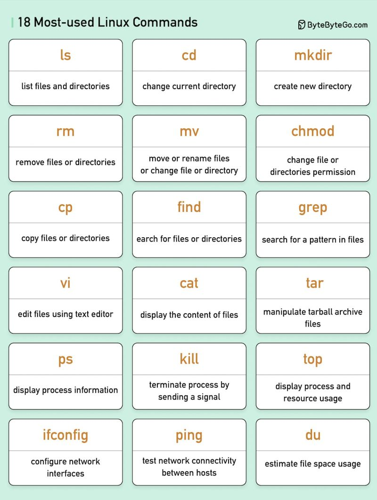
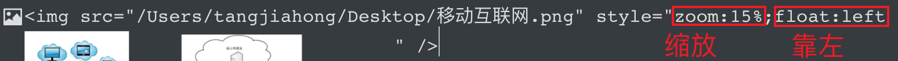
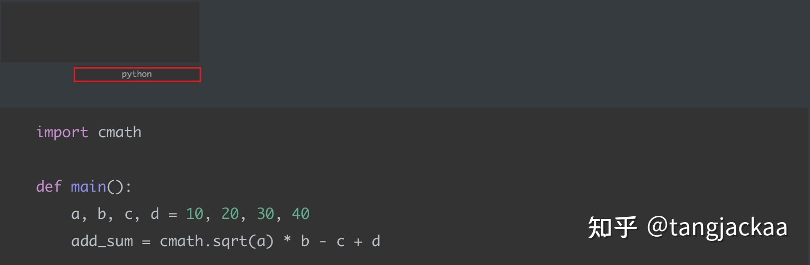
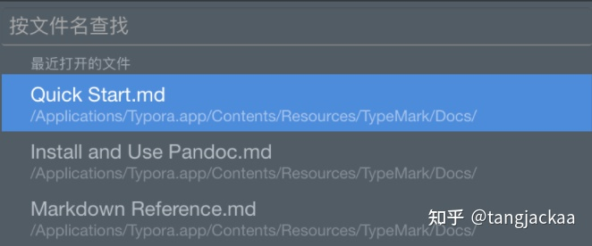

# Git


TEST 1

TEST 2

Test 3

Test 4

Another Feature in Main
New Feature


```
git init 
git add.
git commit -m "first commit"
git remote add origin http://github......
git push -u origin main / git push
```

- `git clone`：将远程仓库克隆到本地。

- `git add`：将本地文件添加到暂存区。

- `git commit`：将暂存区中的文件保存到本地仓库中，并创建版本记录。

- `git push`：将本地仓库中的文件同步到远程仓库中。git push -f origin main

- `git pull`：将远程仓库中的文件同步到本地仓库中。git pull origin main

- `git branch`：查看、创建和切换分支。

- `git merge`：合并两个分支。

- `git tag`：查看、创建和删除标签。

- `git log`：查看仓库的版本历史。

  

  

##### 0. 工作流

```
1.git clone // 到本地
2.git checkout -b xxx 切换至新分支xxx
（相当于复制了remote的仓库到本地的xxx分支上
3.修改或者添加本地代码（部署在硬盘的源文件上）
4.git diff 查看自己对代码做出的改变
5.git add .上传更新后的代码至暂存区
6.git commit 可以将暂存区里更新后的代码更新到本地git
7.git push origin xxx 将本地的xxxgit分支上传至github上的git
-----------------------------------------------------------
（如果在写自己的代码过程中发现远端GitHub上代码出现改变）
1.git checkout main 切换回main分支
2.git pull origin master(main) 将远端修改过的代码再更新到本地
3.git checkout xxx 回到xxx分支
4.git rebase main 我在xxx分支上，先把main移过来，然后根据我的commit来修改成新的内容
（中途可能会出现，rebase conflict -----》手动选择保留哪段代码）
5.git push -f origin xxx 把rebase后并且更新过的代码再push到远端github上
（-f ---》强行）
6.原项目主人采用pull request 中的 squash and merge 合并所有不同的commit
----------------------------------------------------------------------------------------------
远端完成更新后
1.git branch -d xxx 删除本地的git分支
2.git pull origin main 再把远端的最新代码拉至本地
```


##### 1. 回退commit版本：

1. git log 查看历史版本
2. git reset --hard HEAD^ 删除最后一个版本
3. git reset --hard + 版本号  恢复删除的版本，版本号为log中的黄色字符串

##### 2. 如何git单独commit单个文件夹

1. option + cmd + c 复制文件夹路径/文件夹拖入terminal自动显示路径
2. git add + 复制的路径
3. git commit -m "..."
4. git push

##### 3. branch操作

查看本地分支： git branch

查看远程分支： git branch -r

创建本地分支： git branch [name] ----注意新分支创建后不会自动切换为当前分支

切换分支： git checkout [name]

创建新分支并立即切换到新分支： git checkout -b [name]

删除分支： git branch -d [name] ---- -d选项只能删除已经参与了合并的分支，对于未有合并的分支是无法删除的。如果想强制删除一个分支，可以使用-D选项

合并分支： git merge [name] ----将名称为[name]的分支与当前分支合并

创建远程分支(本地分支push到远程)： git push origin [name]

删除远程分支： git push origin :heads/[name]


# Linux



# Mac


[复杂度](https://github.com/underdog1118/leetcode-record/blob/main/notes/Time%20and%20Space%20comlexity.md)


#### **1、标题（⌘ + 数字）**

一级标题：***（⌘ + 1）\***

二级标题：***（⌘ + 2）\***

三级标题：***（⌘ + 3）\***

四级标题：***（⌘ + 4）\***

...六级标题：***（⌘+6）\***

#### **2、下划线（⌘ + u）**

#### **3、删除线（^ + ⇧ + `）**

#### **4、字体（加粗⌘+b, 斜体⌘+i）**

字体加粗（**⌘ + b）**

字体倾斜**（⌘ + i）**

#### **5、无序列表（⌥ + ⌘ + u）**

- 张三
- 李四

#### **6、有序列表（⌥ + ⌘ + o）**

1. 苹果
2. 香蕉
3. 西瓜

#### **7、任务列表（⌥ + ⌘ + x）**

- 完成作业
- 跑步
- 看一部电影

#### **8、增加或减少缩进（⌘ + ]或[）**

1. 北京
2. 上海

#### **9、引用（⌥ + ⌘ + q）**


#### **10、插入链接（⌘ + k）**


#### **11、插入图片(鼠标拖拽)**

拖拽本地图片到Typora，默认居中，可调整缩放、靠左或靠右



#### **12、插入代码块（⌘ + ⌥ + c）**

支持Java、Python、Groovy等绝大多数编程语言
右下角选择编程语言类型



#### **13、文章跳转（⌘ + 方向键**）

跳转至文章开头***（⌘ + 向上箭头）\***
跳转至文章结尾***（⌘ + 向下箭头）\***

#### **14、选中英文单词/中文**

选中英文单词或连续的中文 ***（⌘ + d）\***
选中光标左边英文单词/中文 ***（⌘+⌥+左方向）\***
选中光标左边英文单词/中文 ***（⌘+⌥+右方向）\***

#### **15、按行选中（⌘ + l）**

#### **16、查找替换（⌘ + f）**


支持区分英文大小写和整个单词搜索，也支持中文搜索，下拉查找就可以输入替换内容


#### **17、快速生成表格（⌘ + ⌥ + T）**

#### **18、快速打开笔记（⇧ + ⌘ + o）**



#### **19、新建文件（⌘ + n）**

#### **20、显示和隐藏侧边栏（⇧ + ⌘ + L）**

#### **21、分割线（--- + enter 或 ⌘ + ⌥ + -）**

输入 **---直接按回车** 或 快捷键 **⌘ + ⌥ + -**

#### 22. **插入引用（⌘ + ⌥ + Q）**

#### 23. **插入公式块（⌘ + ⌥ + B）**


# Win

Ctrl + X	删除

Ctrl + C	复制

Ctrl + V	粘贴

Ctrl + Z	撤销

Ctrl + D	复制当前行

Shift + Enter	向下另起一行

Ctrl + Alt + Enter	向上添加一行

Shift + Left/Right/Home/End	向左/向右/行头/行尾选择

Ctrl + Shift + up/down	选择行向上下移动

Ctrl + Shift + F12	切换全屏代码


