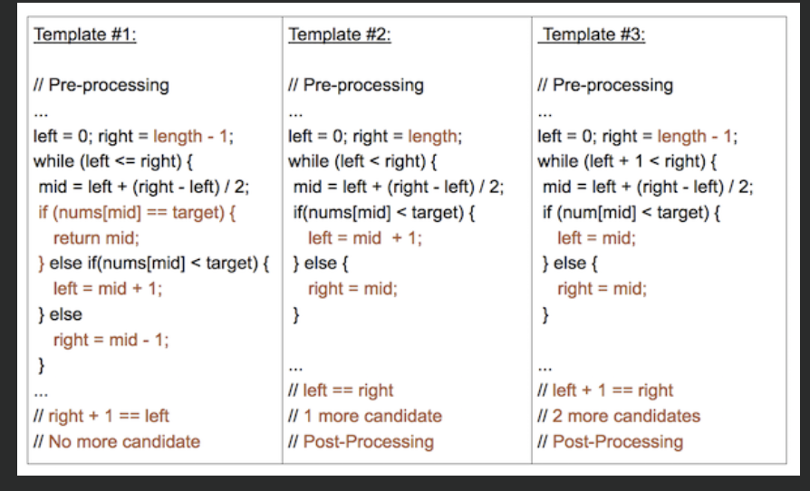
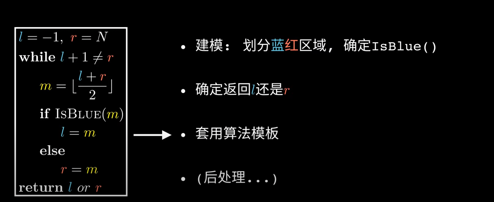
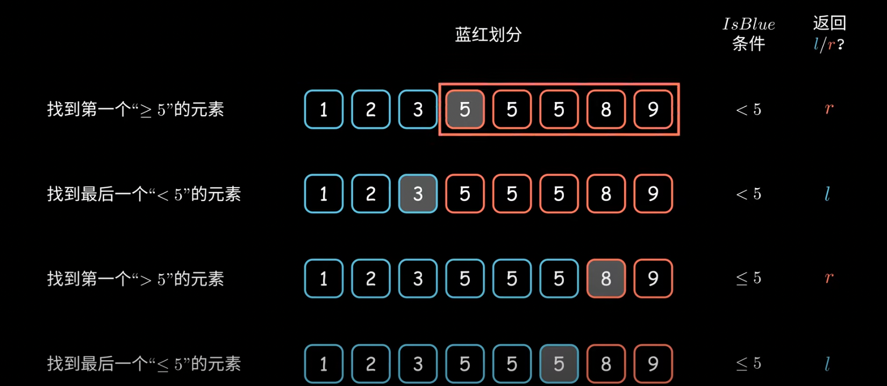

## 1.Binary Search

O(logN) 

Sorted







```java
int[] nums = new int[]{};
int target;
if(nums == null || nums.length == 0) //判断空集
  return -1;
//一. 单独找到某个数字
//1.左闭右闭
int left = 0;
int right = nums.length - 1;
while (left <= ight){  
  int mid = left + (right - left）/2;   //防止overflow
  if(nums[mid] < target){
    left = mid + 1;
  }else if(nums[mid] > target){
    right = mid - 1;       
  }else{
    return mid;
  }
}
//2.左闭右开
int left = 0;
int right = nums.length;
while (left < right){  
  int mid = left + (right - left/2;   //防止overflow
  if(nums[mid] < target){
    left = mid + 1;
  }else if(nums[mid] > target){
    right = mid;       
  }else{
    return mid;
  }
}
//3.左开右开
int left = -1;
int right = nums.length;
while(left + 1 < right){
  int mid = left + (right-left)/2;
  if(nums[mid] < target){
    left = mid;
  }else if(nums[mid] > target){
  	right = mid;  
  }else{
    return mid;
  }
}
                    
                    
```

```java
//二.寻找左边界（多个相同的target)
    int left_bound(int[] nums, int target) {
        int left = -1;
        int right = nums.length;
        while (left + 1 != right){
            int mid = left + (right - left) / 2;
            if (nums[mid] < target){
                left = mid;
            }else if (nums[mid] > target){
                right = mid;
            }else if (nums[mid] == target){
                right = mid; //找左极限， 得到target时候令right = mid, 把区间往左边压
            }
        }
      if (right == nums.length || nums[right] != target) { //判断target是否存在
        	return -1;
      }else{
      		return right; //left为最后一个<target元素，right为第一个>=target元素
      }
    }
```

```java
  //三.找最右侧的target
	int right_bound(int[] nums, int target) {
        int left = -1;
        int right = nums.length;
        while (left + 1 < right){
            int mid = left + (right - left) / 2;
            if (nums[mid] > target){
                right = mid;
            }else if (nums[mid] < target){
                left = mid;
            }else if (nums[mid] == target){
                left = mid;  //找到target时候，把区间往右侧压缩， 找最右侧=target的元素
            }
        }
        if (left < 0 || nums[left] != target) { //判断索引是否越界和target是否存在
            return -1;
        }else{
            return left; //left为最后一个<=target元素，right为第一个>target元素
        }
    }
```

```java
//应用问题，珂珂吃香蕉
//1.先定义函数 f(x) 为 关于 x 的函数， f(x)随着x变大而单调递增/单调递减
//2.在主函数里调用f(x), left, right 二分查找 mid 与 target 比较
//在f(x) == target的限制下， 得到x的边界值
int fx(int[] nums, int t){
}
//通关判断计算t的范围用来定义left和right的值 [l,r]
int left = l;
int right = r;
while (left < right) {
  int mid = left + (right - left) / 2;
  while (left < right) {
    if (fx(nums, t) < target) { }
    else if (fx(nums, t) > target) { }
    else { } // 相等，推动边界
  }
  return left // 或者right
}
```

在旋转数组中找target, leetcode 153 154

## 2. Sliding Window

```java
// 大致逻辑 时间复杂度O(N)
int left = 0, right = 0;
while (right < s.size()) {
    // 增大窗口
    window.add(s[right]);
    right++;
    
    while (window needs shrink) {
        // 缩小窗口
        window.remove(s[left]);
        left++;
    }
}
```

```java
/* 滑动窗口算法框架 */
void slidingWindow(string s) {
    unordered_map<char, int> window;   //HashMap 
    
    int left = 0, right = 0;
    while (right < s.size()) {
        // c 是将移入窗口的字符
        char c = s[right];
        // 增大窗口
        right++;
        // 进行窗口内数据的一系列更新
        ...

        /*** debug 输出的位置 ***/
        printf("window: [%d, %d)\n", left, right);
        /********************/
        
        // 判断左侧窗口是否要收缩
        while (window needs shrink) {
            // d 是将移出窗口的字符
            char d = s[left];
            // 缩小窗口
            left++;
            // 进行窗口内数据的一系列更新
            ...
        }
    }
}
```

