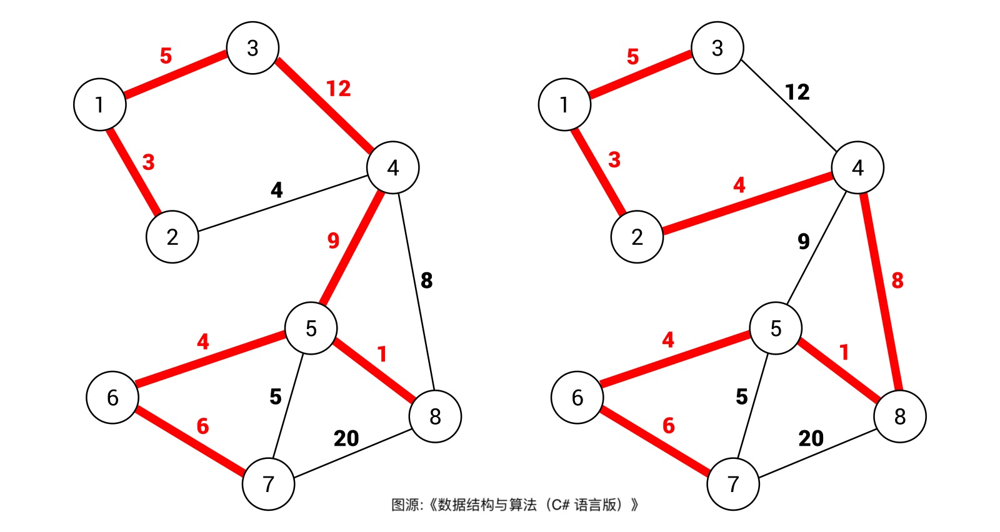
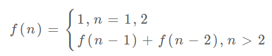

## **leetcode常见技巧

#### 1) Design class类型

```java

public class Function {
    //先在外部定义变量类型
    HashMap<Integer, Integer> map;
    int[] nums;
    Random random;
    public Function() { //构造器 Instructor
        //在构造器内初始化
        map = new HashMap<>();
        nums = new int[100];
        random = new Random();
    }
    public boolean add(int k) { //类里的method
        return true;
    }
  
    public static void main(String[] args) {
        //调用非static类时
        Function fuc = new Function(); //用构造器定义一个类的instance实例
        fuc.add(5); //调用类内部的方法    
    }
    
}

在你的Java代码中，add方法是一个非静态方法，而不是静态方法。静态方法和非静态方法之间有一些区别：

调用方式：
非静态方法（没有使用static关键字）：这些方法是与对象实例相关联的，只能通过创建类的实例来调用。在你的示例中，你必须首先创建一个Solution类的实例，然后使用该实例调用add方法。例如：
Function f = new Function(); 
f.add(5);

静态方法（使用static关键字）：这些方法与类本身相关联，而不是与类的实例相关联。它们可以直接通过类名来调用，而无需创建类的实例。例如：
Function.add(5);
或者直接：
add(5);

访问对象成员：

非静态方法可以访问类的实例变量（成员变量）以及其他非静态方法。
静态方法不能直接访问类的实例变量，因为它们与特定的实例无关，只能访问静态成员（静态变量和其他静态方法）。
```

#### 2) Random生成

```java
Random rand = new Random();
int max = ...;
// nextInt(n) 方法在 [0, max) 中生成一个随机整数
int num = rand.nextInt(max);
```

#### 3) long

```java
//Java生成long型注意：
long num = (long) k * n;  //后面进行了乘法计算，需要加上(long)转型
long num2 = 1000000000L; //末尾加上L！！
```

#### 4) Java 内置sort

```java
//排序也可以用lambda, 比如只把数组按照某一index处的数字从小到大排序：
Arrays.sort(array, (n1,n2)->n1[0]-n2[0]);

Arrays.sort(array, (n1,n2)->Integer.compare(n1[0],n2[0]); //防止long溢出
            
Arrays.sort(array, (n1,n2)-> {  //防止数据溢出
      if(n1[0]>n2[0]) return 1;
      if(n1[0]<n2[0]) return -1;
      return 0;
}); 
```

#### 5) Java除法

```java
//默认是地板floor除 
10 / 3 = 3
//想用天花板ceiling除的话 
ceil : a/b  => (a+b-1)/b 
(10+2)/3 = 4    
```

#### 6) 异或

```java
1.一个数和 0 做 XOR 运算等于本身：a⊕0 = a
一个数和其本身做 XOR 运算等于 0：a⊕a = 0
XOR 运算满足交换律和结合律：a⊕b⊕a = (a⊕a)⊕b = 0⊕b = b

2.couples : 01 23 45 67 89
couple1 ^ 1 = couple2

3.判断两个数是否异号 (用乘法容易溢出)
int x = -1, y = 2;
boolean f = ((x ^ y) < 0); // true

int x = 3, y = 2;
boolean f = ((x ^ y) > 0); // false

4. n&(n-1) :消除数字 n 的二进制表示中的最后一个 1 
	& 符号是位运算符中的一种，表示按位与（AND），假设有两个二进制数 a 和 b，它们的每一位分别为 a[i] 和 b[i]，则 a & b 的结果是一个二进制数，其每一位都是 a[i] 和 b[i] 的逻辑 AND 运算的结果。具体来说，如果 a[i] 和 b[i] 都为 1，则结果的第 i 位为 1，否则为 0。
```

#### 7) 公共最大因数GCD

```java
public static int gcd(int a, int b) {
    if (b == 0) {
        return a;
    }
    return gcd(b, a % b);
}
```

#### 8) 质数筛法 lc 204

```java
boolean[] isPrime = new boolean[];
    public int countPrimes(int n) {
        boolean[] isPrime = new boolean[n+1];
        Arrays.fill(isPrime, true);
        for (int i = 2; i * i <= n; i++) { // i*i范围内即可
            if (!isPrime[i]) {
                continue;
            }
            for (int j = 2; j*i <= n; j++) { //若i是质数，所有i*k (k>=2的常数)都为和数
                isPrime[j*i] = false;
            }
        }

        int res = 0;
        for (int i = 2; i < n; i++) {
            if (isPrime[i]) {
                res++;
            }
        }
        return res;
    }
```

#### 9) 众数Boyer-Moore Voting Algorithm 投票算法 lc 169

```java
    public int majorityElement(int[] nums) {
        int target = 0;
        int count = 0;
        int n = nums.length;
        for (int i = 0; i < n; i++) {
            if (count == 0) {
                target = nums[i];
                count++;
            } else if(nums[i] == target) {
                count++;
            } else {
                count--;
            }
        }
        return target;
    }
```


## 1.Binary Search

O(logN) 

Sorted


```java
int[] nums = new int[]{};
int target;
if(nums == null || nums.length == 0) //判断空集
  return -1;
//一. 单独找到某个数字
//1.左闭右闭
int left = 0;
int right = nums.length - 1;
while (left <= right){  
  int mid = left + (right - left）/2;   //防止overflow
  if(nums[mid] < target){
    left = mid + 1;
  }else if(nums[mid] > target){
    right = mid - 1;       
  }else{
    return mid;
  }
}
//2.左闭右开
int left = 0;
int right = nums.length;
while (left < right){  
  int mid = left + (right - left)/2;   //防止overflow
  if(nums[mid] < target){
    left = mid + 1;
  }else if(nums[mid] > target){
    right = mid;       
  }else{
    return mid;
  }
}
//3.左开右开
int left = -1;
int right = nums.length;
while(left + 1 < right){
  int mid = left + (right-left)/2;
  if(nums[mid] < target){
    left = mid;
  }else if(nums[mid] > target){
  	right = mid;  
  }else{
    return mid;
  }
}              
```

```java
//二.寻找左边界（多个相同的target存在于数组nums中时）

/**
当目标元素 target 不存在数组 nums 中时，搜索左侧边界的二分搜索的返回值可以做以下几种解读：

1、返回的这个值是 nums 中大于等于 target 的最小元素索引。
2、返回的这个值是 target 应该插入在 nums 中的索引位置。 
3、返回的这个值是 nums 中小于 target 的元素个数。

比如在有序数组 nums = [2,3,5,7] 中搜索 target = 4，搜索左边界的二分算法会返回 2，你带入上面的说法，都是对的。

综上，此招左边界的方法也可以用来找target的右边界 （lc34)：int r = left_bound(nums,target+1)        找target+1的最左侧值，再-1即为target最右边界; 即使target+1不存在，r仍会返回该值应该插入在nums中的index（删去底端的是否存在的判断条件，直接return)
*/
    int left_bound(int[] nums, int target) {
        int left = 0;
        int right = nums.length;
        while (left < right) {
            int mid = left + (right - left) / 2;
            if (nums[mid] < target){
                left = mid + 1;
            }else if (nums[mid] > target){
                right = mid;
            }else if (nums[mid] == target){
                right = mid; //找左极限， 得到target时候把区间往左边压
            }
        }
      
     	//** 也可以不写，下面直接return可以得到target应该插入在nums中的索引位置(见顶端)
 		//第1个判断：此时 target 比所有数都大(超出右边界）or 比所有数字都小（超出左边界），返回 -1
        
        //其实对于这个算法，left 不可能小于 0。你可以想象一下算法执行的逻辑，left 初始化就是 0，且只可能一直往右走，那么只可能在右侧越界。不过在访问数组索引之前保证索引在左右两端都不越界是一个很好的编程习惯，没有坏处，我这里就同时判断了。这样做的另一个好处是可以让二分的模板更统一，降低你的记忆成本。
        if (left < 0 || left >= nums.length) {  //可以只写 left >= nums.lenght
            return -1;
        }
        //第2个判断：nums[left] 是否是target
        return nums[left] == target ? left : -1;
    }
```

```java
  //三.找最右侧的target
	int right_bound(int[] nums, int target) {
        int left = 0;
        int right = nums.length;
        while (left < right){
            int mid = left + (right - left) / 2;
            if (nums[mid] > target){
                right = mid;
            }else if (nums[mid] < target){
                left = mid + 1;
            }else if (nums[mid] == target){
                left = mid + 1;  //找到target时候，把区间往右侧压缩， 找最右侧=target的元素
            }
        }
        
        //判断索引是否越界和target是否存在, left的取值范围是 [0, nums.length]，但由于我们最后返回的是 left - 1，所以 left 取值为 0 的时候会造成索引越界
        if (left - 1 < 0 || nums[left - 1] != target) { 
            return -1;
        }else{
            return left - 1; //*** left为第一个>target元素，left-1为最后一个<=target元素,即右边界
        }
        
        //或者直接像下面这样写：和左边界一样，降低记忆成本
        
        if (left - 1 < 0 || left - 1 >= nums.length) {
            return -1;
        }
        return nums[left-1] == target ? left-1 : -1;        
    }
```


```java
// 上述两种找左右边界最后的判断是否存在该target，也可以在开始的时候就判断，最后就不用再判断直接return即可
if (nums[0] > target || nums[nums.length-1] < target) {
    return -1;
}
```


```java
//应用问题，珂珂吃香蕉
//1.先定义函数 f(x) 为 关于 x 的函数， f(x)随着x变大而单调递增/单调递减
//2.在主函数里调用f(x), left, right 二分查找 mid 与 target 比较
//在f(x) == target的限制下， 得到x的边界值
int fx(int[] nums, int t){
}
//通关判断计算t的范围用来定义left和right的值 [l,r]
int left = l;
int right = r;
while (left < right) {
  int mid = left + (right - left) / 2;
  while (left < right) {
    if (fx(nums, t) < target) { }
    else if (fx(nums, t) > target) { }
    else { } // 相等，推动边界
  }
  return left // 或者right
}
```

在旋转数组中找target, leetcode 153 154

## 2. Sliding Window

Java 中的 Integer 和 String 这种包装类不能直接用 `==` 进行相等判断，而应该使用类的 `equals` 方法

```java
// 大致逻辑 时间复杂度O(N)
int left = 0, right = 0;
while (right < s.size()) {
    // 增大窗口
    window.add(s[right]);
    right++;
    
    while (window needs shrink) {
        // 缩小窗口
        window.remove(s[left]);
        left++;
    }
}
```

```java
/* 滑动窗口算法框架 */
void slidingWindow(string s, string t) {
    Map<Character, Integer> need = new HashMap<>();
    Map<Character, Integer> window = new HashMap<>();
    for (char c : t.toCharArray()) 
        need.put(c, need.getOrDefault(c,0) + 1); //先设置need
    int left = 0, right = 0, count = 0;              
    while (right < s.length()) {
        // c 是将移入窗口的字符
        char c = s[right];
        // 增大窗口
        right++;
        // 进行窗口内数据的一系列更新
        ...
       if (need.constainsKey(c)) {
           window.put(c, window.getOrDefault(c, 0) + 1);
           if (need.get(c).equals(window.get(c))) {
               count ++;
           }
       }

        /*** debug 输出的位置 ***/
        printf("window: ["+left+","+ right+")");
        /********************/
        
        // 判断左侧窗口是否要收缩
        while (window needs shrink) {
            // d 是将移出窗口的字符
            char d = s[left];
            // 缩小窗口
            left++;
            // 进行窗口内数据的一系列更新
            ...
            if (need.containsKey(d)) {
                if (need.get(d).equals(window.get(d))) {
                    count--;
                }
                window.put(d, window.getOrDefault(d, 0) - 1);
            }	
        }
    }
}
```

#### * Rabin-Karp （extend)

```java
int L;  //数字位数 8333  L=4
int R;  //进制  10进制 R=10
int RL = Math.pow(R, L-1); // R*(L-1) 用于删除首位
// 1.数字末位添加
num = num * R + addVal;  // 8333 * 10 + 5 = 83335
// 2.首位数字删除
num = num - removeVal * RL;  // 8333 - 8 * 10^3 = 333
```

```java
// Rabin-Karp 指纹字符串查找算法
int rabinKarp(String txt, String pat) {
    // 位数
    int L = pat.length();
    // 进制（只考虑 ASCII 编码）
    int R = 256;
    // 取一个比较大的素数作为求模的除数
    long Q = 1658598167;
    // R^(L - 1) 的结果
    long RL = 1;
    for (int i = 1; i <= L - 1; i++) {
        // 计算过程中不断求模，避免溢出  R ^ (L - 1)
        RL = (RL * R) % Q; 
    }
    // 计算模式串的哈希值，时间 O(L)
    long patHash = 0;
    for (int i = 0; i < pat.length(); i++) {
        patHash = (R * patHash + pat.charAt(i)) % Q;
    }
    
    // 滑动窗口中子字符串的哈希值
    long windowHash = 0;
    
    // 滑动窗口代码框架，时间 O(N)
    int left = 0, right = 0;
    while (right < txt.length()) {
        // 扩大窗口，移入字符
        windowHash = ((R * windowHash) % Q + txt.charAt(right)) % Q;
        right++;

        // 当子串的长度达到要求
        if (right - left == L) {
            // 根据哈希值判断是否匹配模式串
            if (windowHash == patHash) {
                // 当前窗口中的子串哈希值等于模式串的哈希值
                // 还需进一步确认窗口子串是否真的和模式串相同，避免哈希冲突
                if (pat.equals(txt.substring(left, right))) {
                    return left;
                }
            }
            // 缩小窗口，移出字符
            windowHash = (windowHash - (txt.charAt(left) * RL) % Q + Q) % Q;
            // X % Q == (X + Q) % Q 是一个模运算法则
            // 因为 windowHash - (txt[left] * RL) % Q 可能是负数
            // 所以额外再加一个 Q，保证 windowHash 不会是负数
            left++;
        }
    }
    // 没有找到模式串
    return -1;
}

```


## 3. Reverse Linked List

```java
// 1. 反转整个链表 ListNode head
// 1）递归
    public ListNode reverseList(ListNode head) {
        if (head == null || head.next == null) {return head;} //含有0个和1个的情况
        
        ListNode last = reverseList(head.next); //  null <- 2 <- 3 <- 4 <- 5
        //不要跳进递归， 而是弄懂上面的函数会产生什么结果，即翻转了head之后的链表
        
        head.next.next = head; // 1 <- 2 ...
        head.next = null;  // null <- 1 <- 2 <- 3 <- 4 <- 5
        return last;
    }

// 2）常规
    public ListNode reverseList(ListNode head) {
        ListNode pred = null;
        ListNode cur = head;
        while (cur != null) {
            ListNode nextCur = cur.next;
            cur.next = pred;
            pred = cur;
            cur = nextCur;
        }
        return pred;
    }
```

```java
// 2. 翻转链表head的前n个元素
ListNode succ = null; //  添加后驱节点,只在 n == 1时记录一次， 注意是在方法之外
public ListNode reverseN(ListNode head, int n) {
    if (n == 1) {
        succ = head.next; //记录第n+1个节点,即最后反转完n个元素后需要链接的后续链表
        return head;
    }
    ListNode last = reverseN(head.next, n - 1); //递归，翻转head.next开始的n-1个节点
    head.next.next = head; //翻转后的链表最后一个是head.next, 再让其指向head
    
    head.next = succ;   //让反转之后的 head 节点和后面的节点连起来
    return last; //last为翻转后的头节点
}
```

```java
// 3. 翻转链表head的第m到第n个元素
public ListNode reverseBetween(ListNode head, int m, int n) {
	if (m == 1) { //base case
        return reverseN(head, n);
    }
    head.next = reverseBetween(head.next, m - 1, n - 1); //head连接后一位翻转后的内容
    return head;
}
    
```

```java
// 4.每两两翻转链表中的元素
public ListNode swapPairs(ListNode head) {
	if (head == null || head.next == null) {return head;} //base
    ListNode first = head;
    ListNode second = head.next;
    ListNode other = head.next.next;
    
    second.next = first;  //先反转前两个
    first.next = swapPairs(other); //接上剩余后翻转过的链表
    return second;
}
```

## 4. PreSum and Diff

```java
// preSum 前缀和数组，长度需要比原数组大1方便计算. （放入一个默认的0初始数据）
// 主要适用的场景是原始数组不会被修改的情况下，频繁查询某个区间的累加和
// 前缀和数组
private int[] prefix;
/* 输入一个数组，构造前缀和 */
public PrefixSum(int[] nums) {
    prefix = new int[nums.length + 1]; // +1
    // 计算 nums 的累加和
    for (int i = 1; i < prefix.length; i++) {  //从1开始，0默认为0便于计算
        prefix[i] = prefix[i - 1] + nums[i - 1];
    }
}
/* 查询闭区间 [i, j] 的累加和 */
public int query(int i, int j) {
    return prefix[j + 1] - prefix[i];
}
```

```java
// diff 差分数组， 长度和原数组一致即可
// 差分数组的主要适用场景是频繁对原始数组的某个区间的元素进行增减

int[] diff = new int[nums.length];
// 1. 构造差分数组 ,原数组已经有差
diff[0] = nums[0];
for (int i = 1; i < nums.length; i++) {
    diff[i] = nums[i] - nums[i - 1];
}
// 2.原数组初始全为0时， diff只要定义即可，默认全为0

// 3. 给闭区间 [i, j] 增加 val（可以是负数）, 可以先对diff进行全部改变， 最终结果用来算res
public void increment(int i, int j, int val) {
    diff[i] += val;
    if (j + 1 < diff.length) {  //最后一个元素也更改，不需要更新
        diff[j + 1] -= val;
    }
}
// 4. 返回结果数组res
public int[] result() {
    int[] res = new int[diff.length];
    // 根据差分数组构造结果数组
    res[0] = diff[0];
    for (int i = 1; i < diff.length; i++) {
        res[i] = res[i - 1] + diff[i];
    }
    return res;
}
```

## 5. nSum

```java
// 2Sum 用hashmap 找 target - nums[i], 不在就把nums[i]存进map
// 3Sum 先排序。 固定一个k， 相向移动双指针 i = k + 1, j = nums.length - 1 直到i < j不成立
// 4Sum 先排序。 固定一个m， 往右移动n = m + 1, 相向移动双指针 i = n + 1, j = nums.length - 1
// 该类问题需要注意去重: if (k > 0 && nums[k] == nums[k-1]) {continue;}
```

## 6. Monotonic Stack & Queue


```java
//M stack : 从左往右看，找第一个能看到的比自己高的人
//两个循环,但其实是O(n).总共有 n 个元素，每个元素都被 push 入栈了一次，而最多会被 pop 一次，没有任何冗余操作。
int[] nextGreaterElement(int[] nums) {
    int n = nums.length;
    // 存放答案的数组
    int[] res = new int[n];
    Stack<Integer> s = new Stack<>(); 
    // 倒着往栈里放
    for (int i = n - 1; i >= 0; i--) {
        // 判定个子高矮
        while (!s.isEmpty() && s.peek() <= nums[i]) {
            // 矮个起开，反正也被挡着了。。。
            s.pop();
        }
        // nums[i] 身后的更大元素
        res[i] = s.isEmpty() ? -1 : s.peek();
        s.push(nums[i]);
    }
    return res;
}
```

```java
// M Queue
class MonotonicQueue {
// 双链表，支持头部和尾部增删元素 , 也可以用双端队列Deque<Integer> dq = new LinkedList<>();
// 维护其中的元素自尾部到头部单调递减
	private LinkedList<Integer> maxq = new LinkedList<>();

// 在尾部添加一个元素 n，维护 maxq 的单调性质
	public void push(int n) {
    // 将前面小于自己的元素都删除
    	while (!maxq.isEmpty() && maxq.getLast() < n) {
        	maxq.pollLast();
    	}
    	maxq.addLast(n);
	}
    
	public int max() {
    	// 队头的元素肯定是最大的
    	return maxq.getFirst();
	}
    
    //队头删除元素 n
    public void pop(int n) {
        //之所以要判断 n == maxq.getFirst()，是因为我们想删除的队头元素 n 可能已经被「压扁」了，可能已经不存在了，所以这时候就不用删除了：
        if (n == maxq.getFirst()) {
            maxq.pollFirst();
        }
    }
}
```

## 7. Traverse binary tree

#### 1) 前序

```java
// 1.前序 Pre-Order
class Solution {
    /* 1 动态规划思路 */
    // 定义：输入一个节点，返回以该节点为根的二叉树的前序遍历结果
    public List<Integer> preorderTraversal(TreeNode root) {
        LinkedList<Integer> res = new LinkedList<>();
        if (root == null) {
            return res;
        }
        // 前序遍历结果特点：第一个是根节点的值，接着是左子树，最后是右子树
        res.add(root.val);
        res.addAll(preorderTraversal(root.left));
        res.addAll(preorderTraversal(root.right));
        return res;
    }

    /* 2 回溯算法思路 */
    LinkedList<Integer> res = new LinkedList<>();
    // 返回前序遍历结果
    public List<Integer> preorderTraversal2(TreeNode root) {
        traverse(root);
        return res;
    }
    // 二叉树遍历函数
    void traverse(TreeNode root) {
        if (root == null) {
            return;
        }
        // 前序遍历位置
        res.add(root.val);
        traverse(root.left);
        traverse(root.right);
    }
}

// 3 迭代，用栈。 遍历顺序：中-左-右， 入栈顺序：中-右-左
class Solution {
    public List<Integer> preorderTraversal(TreeNode root) {
        List<Integer> res = new LinkedList<>();
        Stack<TreeNode> stack = new Stack<>();
        stack.push(root);
        while (!stack.isEmpty()) {
            TreeNode node = stack.pop(); //弹出中节点
            if (node != null) {  
                res.add(node.val);
                stack.push(node.right);  //先放右
                stack.push(node.left);  //再放左，左先弹出
            }   
        }
        return res;
    }
}
```

#### 2）中序

```java
// 2.中序 In-Order
class Solution {
    /* 1 动态规划思路 */
    // 定义：输入一个节点，返回以该节点为根的二叉树的中序遍历结果
    public List<Integer> inorderTraversal(TreeNode root) {
        LinkedList<Integer> res = new LinkedList<>();
        if (root == null) {
            return res;
        }
        res.addAll(inorderTraversal(root.left));
        res.add(root.val);
        res.addAll(inorderTraversal(root.right));
        return res;
    }

    /* 2 回溯算法思路 */
    LinkedList<Integer> res = new LinkedList<>();

    // 返回前序遍历结果
    public List<Integer> inorderTraversal2(TreeNode root) {
        traverse(root);
        return res;
    }

    // 二叉树遍历函数
    void traverse(TreeNode root) {
        if (root == null) {
            return;
        }
        traverse(root.left);
        // 中序遍历位置
        res.add(root.val);
        traverse(root.right);
    }
}

// 3 迭代。 遍历顺序: 左-中-右 入栈顺序： 左-右
public List<Integer> inorderTraversal(TreeNode root) {
    Stack<TreeNode> stack = new Stack<>();
    List<Integer> res = new LinkedList<>();
    TreeNode curr = root;  //指针
    while (!stack.isEmpty() || curr != null) {
        while (curr != null) {
            stack.push(curr);
            curr = curr.left;  //一直添加直到最左最小的node， 此时curr = null
        }
        curr = stack.pop();
        res.add(curr.val);
        curr = curr.right;
    }
    return res;
}
```

#### 3） 后序

```java
// 3. 后序 Post-Order
class Solution {
    /* 1 动态规划思路 */
    // 定义：输入一个节点，返回以该节点为根的二叉树的后序遍历结果
    public List<Integer> postorderTraversal(TreeNode root) {
        LinkedList<Integer> res = new LinkedList<>();
        if (root == null) {
            return res;
        }
        // 后序遍历结果特点：先是左子树，接着是右子树，最后是根节点的值
        res.addAll(postorderTraversal(root.left));
        res.addAll(postorderTraversal(root.right));
        res.add(root.val);
        return res;
    }

    /* 2 回溯算法思路 */
    LinkedList<Integer> res = new LinkedList<>();
    // 返回后序遍历结果
    public List<Integer> postorderTraversal2(TreeNode root) {
        traverse(root);
        return res;
    }
    // 二叉树遍历函数
    void traverse(TreeNode root) {
        if (root == null) {
            return;
        }
        traverse(root.left);
        traverse(root.right);
        // 后序遍历位置
        res.add(root.val);
    }
}

// 3. 迭代。 前序类似，翻转输出。 遍历顺序 左-右-中 入栈顺序：中-左-右 出栈顺序：中-右-左， 最后翻转结果
public List<Integer> postorderTraversal(TreeNode root) {
    List<Integer> res = new LinkedList<>();
    Stack<Integer> reverseRes = new Stack<>();  //顺序是左右中，先用中右左接住
    Stack<TreeNode> stack = new Stack<>();
    stack.push(root);
    while (!stack.isEmpty()) {
        TreeNode node = stack.pop(); //弹出中节点
        if (node != null) {  
            reverseRes.push(node.val);
            stack.push(node.left);  //先放左
            stack.push(node.right);  //后方右，先弹出
        }   
    }
    while (!reverseRes.isEmpty()){  //翻转成左右中输出
        res.add(reverseRes.pop());
    }
    return res;

}
```

#### 4） 层次遍历 

```java
// 4. 层次遍历 Level-Order BFS
// 输入一棵二叉树的根节点，层序遍历这棵二叉树
public void levelTraverse(TreeNode root) {
    if (root == null) return;
    Queue<TreeNode> q = new LinkedList<>();
    q.offer(root);

    // 从上到下遍历二叉树的每一层
    while (!q.isEmpty()) {
        int sz = q.size();
        // 从左到右遍历每一层的每个节点
        for (int i = 0; i < sz; i++) {
            TreeNode cur = q.poll();
            // 将下一层节点放入队列
            if (cur.left != null) {
                q.offer(cur.left);
            }
            if (cur.right != null) {
                q.offer(cur.right);
            }
        }
    }
}
```

```java
// 4.1 dfs模拟bfs
List<Integer> res = new ArrayList<>();
public List<Integer> levelOrder(TreeNode root) {
    if (root == null) {return res;}
    dfsAsBfs(root, 0); //从depth = 0开始
    return res;
}
public void dfsAsBfs(TreeNode root, int depth) {
    if (root == null) {return;}
    if (depth == res.size()) {  //关键：判断是否为分割点， 此处开始对res的操作
        res.add(root.val);
    }
    
    dfsAsBfs(root.left, depth + 1); //先左再右，能找到从左侧看的所有层的第一个元素
    dfsAsBfs(root.right, depth + 1); //depth++进行下一次递归
    
    // 最后两行可以替换为： 原版的回溯，depth++用完后再-- (其实不用depth--. 这里的depth不会再被用到了)
        depth++;
        recurBfs(root.left, depth);
        recurBfs(root.right, depth);
        //depth--;
    // 如果depth不是该方法的内部参数，而是global变量在外部， 则需要--
    }
}
```

```java
// 4.1 bfs题目模版
//计算从起点 start 到终点 target 的最近距离
int BFS(Node start, Node target) {
    Queue<Node> q; // 核心数据结构
    Set<Node> visited; // 避免走回头路
    
    q.offer(start); // 将起点加入队列
    visited.add(start);
    int step = 0; // 记录扩散的步数

    while (q not empty) {
        int sz = q.size();
        /* 将当前队列中的所有节点向四周扩散 */
        for (int i = 0; i < sz; i++) {
            Node cur = q.poll();
            /* 划重点：这里判断是否到达终点 */
            if (cur is target)
                return step;
            /* 将 cur 的相邻节点加入队列 */
            for (Node x : cur.adj()) {
                if (x not in visited) {
                    q.offer(x);
                    visited.add(x);
                }
            }
        }
        /* 划重点：更新步数在这里 */
        step++;
    }
}
```


## 8. Same/Symmetric Tree

```java
//比较两棵树是否相等
public boolean isSameTree(TreeNode n1, TreeNode n2) {
    if (n1 == null || n2 == null) {
        return n1 == n2;   //两个null, true; 一个null, false
    }
   	return n1.val == n2.val && isSameTree(n1.left, n2.left) && isSameTree(n1.right, n2.right);
}

//若比较是否对称, 最后改成
	return n1.val == n2.val && isSymmetric(n1.left, n2.right) && isSymmetric(n1.right,n2.left);
```

## 9. Sort

假定在待排序的记录序列中，存在多个具有相同的关键字的记录，若经过排序，这些记录的相对次序保持不变，即在原序列中，A1=A2，且A1在A2之前，而在排序后的序列中，A1仍在A2之前，则称这种排序算法是稳定的；否则称为不稳定的。

稳定也可以理解为一切皆在掌握中,元素的位置处在你在控制中.而不稳定算法有时就有点碰运气,随机的成分.当两元素相等时它们的位置在排序后可能仍然相同.但也可能不同.是未可知的.

**各排序算法的稳定性：**

1、堆排序、快速排序、希尔排序、直接选择排序**不是稳定**的排序算法；

2、基数排序、冒泡排序、直接插入排序、折半插入排序、归并排序**是稳定**的排序算法。


#### 1) MergeSort


```java
// tc : O(N*logN) logN层二叉树，每层N个元素 ; sc : O(N) temp长度和nums一致
class Solution {
    int[] temp;
    public int[] sortArray(int[] nums) {
        temp = new int[nums.length];
        mergeSort(nums, 0, nums.length - 1);
        return nums;
    }

    public void mergeSort(int[] nums, int l, int r) {
        if (l == r) {
            return;
        }
        
        int mid = l + (r - l) / 2;
        mergeSort(nums, l, mid);  //左侧排序
        mergeSort(nums, mid + 1, r);  //右侧排序

        int i = l, j = mid + 1;  //双指针归并排序两个有序数组
        int cnt = 0;
        while (i <= mid || j <= r) {
            if (i == mid + 1) {  //左侧已排完，右侧全放进去
                temp[cnt++] = nums[j++];
            } else if (j == r + 1) {
                temp[cnt++] = nums[i++];
            } else if (nums[i] < nums[j]) {  //小的先放
                temp[cnt++] = nums[i++];
            } else {
                temp[cnt++] = nums[j++];
            }
        }

        for (int k = 0; k < r - l + 1; k++) {  //排序完的temp放到nums相对应的位置里
            nums[l + k] = temp[k];
        }
//        for (int k = l; k <= r; k++) {  另一种写法
//            nums[k] = temp[k-l];
        }
    }
}
```

#### 2) Quick Sort


```java
// 最佳情况： tc - O(NlogN), sc - O(logN)  ；
// 最差情况 ： tc - O(N^2), sc - O(N) , 退化成选择排序
class Solution {
    public int[] sortArray(int[] nums) {
        //shuffle(nums);
        quickSort(nums, 0, nums.length - 1); //左闭右闭
        return nums;    
    }

    public void quickSort(int[] nums, int l, int r) {
        if (l >= r) {  //不需要再排序了
            return;
        }
        int pos = randomPartition(nums, l, r);
        quickSort(nums, l, pos - 1);
        quickSort(nums, pos + 1, r);
    }

    public int randomPartition(int[] nums, int l, int r) {  //代替洗牌算法
         int i = new Random().nextInt(r-l+1) + l;  //随机选取一个[l,r]的数与r交换洗牌， 
         swap(nums, r, i); //交换r和i，这样在partition中 pivot = nums[r] 不再必定是最右侧元素，
        			//而是一个随机的pivot，减少了O(n^2)的可能性，把期望带向O(nlogN)
         return partition(nums, l ,r);  //可以直接和下面一个方法合并成同一个
    }

    public int partition(int[] nums, int l, int r) {
        int pivot = nums[r];
        int i = l - 1; //左指针
        for (int j = l; j <= r - 1; j++)  {  //右指针
            if (nums[j] < pivot) {  //找到了比pivot小的值，应该往左边放
                i++;              //从index 0开始
                swap(nums, i, j); //交换i处>pivot的值 和 j处<= pivot的值
            }
        }
        swap(nums, i + 1, r);  //此时[l, i]的元素都小于pivot, [i+1, r]的 元素都大于pivot
    // i+1是第一个>=pivot的值，把它和pivot交换，即能让pivot左侧元素都小于它，右侧都大于等于它
        return i + 1;
    }

    public void swap(int[] nums, int i, int j) { //交换2元素
        int temp = nums[i];
        nums[i] = nums[j];
        nums[j] = temp;
    }

    
    //洗牌算法, 可以替换randomPartition。 在最早就把整个数组打乱，避免O(n^2)，操作中不用再变
    public void shuffle(int[] nums) {  
        Random rand = new Random();
        int n = nums.length;
        for (int i = 0 ; i < n; i++) {
            // 生成 [i, n - 1] 的随机数
            int r = i + rand.nextInt(n - i);
            swap(nums, i, r);
        }
    }

}
```


#### 3) Selection Sort

```java
// sc : O(N^2)  n+(n-1)+(n-2)+..+1 = 1/2(n^2 + n) ==> n^2;     tc : O(1)  
// 优点：交换次数最少。
// 缺点： 即使输入数据是有序的，「选择排序」依然需要「傻乎乎」地走完所有的流程
public void selectionSort(int[] nums) {
    for (int i = 0; i < nums.length - 1; i++) { //到倒数第二个元素停止。因为已经把最后两个元素进行了比较
        int minIndex = i;
        for (int j = i + 1; j < nums.length; j++) {
            if (nums[j] < nums[minIndex]) {
                minIndex = j;  //找到i后未排序的元素中最小的元素
            }
        }
        swap(nums, i, minIndex); //选择区间 [i, len - 1] 里最小的元素的索引，交换到下标 i
    }
}
public void swap(int[] nums, int l, int r) {
    int temp = nums[l];
    nums[l] = nums[r];
    nums[r] = temp;
}
```

#### 4) Insert Sort


```java
// sc : 最差O(N^2)， 几乎排列完成时/在小区间内执行排序任务的时候，可以转向使用「插入排序， sc接近 O(N)  
// tc : O(1).  

public int[] insertSort(int[] nums) {
    for (int i = 1; i < nums.length; i++) {
        int temp = nums[i];  //暂存的需要插入的元素
        int j = i;
        while (j > 0 && nums[j-1] > temp) {  //左侧有元素比temp大，往右移动元素覆盖
            nums[j] = nums[j-1];
            j--;
        }
        nums[j] = temp;  //插入到合适的地方
    }
    return nums;
}
```

#### 5) Bubble Sort

```java
// sc : 最差O(n^2)  最好O(N),一轮循环后发现顺序正确直接退出 ;  tc : O（1） 原地操作常量
// 1.普通版
public int[] bubbleSort(int[] nums) {
    for (int i = 0; i < nums.length; i++) {
        for (int j = 0; j < nums.length - i - 1; j++){
            if (nums[j] > nums[j+1]) {
                int temp = nums[j];
                nums[j] = nums[j+1];
                nums[j+1] = temp;
            }
        }
    }
    return nums;
}
//2.中途退出最佳情况sc O(N)版本
public int[] bubbleSort2(int[] nums) {
    boolean didSwap;
    for (int i = 0; i < nums.length; i++) {
        didSwap = false;
        for (int j = 0; j < nums.length - i - 1; j++){
            if (nums[j] > nums[j+1]) {
                int temp = nums[j];
                nums[j] = nums[j+1];
                nums[j+1] = temp;
                didSwap = true;  //此轮进行了交换
            }
        }
        if (!didSwap) {  //此轮循环未进行交换，说明顺序正确，直接退出循环
            return nums;
        }
    }
    return nums;
}
```

#### 6) Heap Sort

```java
// tc : O(NlogN) :完全二叉树先构建最大堆，需要大概n/2次下沉，此过程为O(n); 然后再逐个交换堆顶和最后一个元素，需要循环执行N次，每次都需要进行下沉heapift()调整堆需要O(logN)
class Solution {
    public int[] sortArray(int[] nums) {
        //Heap Sort
        int len = nums.length;
        //从len/2-1开始,往前走把所有非叶子节点下沉构造最大堆
        for (int i = len/2 - 1; i>= 0; i--) {
            heapfiy(nums, len, i);  //长度是len, 要下沉的元素index是i
        }
        //交换堆顶最大值和当前最后一个元素，固定最后一个元素（原最大值）并对堆顶元素进行下沉
        for (int i = len - 1; i > 0; i--) { //堆顶元素只剩一个不需要再操作(i=0)
            int temp = nums[0];
            nums[0] = nums[i];
            nums[i] = temp;
            heapfiy(nums, i, 0); //长度为i,每次下沉都-1； index为0
        }
        return nums;
    }

    public void heapfiy(int[] arr, int len, int i) {
        int max = i;
        int left = i * 2 + 1; //左子树idx （index从0开始的计算方式）
        int right = i * 2 + 2; //右子树idx
        if (left < len && arr[left] > arr[max]) { //在范围内且大于其parent
            max = left;
        }
        if (right < len && arr[right] > arr[max]) {
            max = right;
        }
        //当索引i处的子树值大于它的值时，不满足最大堆要求, 交换i和max； 再递归调整....
        if (max != i) {
            int temp = arr[i];
            arr[i] = arr[max];
            arr[max] = temp;
            heapfiy(arr, len, max); //需要递归调整以最大值为根节点的子树，因为发生了交换
        }
    }
}
```


#### 7) Counting Sort

```java
//计数排序 tc : O(n) = O(n+k), n是数组长度，k是数组中最大值和最小值之差 ; sc: O(n) res
class Solution {
    private int[] res;
    public int[] sortArray(int[] nums) {
        //计数排序
        res = new int[nums.length];
        countingSort(nums);
        return res;
    }

    public void countingSort(int[] arr) {
        HashMap<Integer,Integer> counts = new HashMap<>();
        int min = arr[0], max = arr[0];
        //找到最大值和最小值
        for (int i = 0; i < arr.length; i++) {
            if (arr[i] < min) {
                min = arr[i];
            }
            if (arr[i] > max) {
                max = arr[i];
            }
            // 按照key : 元素 ， val : 出现频率放入map中
            counts.put(arr[i], counts.getOrDefault(arr[i], 0) + 1);
        }

        int index = 0;
        for (int i = min; i <= max; i++) { //从min到max把元素从小到大按各自频率放入res中
            while (counts.getOrDefault(i, 0) != 0) {  //每放入一次，index++, 频率--
                res[index++] = i;
                counts.put(i, counts.get(i) - 1);
            }
        }
    }
}
```


## 10. LCA (lowest common ancestor)

**如果一个节点能够在它的左右子树中分别找到 `p` 和 `q`，则该节点为 `LCA` 节点**。

```java
// 1. 找binary tree的lca
    public TreeNode lowestCommonAncestor(TreeNode root, TreeNode p, TreeNode q) {
        if (root == null) {return null;}
        if (root.val == p.val || root.val == q.val) { //前序遍历
            return root;
        }
        TreeNode left = lowestCommonAncestor(root.left, p, q);
        TreeNode right = lowestCommonAncestor(root.right, p, q);
        if (right != null && left != null) {   //1. root的左右子树分别能找到p和q/q和p
            return root;
        }
        // 2.left没找到去right找，如果left和right有一侧是null，
        // lca必定是另一侧返回的root （前提条件是p和q必定存在于树中）
        // 3.都为null则为null
        return left != null ? left : right; 
    }
```

```java
// 2.找bst的Lca
    public TreeNode lowestCommonAncestor(TreeNode root, TreeNode p, TreeNode q) {
        int val1 = Math.min(p.val, q.val);
        int val2 = Math.max(p.val, q.val);
        return find(root, val1, val2);
    }

    public TreeNode find(TreeNode root,int v1, int v2) {
        if (root == null) {return null;}
        // if (root.val == v1 || root.val == v2) {
        //     return root; //找到直接返回
        // }
        // if (root.val > v1 && root.val < v2) { //左右子树分别找到，符合定义直接返回root
        //     return root;}
        if (root.val < v1) { //只需要去右边找到v1/v2即为lca
            return find(root.right, v1, v2);
        } else if (root.val > v2) { //只需要去左边找到v1/v2即为lca
            return find(root.left, v1, v2);
        }
        return root; //合并了上面的两步 v1 <= root.val <= v2
    }
```

## 11.top K

对于 topk 问题：==最大堆求topk小，最小堆求 topk 大==。

topk小：构建一个 k 个数的最大堆，当读取的数小于根节点时，替换根节点，重新塑造最大堆
topk大：构建一个 k 个数的最小堆，当读取的数大于根节点时，替换根节点，重新塑造最小堆

```java
public int topKth(int[] nums, int k) {
    PriorityQueue<Integer> heap = new PriorityQueue<>(); //默认最小堆
    for (int n : nums) {
        heap.add(n);
        if (heap.size() > k) {
            heap.poll();  //始终维护堆中有k个较大的元素
        }
    }
    return heap.peek();  //最后top元素即为Kth largest
}
```

## 12. Backtracking

```java
//回溯算法的一个特点，不像动态规划存在重叠子问题可以优化，回溯算法就是纯暴力穷举，复杂度一般都很高
result = []
def backtrack(路径, 选择列表):
    if 满足结束条件:
        result.add(路径)
        return
    
    for 选择 in 选择列表:
        做选择
        backtrack(路径, 选择列表)
        撤销选择
```


#### 1) Permutation 排列

```java
// 全排列（无重不可复选） ：使用used数组记录，不用swap的方法，好理解。 无论哪种，时间复杂度都不可能低于 O(N!)，因为穷举整棵决策树是无法避免的。
// tc : O(N*N!) 每次添加结果到res需要新建List需要O(N), 要添加O(N!)次
//sc: O(N) （我们不计算仅用于return output的空间，因此忽略输出数组res) track装满N个，然后回溯减小
class Solution {
    List<List<Integer>> res = new LinkedList<>();
    public List<List<Integer>> permute(int[] nums) {
        List<Integer> track = new ArrayList<>(); //追踪当前路径
        boolean[] used = new boolean[nums.length]; //记录在回溯过程中已经添加到路径的值(不可用)
        backtrack(nums, track, used);
        return res;
    }

    public void backtrack(int[] nums, List<Integer> track, boolean[] used) {
        //终止条件: track路径中记录了所有nums中的元素，当前已走完的结果加到res中
        if (track.size() == nums.length) {
            //*重点：不能直接加track，因为会在后续被改变。创建一个新的track的Arraylist副本
            res.add(new ArrayList(track));
            return;
        }

        for (int i = 0; i < nums.length; i++) {
            if (used[i]) { //遇到已添加的节点，继续找下一个
                continue;
            }
            //当前节点加入track
            track.add(nums[i]);
            used[i] = true;
            //进行加入当前节点后的下一轮回溯
            backtrack(nums, track, used);
            //当前i结束，返回上一层，并标记成unused
            track.remove(track.size()-1);
            used[i] = false;
        }
    }
}
```

#### 2) Combination 组合 （Subsets 子集)

```java
// 无重不可复选
// tc : O(N*2^N) 在每个子集的末尾最多复制N的长度列表。总共有2^N个子集。
// sc : O(N) track最大到装N个数字，然后会in-place回溯减少再增大 （我们不计算仅用于return output的空间，因此忽略输出数组res）
class Solution {
    List<List<Integer>> subRes = new LinkedList<>();
    List<List<Integer>> combinRes = new LinkedList<>();
    public List<List<Integer>> subsets(int[] nums) {
        List<Integer> track = new LinkedList<>(); //可以定义在方法外
        backtrack(nums,track, 0);
        return res;
    }

    public void backtrack(int[] nums, List<Integer> track, int index) {
       // 1.子集： 每轮添加路径数组到结果数组中
        subRes.add(new LinkedList(track)); 
       // 2.组合 ： k个数字的组合，只要长度为k的
        if (track.size() == k) {
            combinRes.add(new LinkedList(track));
        }
        
        //for循环遍历数组nums
        for (int i = index; i < nums.length; i++) {
            //做选择，将选择添加到路径数组中
            track.add(nums[i]);
            //回溯，继续向数组中下一个数字遍历
            backtrack(nums,track, i+1);  //*** 注意是i+1而不是index+1 ***
            //撤销选择，将选择从路径中删除
            track.remove(track.size()-1);
        }
    }
}
```

#### 3) 重复不可复选剪枝

```java
// 排列/组合有重复元素时，去重思路一致
// 1.排序,相同的元素紧邻方便后续判断
Arrays.sort(nums);
// 2.新增used数组记录元素使用情况
boolean[] used = new boolean[nums.length];
// 3.剪枝, 控制相同元素的出现顺序是唯一的 [1,2',2'',2'''] : 2->2'-2''
for (int i .....) {
    if (i > 0 && nums[i-1] == nums[i] && !used[i-1]) {
        continue;
    }
}

// 或者组合也可以不用used判断： lc90
for (int i = index; i < nums.length; i++) {
    if (i > index && nums[i] == nums[i-1]) {  //前一相同的元素已经用过
        continue;
    }
}
```

#### 4) 无重复可复选

```java
// 1. 组合/子集问题回溯算法框架 
void backtrack(int[] nums, int start) {
    // 回溯算法标准框架
    for (int i = start; i < nums.length; i++) {
        // 做选择
        track.addLast(nums[i]);
        // 注意参数
        backtrack(nums, i);  // *** 不用i+1， 代表着当前元素可以在下次重复使用 ***
        // 撤销选择
        track.removeLast();
    }
}

// 2. 排列问题回溯算法框架  *** 删除所有used数组的去重逻辑 ***
void backtrack(int[] nums) {
    for (int i = 0; i < nums.length; i++) {
        // 做选择
        track.addLast(nums[i]);
        backtrack(nums);
        // 撤销选择
        track.removeLast();
    }
}
```


## 13) Greedy

<<<<<<< HEAD

## 14) Graph

#### 1）DFS Travesal

1. 多叉树 （N-ary Tree)

```java
/* 多叉树遍历框架 */
void traverse(TreeNode root) {
    if (root == null) return;
    // 前序位置
    for (TreeNode child : root.children) {
        traverse(child);
    }
    // 后序位置
}
```

2. 图 （区别在于：图包含环，多叉树无，所以就要一个 `visited` 数组进行辅助）


```java
// 记录被遍历过的节点  ** 一般可能有环的图才用visited, 无环图不需要
boolean[] visited;  //灰色点
// 记录从起点到当前节点的路径
boolean[] onPath;  //绿色点

/* 图遍历框架 */   图dfs关注点在节点
void traverse(Graph graph, int s) {
    if (visited[s]) return;
    visited[s] = true;    // 经过节点 s，标记为已遍历

    onPath[s] = true;    // 做选择：标记节点 s 在路径上
    for (int neighbor : graph.neighbors(s)) {
        traverse(graph, neighbor);
    }
    onPath[s] = false;    // 撤销选择：节点 s 离开路径
}
```

```java
***// 回溯算法，关注点在树枝 ***
void backtrack(TreeNode root) {
    if (root == null) return;
    for (TreeNode child : root.children) {
        // 做选择
        printf("从 %s 到 %s", root, child);
        backtrack(child);
        // 撤销选择
        printf("从 %s 到 %s", child, root);
    }
}
```

#### 2）BFS Travesal

==优势：快速找到图中两节点之间的最短路径== （所有edges有相等和正数的权重）

相对dfs而言，因为bfs在找到第一个符合条件的路径时必定是最短路径

```java
//大致模版
int[][] dirs = {{1,0},{0,1},{-1,0},{0,-1},{1,1},{-1,-1},{-1,1},{1,-1}}; //方向
Queue<int[]> queue = new LinkedList<>();
queue.offer(new int[]{0,0});
grid[0][0] = 1; // 淹没操作
while (!queue.isEmpty()) {
    int size = queue.size();
    for (int i = 0; i < size; i++) {
        int[] currPos = queue.poll();
        if (...) {
            return res; //到达终点
        }
        for (int[] dir : dirs) {  //遍历所有方向
            int nextI = currPos[0] + dir[0];
            int nextJ = currPos[1] + dir[1];
            //越界 或者 已经走过/不能选
            if (nextI < 0 || nextI >= n || nextJ < 0 || nextJ >= n || grid[nextI][nextJ] != 0) {
                continue;
            }
            //只把legal和 = 0的下一步加入到queue中
            queue.offer(new int[]{nextI,nextJ});
            grid[nextI][nextJ] = 1; // *** 淹没，防止走回头路,否则TLE
        }
    }
    res ++; //更新bfs往外走的一步，本层结束进入下一层
}
```

#### 3）Topological sorting


**直观地说就是，让你把一幅图「拉平」，而且这个「拉平」的图里面，所有箭头方向都是一致的**。

有向图中若有环（DCG) ，必定无法拓扑排序，因为做不到箭头一致；

但若是==有向无环图 DAG (Directed Acyclic Graph)==  ，一定可以拓扑排序。

```java
    public List<Integer>[] buildGraph(int num, int[][] edges) {
        List<Integer>[] graph = new LinkedList[num]; //注意是链表数组
        for (int i = 0; i < numCourses; i++) {
            graph[i] = new LinkedList<>(); //默认必须加上list
        }
        
        for (int[] prerequisite : prerequisites) { //指向
            int from = edges[1], to = edges[0];
            graph[from].add(to);
        }
        return graph;
    }
//此处通过邻接表构建图的箭头方向是被依赖关系, 即 from被to依赖： from -> to。 to被添加到from的list中
```

1. 此种dfs建图方法的拓扑序是==**后序遍历的倒序 **== ：lc210/207

```java
int len = graph.length;
int[] res = new int[len];
int idx = len-1 ; //从末尾开始赋值，即为倒序
void traverse(Graph graph, int s) {
    if (visited[s]) return;
    visited[s] = true;    // 经过节点 s，标记为已遍历

    onPath[s] = true;    // 做选择：标记节点 s 在路径上
    for (int neighbor : graph.neighbors(s)) {
        traverse(graph, neighbor);
    }
    res[len-1] = s;  // *** 后序遍历，倒序记录res即为拓扑序 ***
    
    onPath[s] = false;    // 撤销选择：节点 s 离开路径
}
```

**2. bfs 实现拓扑排序**

```java
   public int[] findOrder(int numCourses, int[][] prerequisites) {
        List<Integer>[] graph = buildGraph(numCourses, prerequisites);
        int[] res = new int[numCourses];
        int[] indegree = new int[numCourses];
        Queue<Integer> queue = new LinkedList<>();
        //计算所有入度
        for (int[] prerequisite : prerequisites) {
            int to = prerequisite[0];  
            indegree[to]++;
        }
        
        for (int i = 0 ; i < numCourses; i++) {
        // 节点 n 没有入度，即没有依赖的节点
        // 可以作为拓扑排序的起点，加入队列
            if (indegree[i]==0) { 
                queue.offer(i);
            }
        }

        int cnt = 0;
        while (!queue.isEmpty()) {
            int size = queue.size();
            for (int i = 0; i < size; i++) {
                // 弹出节点 cur，并将它指向的节点的入度减一
                int curr = queue.poll();
                res[cnt++] = curr; //*** 记录遍历到的节点 并且该节点遍历顺序即为拓扑序
                for (int next : graph[curr]) {
                    indegree[next]--;
                    // 如果入度变为 0，说明 next 依赖的节点都已被遍历，加入queue
                    if (indegree[next] == 0) {
                        queue.offer(next);
                    }
                }
            }
        }
        return cnt != numCourses ? new int[]{} : res; //判断是否有环（能全部上完）
    }


    public List<Integer>[] buildGraph(int numCourses, int[][] prerequisites) {
    	//与上文一致
    }

时间复杂度： O(V+E)  
1.buildgraph使用了O(E),因为遍历了所有的edges
2.bfs过程，最坏需要遍历所有的边和点， O(V+E)
    
空间复杂度： O(V+E)
1.adjacency list 需要 O(E)
2.存储入度需要 O（V）; queue需要 O(V)
```

#### 4）Union-Find 并查集

```java
class UF {
    // 连通分量个数
    private int count;
    // 存储每个节点的父节点
    private int[] parent;

    // n 为图中节点的个数
    public UF(int n) {
        this.count = n;
        parent = new int[n];
        for (int i = 0; i < n; i++) {
            parent[i] = i; //根节点的parent指向自己
        }
    }
    
    // 将节点 p 和节点 q 连通
    public void union(int p, int q) {
        int rootP = find(p);
        int rootQ = find(q);
        
        if (rootP == rootQ) //注意！0-1,0-2已经union；若要union(1,2)，此时的1，2已经connected
            return;			//应当直接跳过，因为1，2的root相同，且两者union时count也不会变
            
        parent[rootQ] = rootP;
        // 两个连通分量合并成一个连通分量
        count--;
    }

    // 判断节点 p 和节点 q 是否连通
    public boolean connected(int p, int q) {
        int rootP = find(p);
        int rootQ = find(q);
        return rootP == rootQ;
    }

    public int find(int x) {
        if (parent[x] != x) { //找到根节点
            parent[x] = find(parent[x]);  //路径压缩
        }
        return parent[x];
    }

    // 返回图中的连通分量个数
    public int count() {
        return count;
    }
}
```

#### 5）Kruskal Minimum Spanning Tree

最小生成树。**「树」和「图」的根本区别：树不会包含环，图可以包含环**。



**所有可能的生成树中，权重和最小的那棵生成树就叫「最小生成树」**。 上图右侧<左侧

==**对于添加的这条边，如果该边的两个节点本来就在同一连通分量里，那么添加这条边会产生环；反之，如果该边的两个节点不在同一连通分量里，则添加这条边不会产生环**==。

Kruskal算法：（贪心）O(ElogE)

**==将所有边按照权重从小到大排序==，从权重最小的边开始遍历，如果这条边和 `mst` 中的其它边不会形成环，则这条边是最小生成树的一部分，将它加入 `mst` 集合；否则，这条边不是最小生成树的一部分，不要把它加入 `mst` 集合**。 (Union-Find模版上找出环则跳过)

#### 6) Prim MST

**Prim 算法也使用贪心思想来让生成树的权重尽可能小**，也就是==切分定理==

「切分」这个术语其实很好理解，就是将一幅图分为两个**不重叠且非空**的节点集合：

「切分定理」：**对于任意一种「切分」，其中权重最小的那条「横切边」一定是构成最小生成树的一条边**。


**Prim 算法使用 [BFS 算法思想](https://labuladong.github.io/algo/di-ling-zh-bfe1b/bfs-suan-f-463fd/) 和 `visited` 布尔数组避免成环**. O(ElogE)

从一个起点的切分（一组横切边）开始执行类似 BFS 算法的逻辑，借助切分定理和优先级队列动态排序的特性，从这个起点「生长」出一棵最小生成树。

```java
class Prim {
    // 核心数据结构，存储「横切边」的优先级队列
    private PriorityQueue<int[]> pq;
    // 类似 visited 数组的作用，记录哪些节点已经成为最小生成树的一部分
    private boolean[] inMST;
    // 记录最小生成树的权重和
    private int weightSum = 0;
    // graph 是用邻接表表示的一幅图，
    // graph[s] 记录节点 s 所有相邻的边，
    // 三元组 int[]{from, to, weight} 表示一条边
    private List<int[]>[] graph;

    public Prim(List<int[]>[] graph) {
        this.graph = graph;
        this.pq = new PriorityQueue<>((a, b) -> {
            // 按照边的权重从小到大排序
            return a[2] - b[2];
        });
        // 图中有 n 个节点
        int n = graph.length;
        this.inMST = new boolean[n];

        // 随便从一个点开始切分都可以，我们不妨从节点 0 开始
        inMST[0] = true;
        cut(0);
        // 不断进行切分，向最小生成树中添加边
        while (!pq.isEmpty()) {
            int[] edge = pq.poll();
            int to = edge[1];
            int weight = edge[2];
            if (inMST[to]) {
                // 节点 to 已经在最小生成树中，跳过
                // 否则这条边会产生环
                continue;
            }
            // 将边 edge 加入最小生成树
            weightSum += weight;
            inMST[to] = true;
            // 节点 to 加入后，进行新一轮切分，会产生更多横切边
            cut(to);
        }
    }

    // 将 s 的横切边加入优先队列
    private void cut(int s) {
        // 遍历 s 的邻边
        for (int[] edge : graph[s]) {
            int to = edge[1];
            if (inMST[to]) {
                // 相邻接点 to 已经在最小生成树中，跳过
                // 否则这条边会产生环
                continue;
            }
            // 加入横切边队列
            pq.offer(edge);
        }
    }

    // 最小生成树的权重和
    public int weightSum() {
        return weightSum;
    }

    // 判断最小生成树是否包含图中的所有节点
    public boolean allConnected() {
        for (int i = 0; i < inMST.length; i++) {
            if (!inMST[i]) {
                return false;
            }
        }
        return true;
    }
}

```

#### 7）Dijkstra 算法

```java
class State {
    // 图节点的 id
    int id;
    // 从 start 节点到当前节点的距离
    int distFromStart;

    State(int id, int distFromStart) {
        this.id = id;
        this.distFromStart = distFromStart;
    }
}
// 返回节点 from 到节点 to 之间的边的权重
int weight(int from, int to);

// 输入节点 s 返回 s 的相邻节点
List<Integer> adj(int s);

// 输入一幅图和一个起点 start，计算 start 到其他节点的最短距离
int[] dijkstra(int start, List<Integer>[] graph) {
    // 图中节点的个数
    int V = graph.length;
    // 记录最短路径的权重，你可以理解为 dp table
    // 定义：distTo[i] 的值就是节点 start 到达节点 i 的最短路径权重
    int[] distTo = new int[V];
    // 求最小值，所以 dp table 初始化为正无穷
    Arrays.fill(distTo, Integer.MAX_VALUE);
    // base case，start 到 start 的最短距离就是 0
    distTo[start] = 0;

    // 优先级队列，distFromStart 较小的排在前面
    Queue<State> pq = new PriorityQueue<>((a, b) -> {
        return a.distFromStart - b.distFromStart;
    });

    // 从起点 start 开始进行 BFS
    pq.offer(new State(start, 0));

    while (!pq.isEmpty()) {
        State curState = pq.poll();
        int curNodeID = curState.id;
        int curDistFromStart = curState.distFromStart;
		
        //** 输入起点 start 和终点 end，计算起点到终点的最短距离
        // 在这里加一个终点的判断就行了，其他代码不用改
        if (curNodeID == end) {
            return curDistFromStart;
        }   
        // 已经有一条更短的路径到达 curNode 节点了
        if (curDistFromStart > distTo[curNodeID]) {
            continue;
        }
        // 将 curNode 的相邻节点装入队列
        for (int nextNodeID : adj(curNodeID)) {
            // 看看从 curNode 达到 nextNode 的距离是否会更短
            int distToNextNode = distTo[curNodeID] + weight(curNodeID, nextNodeID);
            if (distTo[nextNodeID] > distToNextNode) {
                // 更新 dp table
                distTo[nextNodeID] = distToNextNode;
                // 将这个节点以及距离放入队列
                pq.offer(new State(nextNodeID, distToNextNode));
            }
        }
    }
    return distTo;
}

```

## 15) Dynamic Programming


==State-transition equation (状态转移方程)==

##### 1) 斐波那契数列举例



「状态转移方程」描述问题结构的数学形式

**千万不要看不起暴力解，动态规划问题最困难的就是写出这个暴力解，即状态转移方程**。

只要写出暴力解，优化方法无非是用备忘录或者 DP table，再无奥妙可言

##### 2) 种类

* top - down 自上而下     ==memoization== (记忆化) 使用==recursion==
* bottom - up 自下而上   ==tabulation== (表格化)  使用==iteration==

##### 3) LIS (最长上升子序列)

```java
class Solution {
    public int lengthOfLIS(int[] nums) {
        int n = nums.length;
        int[] dp = new int[n];
        Arrays.fill(dp, 1); //初始化为自身的1
        int max = 0;
        for (int i = 0; i < n; i++) {
            //往前找遇到比当前小的即更新当前dp
            for (int j = 0; j < i; j++) {
                if (nums[i] > nums[j]) {
                    dp[i] = Math.max(dp[i], dp[j]+1);
                }
            }
            //找最长的递增子序列
            max = Math.max(max, dp[i]);
        }
        return max;
    }
}
```

##### 4) LCS (最长公共子序列)

```java
class Solution {
    public int longestCommonSubsequence(String text1, String text2) {
        // tc : O(m*n)
        // sc : O(mn)
        int m = text1.length();
        int n = text2.length();
        int[][] dp = new int[m+1][n+1]; // dp[i][j] : don't have to include i,j character into sub
        // def : when reach i , j; substring(0,i), substring(0,j) == first i ele in s1 , first j ele in s2
        for (int i = 1; i < m+1; i++) {
            for (int j = 1; j < n+1; j++) {
                // abcde
                //   2
                // ace
                //  1
                if (text1.charAt(i-1) == text2.charAt(j-1)) {
                    dp[i][j] = dp[i-1][j-1] + 1;
                } else {
                    dp[i][j] = Math.max(dp[i-1][j], dp[i][j-1]);
                }
            }
        }
        return dp[m][n]; 
    }
}
```

##### 5) LCS (最长公共子字符串)

```java
public class Solution {
    public int longestCommonSubstring(String a, String b) {
        int m = a.length();
        int n = b.length();
        //dp[i][j] : have to include i,j char , last index char
        int[][] dp = new int[m+1][n+1];
        int len = 0;
        for (int i = 1; i < m+1; i++) {
            for (int j = 1; j < n+1; j++) {
                if (a.charAt(i-1) == b.charAt(j-1)) {
                    dp[i][j] = dp[i-1][j-1] + 1;
                } else {
                    dp[i][j] = 0;
                }
                len = Math.max(len, dp[i][j]);
            }
        }
        return len;
    }
}
```

## 16）Knapsack DP 背包问题

##### 1) 0-1背包

```java
public static void main(String[] args) {
  int N = 3; //3个物品
  int[] weight = {2,1,3}; //重量
  int[] val = {4,2,3}; //价值
  int W = 4; //装进4kg的容量的背包
  //求最大价值
  System.out.println(findMax(N,W, weight, val));
}

public static int findMax(int N, int W, int[] weight, int[] val) {
  int[][] dp = new int[N+1][W+1]; // dp[i][j] : j容量的背包装i个物品所能得到的最大val
  for (int i = 1; i <= N; i++) {
    for (int w = 1; w <= W; w++) {
      if (w - weight[i-1] < 0) {
        dp[i][w] = dp[i-1][w]; //已经装不下了，等于前一个
      } else {
        dp[i][w] = Math.max(dp[i-1][w],  //没有装当前i的物品，自然等于装了i-1个的最大Val
                            dp[i-1][w-weight[i-1]] + val[i-1]); //装当前i，则前一个只能装w-当前i重量的值 + 当前的价值
      }
    }
  }
  return dp[N][W]; //装N个物品的容量为W的背包的最大Val
}
```
