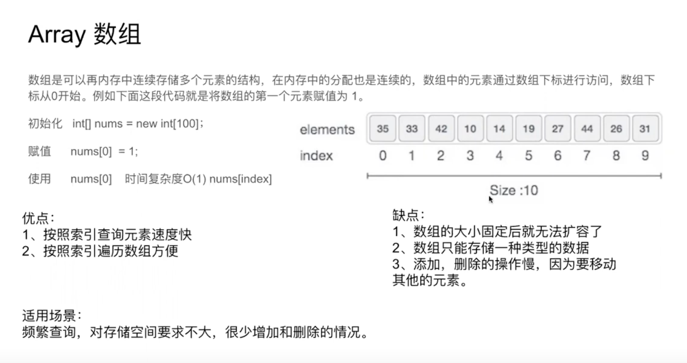

# 一. Array

## 1. 集合，列表，数组

| 集合：由一个或多个确定的元素所构成的整体                     | 元素类型不一定相同， 元素没有顺序 |
| :----------------------------------------------------------- | --------------------------------- |
| 列表：一种数据项构成的有限序列，即按照一定的线性顺序，排列而成的数据项的集合   (==数组和链表==) | 具有顺序，且长度是可变            |
| 数组： 列表的实现方式之一                                    | 与列表区别： 有索引 Index         |




## 2. 数组的操作

### 2.1 读取元素

通过访问索引的方式来读取，时间复杂度为O(1)

### 2.2 查找元素

##### 1）Linear Search

遍历数组，时间复杂度为O(N)

##### 2)Binary Search

### 2.3 插入元素

用链表 or

```java
for(int i = k; i > ...; i--){
  a[i+1] = a[i];
}
```

### 2.4 删除元素

需要1 + （n - 1) 步， 1为删除，n-1为移动其余元素。 O(N) N为array.length

考虑快慢双指针方法

##### 1)删除末尾元素

length --

##### 2)删除首位元素

```java
int[] nums = new int[]{};
for(int i = 1; i < nums.length; i++) {
		nums[i-1] = nums[i];
}
length --;
```

##### 3)删除任意位置

```java
int[] nums = new int[]{};
for (int i = m; i < nums.length; i++) {
  	nums[i-1] = nums[i];
}
length--;
```

### 2.5 In-Place Operations

It is this technique of working directly in the input Array, and *not* creating a new Array, that we call **in-place**. 将space complexity从O(N)变成了O(1).

双指针（快慢指针，左右指针）, 滑动窗口（left指针在后，right指针在前）

### 3. 字符串


##### 3.1 比较Compare

1. ==   在java中最好不用，因为会被用来比较两个对象是否为同一个对象，而不是是否相等

2. string.equals( )

##### 3.2 可变性

C++ 可变。 Java中不可变Immutable

##### 3.3 添加

直接用 string += "..."/  Java中很慢，O（n^2)

Solution: 

```java
//1.把string转变成char array
s = "xxxxx";
char[ ] chars = s.toCharArray( );
...
return new String(chars)
```

```java
//2. StringBuilder
StringBuilder str = new StringBuilder( );
str.append("...");
String s = str.toString();

```

