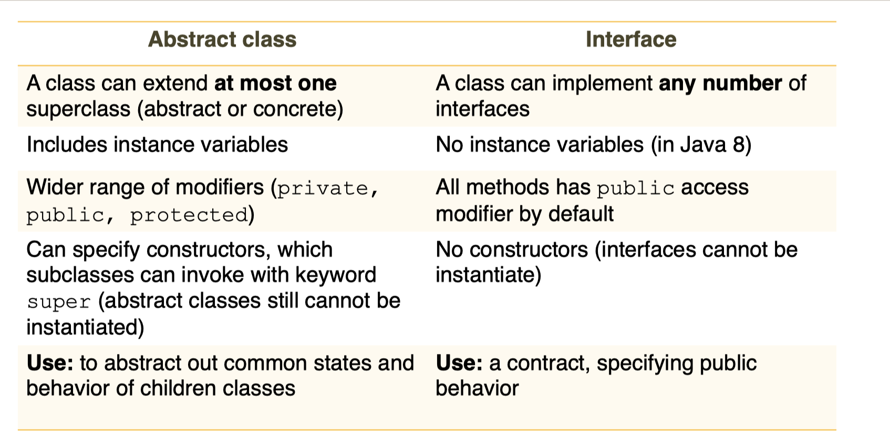

## 1) equals( )

```java
public boolean equals(Object o) {
    if (this == o) return true;
    if (!(o instanceof Athlete)) return false;
    Athlete athlete = (Athlete) o;
    return Objects.equals(getAthletesName(), athlete.getAthletesName()) &&
        Objects.equals(getHeight(), athlete.getHeight()) &&
        Objects.equals(getWeight(), athlete.getWeight()) &&
        Objects.equals(getLeague(), athlete.getLeague());
}
/**
这个方法用于比较两个对象是否相等。在这个例子中，它比较的是两个Athlete对象。
第一行 if (this == o) return true; 中的 this 代表当前对象，如果当前对象和传入的对象相同，就返回 true。
第二行 if (!(o instanceof Athlete)) return false; 中的 instanceof 判断传入的对象是否是 Athlete 类型，如果不是，就返回false。
第三行 Athlete athlete = (Athlete) o; 将传入的对象强制转换为 Athlete 类型。
最后，使用Objects.equals()方法来比较传入的对象的getAthletesName()、getHeight()、getWeight()和getLeague()方法的返回值是否和当前对象的相同。如果所有这些值都相同，则返回 true，否则返回 false。

注意：override equals()同时也需要重写hashCode()
*/
```

## 2) hashCode( )

```java
    @Override
    public int hashCode() {
        return Objects.hash(getAthletesName(), getHeight(), getWeight(), getLeague());
    }
/**
这段代码是在Athlete类中实现的hashCode方法。hashCode方法用于根据对象的内部状态生成唯一的整数值（“哈希码”）。该值可用于快速比较两个对象是否相等，并被各种Java集合（如HashMap和HashSet）用于有效组织和查找对象。

这个例子中的hashCode方法使用了Objects.hash方法，这是java.util.Objects类提供的实用程序方法。该方法采用任意数量的参数，并返回一个通过使用特定算法将所有参数的哈希码组合在一起而计算出的整数值。

在这种情况下，hash方法传递了四个参数: getAthletesName()，getHeight()，getWeight()，getLeague()方法的结果，这些方法是Athlete类的字段。这四个方法的结果被认为是Athlete类的内部状态，生成的哈希码将对这个特定状态是唯一的。
*/
```

**<u>如果父类已经重写了equals( )和hashCode( ), 继承它的子类们就不需要重写了。</u>**

只需要对子类（concrete class 没有子类的类)进行test， 包含它所继承的父类方法的test，父类不用重复test


