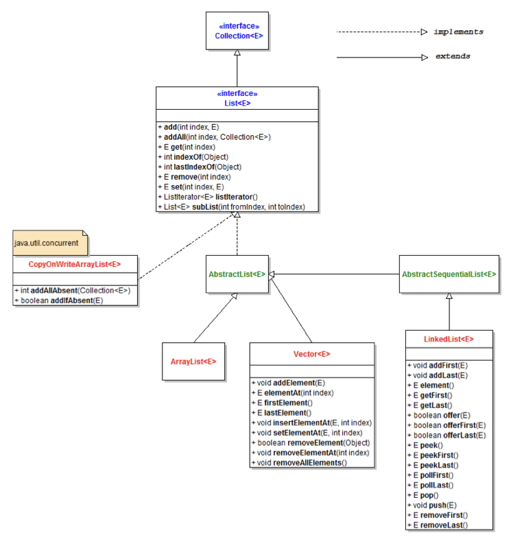
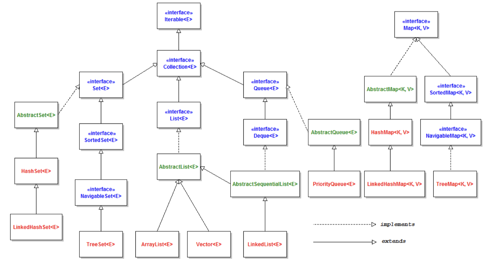

## 1) equals( )

```java
public boolean equals(Object o) {
    if (this == o) return true;
    if (!(o instanceof Athlete)) return false;
    Athlete athlete = (Athlete) o;
    return Objects.equals(getAthletesName(), athlete.getAthletesName()) &&
        Objects.equals(getHeight(), athlete.getHeight()) &&
        Objects.equals(getWeight(), athlete.getWeight()) &&
        Objects.equals(getLeague(), athlete.getLeague());
}
/**
这个方法用于比较两个对象是否相等。在这个例子中，它比较的是两个Athlete对象。
第一行 if (this == o) return true; 中的 this 代表当前对象，如果当前对象和传入的对象相同，就返回 true。
第二行 if (!(o instanceof Athlete)) return false; 中的 instanceof 判断传入的对象是否是 Athlete 类型，如果不是，就返回false。
第三行 Athlete athlete = (Athlete) o; 将传入的对象强制转换为 Athlete 类型。
最后，使用Objects.equals()方法来比较传入的对象的getAthletesName()、getHeight()、getWeight()和getLeague()方法的返回值是否和当前对象的相同。如果所有这些值都相同，则返回 true，否则返回 false。

注意：override equals()同时也需要重写hashCode()
*/
```

## 2) hashCode( )

```java
    @Override
    public int hashCode() {
        return Objects.hash(getAthletesName(), getHeight(), getWeight(), getLeague());
    }
/**
这段代码是在Athlete类中实现的hashCode方法。hashCode方法用于根据对象的内部状态生成唯一的整数值（“哈希码”）。该值可用于快速比较两个对象是否相等，并被各种Java集合（如HashMap和HashSet）用于有效组织和查找对象。

这个例子中的hashCode方法使用了Objects.hash方法，这是java.util.Objects类提供的实用程序方法。该方法采用任意数量的参数，并返回一个通过使用特定算法将所有参数的哈希码组合在一起而计算出的整数值。

在这种情况下，hash方法传递了四个参数: getAthletesName()，getHeight()，getWeight()，getLeague()方法的结果，这些方法是Athlete类的字段。这四个方法的结果被认为是Athlete类的内部状态，生成的哈希码将对这个特定状态是唯一的。
*/
```


子类有新的field时， 需要重写equals hashcode； 否则如果父类的equals,hashcode,tostring在子类中不变，👎子类可以不写

只需要对子类（concrete class 没有子类的类)进行test， 包含它所继承的父类方法的test，父类不用重复test

子类重写了父类的方法， 如果子类用了super.父类方法， 不用再测试父类方法

问题：

1） 哪里需要写equals, hashcode, tostring ： 比如父类已经写了，子类只是super. method( )有必要写出来吗：可以写

抽象类中可以写，子类继承或者重写。

2）哪些类需要测试， 可不可以把他们放在同一个test文件里； test文件几个，取什么名字；

所有的concrete class单独创建测试文件并进行测试

3）哪些方法需要测试， 比如父类和子类有同种方法， 或者子类重写了父类的方法

子类重写了父类方法，只需要测试子类的方法

4）exception 应该怎么写和测试

if else/ try catch都可以


## 3) Enum

```java
public enum ColorType {
    GREEN,
	RED;
}
public void equalOrNot() {
    ColorType s = ColorType.GREEN;

    if (s.equals(ColorType.GREEN)) {  //通常使用equals最佳
       	...
    }
    if (s == ColorType.RED) {
        ...
    }
}
```

## 4）Access Modifer

==父类base class (parent class, super class) private 的 methods和fields 都不会被子类 derived classes (child classes, subclasses)继承==

父类定义field时使用protected : 子类可以直接使用父类的fields

```java
public class Parent {
    protected String name;
}
public class Child extends Parent {
    public void printf {
        System.out.println(this.firstName);
        System.out.println(super.firstName);  //direct access
    }
}
```

父类定义field时使用private : 子类无法直接使用父类的fields, 需要用get( )方法调用

```java
public class Parent {
    private String name;
}
public class Child extends Parent {
    public void printf {
        System.out.println(this.getName());
        System.out.println(super.getName());  //non-direct access
    }
}
```

## 5） Abstract, Interface


## 6) ADT

一个client和ADT交互 -》 API (Application Programming Interface)

ADT = OBJECT Abstract + data OPERATIONS type = objec

分类一个ADT（抽象数据型）的操作：
1）**Creators：Creators能够通过一些必需的参数来构造一个新的对象，即从无到有。（构造器）**
2 **Producers：Producers能从一个对象产生一个新对象（相同的对象）。例如String的concat（）操作能够从两个 String中合并产生新的String。（生产器）**
3）**Observers：Observers通过观察一个抽象类型的对象来返回一个不同于观察对象的一个新对象。例如List的size（）。（观察器）**
4）**Mutators：用于改变对象属性的方法。例如List的add()。（变值器）**

==可变类型的例子：==
List：
creators：ArrayList 和LinkedList的constructor，Collections.singletonList。
producer：Collections.unmodifiable.List
observers：size，get
mutators：add，remove，Collections.sort

==不可变类型的例子：==
String：
creators：String constructor。
producer：concat，substring，toUpperCase。
observers：length。
mutators：没有。因为是不可变数据类型。

## 7）List

```java
// base interface 
List<E>
// Abstract subclasses
• AbstractList<E>  -- > ArrayList<E> // Concrete classes
• AbstractSequentialList<E> -- >  LinkedList<E>  //Concet class
// Main methods (base接口里的方法)
• E get(int index);
• E set(int index, E newValue);
• Void add(int index, E x);
• Void remove(int index);
• ListIterator<E> listIterator();
```



## 8）Java Collections



## 9) Polymorphism

**Static / compile-time** : 指将Java源代码转换为计算机可以运行的机器语言的过程。(Java compiler)

§ Method / constructor overloading : 必须使用不同的参数(数量/类型)

**Dynamic / runtime** : 当您编译的代码在IDE中或作为Java应用程序（JVM)实际运行时。

§ Subtype polymorphism – a result of inheritance § Includes method overriding

```java
Square square = new Square(5);
//第一个Square -- static compile time data type
//最后一个Square -- dynamic runtime data type
```

#### 1）Ad hoc polymorphism (特殊的多态) 

指多态函数可以填入不同类型的参数，根据不同类型的参数产生不同的行为。比如java中常见的方法重载(method overloading)就符合这个定义

https://wiyi.org/polymorphism-in-java.html

#### 2）Subtype polymorphism ”子类型多态”

subtyping是类型多态其中一种形式，它指的是**subtype(一种数据类型)和另一种数据类型(supertype)的一种可替换关系**。这意味着在我们的程序中，supertype的所有函数调用，可以被subtype完全替换。

举个例子，Java中的String完整实现了CharSequence，CharSequence的任何方法调用都可被String替换，那么我们可以说String is a subtype of CharSequence.

#### 3）subtyping和inheritance

子类型和继承是最容易被混淆的概念，实际上它们是完全独立的两个概念。subtyping是一种描述类型之间可替换关系的一种概念，而inheritance是一种代码复用的手段。对于满足subtypeing关系的类型，它们不一定存在inheritance关系，上面的String就是很好的例子。

#### 4) MATCH/STRENGTHEN/WEAKEN THE SPECIFICATION

match : 子类和父类的fields和methos一致  ==true subtype==

strength : 子类添加除父类外的额外f/m

weaken : 删除..

#### 5）Binding

Static binding 静态绑定，也称为编译时绑定，是在编译时就确定下来的。它通常用于静态方法和静态字段，即通过类名直接访问而不是通过实例。(compile time type)

Dynamic binding 动态绑定，也称为运行时绑定，是在运行时确定的。它通常用于实例方法和实例字段，即通过实例访问。动态绑定是 Java 中多态性的基础，因为它允许程序在运行时动态选择执行的方法。(runtime type)

* 当对象具有不同的compile-time and run-time types，只能访问compile-time类型的属性/方法

#### 6) check type and cast（转型）

```java
if (variable instanceof Sometype) {
    ...
}

// instanceof 会对多种types返回true
// 1. 任何对象都会自动继承Object类， 所以 Sometype = Object -> true
// 2. Sometype = 会返回true子类的父类 -〉 tr

// cast 向下转型，需要显示转型, 很危险需要检查
// 向上转型， 自动转型
Point2D point = new Point3D();
if (point instanceof Point3D) {  //只有在instanceof成立时才能转换
    Point3D newPoint = (Point3D) point; //cast 向下转型，需要显示转型；
}
```

## 10)

A parameter is a variable in the declaration of a function. An argument is the value of this variable that gets passed to the function.
