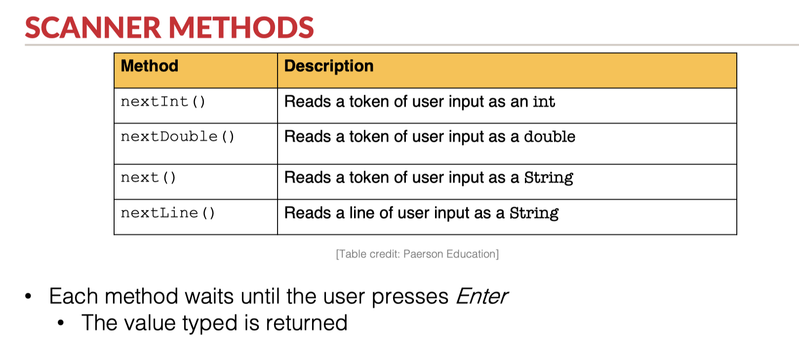
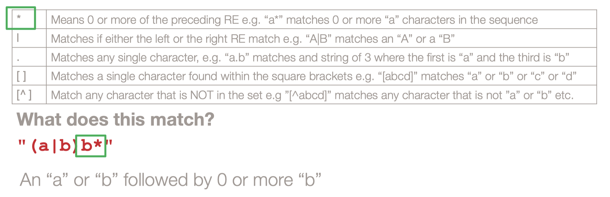
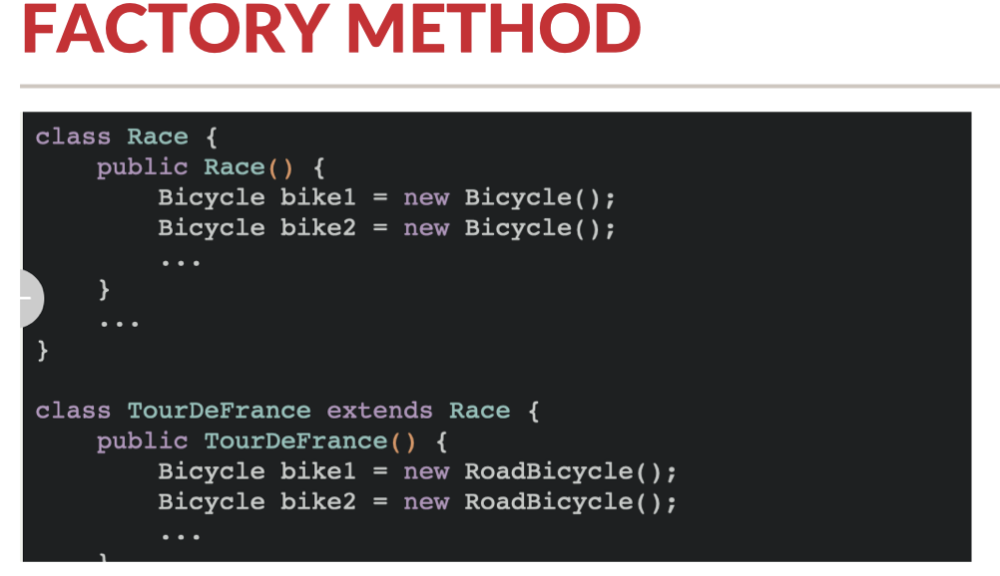
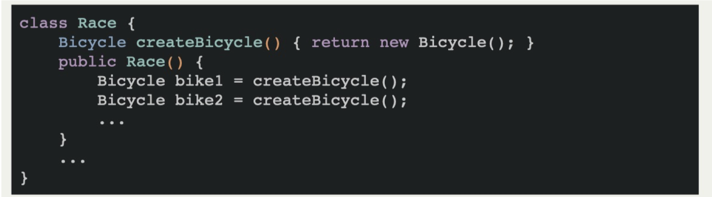
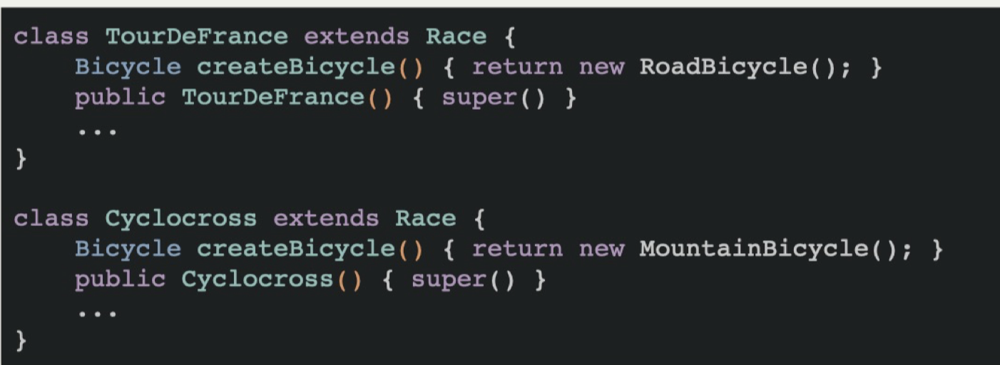
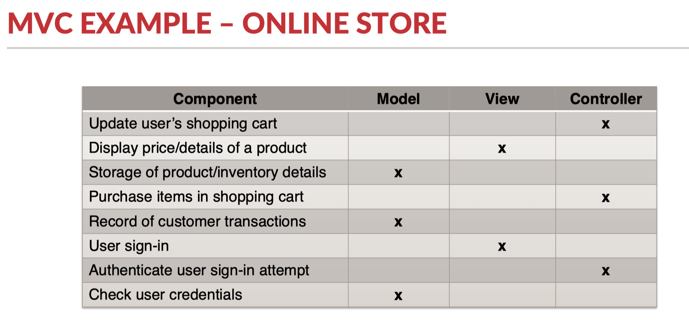
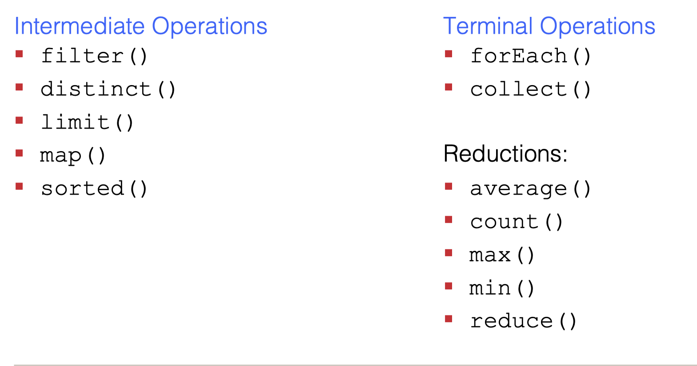

## 1) equals( )

```java
public boolean equals(Object o) {
    if (this == o) return true;
    if (!(o instanceof Athlete)) return false;
    Athlete athlete = (Athlete) o;
    return Objects.equals(getAthletesName(), athlete.getAthletesName()) &&
        Objects.equals(getHeight(), athlete.getHeight()) &&
        Objects.equals(getWeight(), athlete.getWeight()) &&
        Objects.equals(getLeague(), athlete.getLeague());
}
/**
这个方法用于比较两个对象是否相等。在这个例子中，它比较的是两个Athlete对象。
第一行 if (this == o) return true; 中的 this 代表当前对象，如果当前对象和传入的对象相同，就返回 true。
第二行 if (!(o instanceof Athlete)) return false; 中的 instanceof 判断传入的对象是否是 Athlete 类型，如果不是，就返回false。
第三行 Athlete athlete = (Athlete) o; 将传入的对象强制转换为 Athlete 类型。
最后，使用Objects.equals()方法来比较传入的对象的getAthletesName()、getHeight()、getWeight()和getLeague()方法的返回值是否和当前对象的相同。如果所有这些值都相同，则返回 true，否则返回 false。

注意：override equals()同时也需要重写hashCode()
*/
```

## 2) hashCode( )

```java
    @Override
    public int hashCode() {
        return Objects.hash(getAthletesName(), getHeight(), getWeight(), getLeague());
    }
/**
这段代码是在Athlete类中实现的hashCode方法。hashCode方法用于根据对象的内部状态生成唯一的整数值（“哈希码”）。该值可用于快速比较两个对象是否相等，并被各种Java集合（如HashMap和HashSet）用于有效组织和查找对象。

这个例子中的hashCode方法使用了Objects.hash方法，这是java.util.Objects类提供的实用程序方法。该方法采用任意数量的参数，并返回一个通过使用特定算法将所有参数的哈希码组合在一起而计算出的整数值。

在这种情况下，hash方法传递了四个参数: getAthletesName()，getHeight()，getWeight()，getLeague()方法的结果，这些方法是Athlete类的字段。这四个方法的结果被认为是Athlete类的内部状态，生成的哈希码将对这个特定状态是唯一的。
*/
```


子类有新的field时， 需要重写equals hashcode； 否则如果父类的equals,hashcode,tostring在子类中不变，👎子类可以不写

只需要对子类（concrete class 没有子类的类)进行test， 包含它所继承的父类方法的test，父类不用重复test

子类重写了父类的方法， 如果子类用了super.父类方法， 不用再测试父类方法

问题：

1） 哪里需要写equals, hashcode, tostring ： 比如父类已经写了，子类只是super. method( )有必要写出来吗：可以写

抽象类中可以写，子类继承或者重写。

2）哪些类需要测试， 可不可以把他们放在同一个test文件里； test文件几个，取什么名字；

所有的concrete class单独创建测试文件并进行测试

3）哪些方法需要测试， 比如父类和子类有同种方法， 或者子类重写了父类的方法

子类重写了父类方法，只需要测试子类的方法

4）exception 应该怎么写和测试

if else/ try catch都可以


## 3) Enum

```java
public enum ColorType {
    GREEN,
	RED;
}
public void equalOrNot() {
    ColorType s = ColorType.GREEN;

    if (s.equals(ColorType.GREEN)) {  //通常使用equals最佳
       	...
    }
    if (s == ColorType.RED) {
        ...
    }
}
```

## 4）Access Modifer

==父类base class (parent class, super class) private 的 methods和fields 都不会被子类 derived classes (child classes, subclasses)继承==

父类定义field时使用protected : 子类可以直接使用父类的fields

```java
public class Parent {
    protected String name;
}
public class Child extends Parent {
    public void printf {
        System.out.println(this.firstName);
        System.out.println(super.firstName);  //direct access
    }
}
```

父类定义field时使用private : 子类无法直接使用父类的fields, 需要用get( )方法调用

```java
public class Parent {
    private String name;
}
public class Child extends Parent {
    public void printf {
        System.out.println(this.getName());
        System.out.println(super.getName());  //non-direct access
    }
}
```

## 5) Abstract, Interface


## 6) ADT

一个client和ADT交互 -》 API (Application Programming Interface)

ADT = OBJECT Abstract + data OPERATIONS type = objec

分类一个ADT（抽象数据型）的操作：
1）**Creators：Creators能够通过一些必需的参数来构造一个新的对象，即从无到有。（构造器）**
2 **Producers：Producers能从一个对象产生一个新对象（相同的对象）。例如String的concat（）操作能够从两个 String中合并产生新的String。（生产器）**
3）**Observers：Observers通过观察一个抽象类型的对象来返回一个不同于观察对象的一个新对象。例如List的size（）。（观察器）**
4）**Mutators：用于改变对象属性的方法。例如List的add()。（变值器）**

==可变类型的例子：==
List：
creators：ArrayList 和LinkedList的constructor，Collections.singletonList。
producer：Collections.unmodifiable.List
observers：size，get
mutators：add，remove，Collections.sort

==不可变类型的例子：==
String：
creators：String constructor。
producer：concat，substring，toUpperCase。
observers：length。
mutators：没有。因为是不可变数据类型。

## 7）List

```java
// base interface 
List<E>
// Abstract subclasses
• AbstractList<E>  -- > ArrayList<E> // Concrete classes
• AbstractSequentialList<E> -- >  LinkedList<E>  //Concet class
// Main methods (base接口里的方法)
• E get(int index);
• E set(int index, E newValue);
• Void add(int index, E x);
• Void remove(int index);
• ListIterator<E> listIterator();
```


## 8）Java Collections


## 9) Polymorphism

**Static / compile-time** : 指将Java源代码转换为计算机可以运行的机器语言的过程。(Java compiler)

§ Method / constructor overloading : 必须使用不同的参数(数量/类型)

**Dynamic / runtime** : 当您编译的代码在IDE中或作为Java应用程序（JVM)实际运行时。

§ Subtype polymorphism – a result of inheritance § Includes method overriding

```java
Square square = new Square(5);
//第一个Square -- static compile time data type
//最后一个Square -- dynamic runtime data type
```

#### 1）Ad hoc polymorphism (特殊的多态) 

指多态函数可以填入不同类型的参数，根据不同类型的参数产生不同的行为。比如java中常见的方法重载(method overloading)就符合这个定义

https://wiyi.org/polymorphism-in-java.html

#### 2）Subtype polymorphism ”子类型多态”

subtyping是类型多态其中一种形式，它指的是**subtype(一种数据类型)和另一种数据类型(supertype)的一种可替换关系**。这意味着在我们的程序中，supertype的所有函数调用，可以被subtype完全替换。

举个例子，Java中的String完整实现了CharSequence，CharSequence的任何方法调用都可被String替换，那么我们可以说String is a subtype of CharSequence.

#### 3）subtyping和inheritance

子类型和继承是最容易被混淆的概念，实际上它们是完全独立的两个概念。subtyping是一种描述类型之间可替换关系的一种概念，而inheritance是一种代码复用的手段。对于满足subtypeing关系的类型，它们不一定存在inheritance关系，上面的String就是很好的例子。

#### 4) MATCH/STRENGTHEN/WEAKEN THE SPECIFICATION

match : 子类和父类的fields和methos一致  ==true subtype==

strength : 子类添加除父类外的额外f/m

weaken : 删除..

#### 5）Binding

Static binding 静态绑定，也称为编译时绑定，是在编译时就确定下来的。它通常用于静态方法和静态字段，即通过类名直接访问而不是通过实例。(compile time type)

Dynamic binding 动态绑定，也称为运行时绑定，是在运行时确定的。它通常用于实例方法和实例字段，即通过实例访问。动态绑定是 Java 中多态性的基础，因为它允许程序在运行时动态选择执行的方法。(runtime type)

* 当对象具有不同的compile-time and run-time types，只能访问compile-time类型的属性/方法

#### 6) check type and cast（转型）

```java
if (variable instanceof Sometype) {
    ...
}

// instanceof 会对多种types返回true
// 1. 任何对象都会自动继承Object类， 所以 Sometype = Object -> true
// 2. Sometype = 会返回true子类的父类 -〉 tr

// cast 向下转型，需要显示转型, 很危险需要检查
// 向上转型， 自动转型
Point2D point = new Point3D();
if (point instanceof Point3D) {  //只有在instanceof成立时才能转换
    Point3D newPoint = (Point3D) point; //cast 向下转型，需要显示转型；
}
```

## 10)

A parameter is a variable in the declaration of a function. An argument is the value of this variable that gets passed to the function.

## 11） Combine interface and abstract classes to suit the problem

```
An interface > one abstract class > concrete subclasses 

An interface > one high level abstract class > multiple lower level abstract classes > concrete subclasses 

One abstract class > concrete subclasses

One interface > concrete subclasses
```

## 12) Generics (Parametric polymophism) 泛型

```java
public class List<T> {
    private T[] elements;

    public void add(T element) {
        // 添加元素的代码
    }

    public T get(int index) {
        // 获取元素的代码
    }
}
在这个示例中，泛型类型参数 T 可以被任何数据类型替换，我们可以使用这个泛型列表类存储任何类型的数据，而不需要在每次使用时进行类型转换或者类型检查。
```

​	

```java
// how Java compiles generic placeholders (占位符) and wildcards（通配符 "*" "?"）
§ All placeholders and wildcards are replaced with either Object (if unbounded) or the bound class (if bounded) 
    
 <T> compiles as Object 
 <T extends AbstractAnimal> compiles as AbstractAnimal
```

## 13）I/O

##### 0) 传入args参数

```java
1.进入terminal，其下有main.java文件
2.输入 java main.java arg1 arg2 arg3 //输入了3个参数，空格间隔开
2.1 或者在intellij中选中文件点Run->Edit Configurations->手动输入parameters: arg1; arg2; arg3
```




```java
//1.导包
import java.util.Scanner;
//2. scanner
Scanner sc = new Scanner(System.in);
//3. 传参
int num = sc.nextInt();
```

##### 1）

==所有命令行(command line)参数都作为字符串(string)传递，您需要将它们转换为有效的格式==

##### 2）java中的input/output需要time & memory

==Stream oriented== -- IO

steam(流)是一段数据序列 a sequence of data

##### 3) BASIC FILE I/O STEPS

1. Create variables for input and output streams

2. Try to read/write a file line by line

3. Catch exceptions

4. Finally, close streams and clean up

##### 4) BufferReader

Reads text from a character-input stream, **buffering characters** to provide efficient reading of characters, arrays, and lines.

##### 5) TRY WITH RESOURCES

Automatically closes the reader (or writer) 

No need to set reader to null outside try-catch-finally 

No need for a finally block to close the reader

##### 6) FileWriter

把读取的内容写入一个新文件中

Instead of BufferedReader and FileReader -> **BufferedWriter with FileWriter** 

Instead of reader.readLine() -> **writer.write(“contents”)** 

Still need to catch same exceptions

Still need to close stream in finally block unless using try with resources

##### 7) NIO

```java
// Read / write all lines in a file at once
try {
	Path in = Paths.get(“somefile.csv”); 
    Path out = Paths.get(“somefile_out.csv”);
	List<String> lines = Files.readAllLines(in);
	Files.write(out, lines); 
} catch (NoSuchFileException nsf) {
	// handle the exception 
} catch (IOException ioe) {
	// handle the exception 
}
```

## 14) Regex 正则



```java
Pattern re1 = Pattern.compile("(a|b)b*"));
re1.matcher(<something>).mathches()  -> true or false
  //re1.matcher(<someString>) returns an instance of Matcher
//也可以写成：
Matcher m = re1.matcher(<something>);
m.mathches();

§ matches() – does the entire input string match the pattern exactly?
§ lookingAt() – does the pattern occur at the start of the input string? 
§ find() – does the pattern occur anywhere in the input string?
    
//用m.find()iterate through every occurrence of the pattern
while (m.find()) {
	System.out.println(test.substring(m.start(), m.end()); 
}
```

```java
//Common String methods using RegEx 
String.split(<regex>) - Splits a String into an array at every occurrence of <regex> 

String.replaceAll(<regex>, replace_with) - Replaces the first occurrence of <regex> with replace_with
```

```java
在CSV文件中，字段之间通常是由逗号分隔的。但是，如果某个字段本身包含逗号，则可以使用引号将该字段括起来，例如："field1","field2, with comma","field3"。

在这种情况下，读取CSV文件时，需要使用引号来解析包含逗号的字段。因此，在这段代码中，使用line.split("\",\"")将每一行的数据按照引号和逗号分隔，即将字段中包含的逗号作为一个整体来处理。由于双引号在Java中是特殊字符，因此在双引号前添加了反斜杠（\）来转义该字符，以确保在拆分字符串时正确解析字段。
```

## 15）Cohesion/Coupling

Object-oriented design seeks to maximize cohesion, while minimizing coupling

1. Cohesion（内聚性）：是指模块内部的各个元素（如类、函数等）之间的关联程度，即一个模块内各个元素是否紧密相关并有明确的目标。一个高内聚性的模块内的元素可以被视为在目标上紧密相关，它们一起执行某个特定的任务。较高的内聚性通常是优秀的设计目标，因为它可以提高模块的可重用性、可测试性和可维护性。
2. Coupling（耦合度）：是指模块之间的依赖关系，即一个模块对其他模块的影响程度。一个低耦合度的系统意味着一个模块的变化不会影响其他模块的状态。较低的耦合度通常是优秀的设计目标，因为它可以降低代码之间的相互影响和相互依赖，提高系统的可扩展性和可维护性。

## 16) Design Patterns

* Creational design patterns - focus on ways to create or control the creation of objects

* Structural design patterns - focus on object composition, relations between objects (e.g. inheritance), and relations between objects and the system as a whole

* Behavioral patterns - focus on improving or streamlining communication between objects



§问题：在每个Race子类中重新实现构造函数，以使用不同的Bicycle子类

§解决方案：使用Factory method来避免依赖特定的新类型Constructor中的Bicycle





## 17） MVC



* Model – typically talks to data source to retrieve and store data

For example:

A database table A file Some external API

* View - asks model for data, and presents it in a user-friendly format

For example:

Draws an application window with controls for interacting with the data Takes user input, and sends it to the controller

* Controller - listens for the user to change data or state in the UI, notifying the model, or view accordingly

 For example:

User clicks “next” button – tell view to load next screen

User submits form input – tell model to update the data

## 18）函数式编程

#### 1）Stream

```java
int total = IntStream.rangeClosed(1, 10)  //计算1-10
    .map((int x) -> {return x * 2;}) //所有元素 * 2   //intermediate operation 中间操作 lazy
	.sum();  //求和   //terminal operation 终端操作 eager 

int total = IntStream.rangeClosed(1, 20)
   				     .filter(x -> x%2 == 0)  //另一种filter写法
					 .sum();
```




#### 2) Lambdas

map() - takes a method, and applies it to every element in the stream

```java
(int x)->{return x*2;}
//等同于
int multiplyBy2(int x){
    return x * 2; 
}
```

####  3) Collectors

终端操作collect()将流的元素组合成单个object，例如Collection

```java
 Collectors.counting()  //计算stream中数据的数量

 Collectors.joining()   //把stream中的元素合并成一个String (指定的分隔符)

 Collectors.toList()  //将流中的元素放置到一个列表集合中去。这个列表默认为ArrayList

 Collectors.groupingBy() //
     
forEach() 将给定的方法应用于流的每个元素，该方法必须接收一个参数并返回void
```

