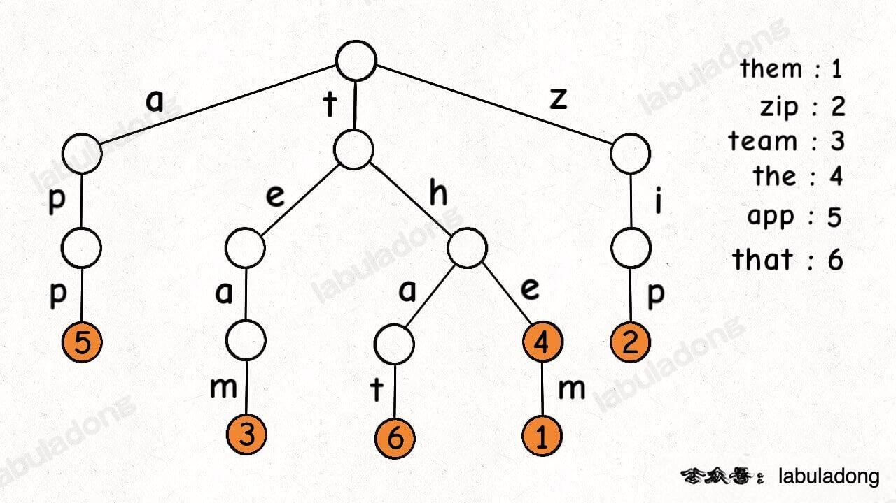

# 一. Array

## 1. 集合，列表，数组

| 集合：由一个或多个确定的元素所构成的整体                     | 元素类型不一定相同， 元素没有顺序 |
| :----------------------------------------------------------- | --------------------------------- |
| 列表：一种数据项构成的有限序列，即按照一定的线性顺序，排列而成的数据项的集合   (==数组和链表==) | 具有顺序，且长度是可变            |
| 数组： 列表的实现方式之一                                    | 与列表区别： 有索引 Index         |


## 2. 数组的操作

### 2.1 读取元素

通过访问索引的方式来读取，时间复杂度为O(1)

### 2.2 查找元素

##### 1）Linear Search

遍历数组，时间复杂度为O(N)

##### 2）Binary Search

O(log2N)

### 2.3 插入元素

用链表 or

```java
for(int i = k; i > ...; i--){
  a[i+1] = a[i];
}
```

### 2.4 删除元素

需要1 + （n - 1) 步， 1为删除，n-1为移动其余元素。 O(N) N为array.length

考虑快慢双指针方法

##### 1)删除末尾元素

length --

##### 2)删除首位元素

```java
int[] nums = new int[]{};
for(int i = 1; i < nums.length; i++) {
		nums[i-1] = nums[i];
}
length --;
```

##### 3)删除任意位置

```java
int[] nums = new int[]{};
for (int i = m; i < nums.length; i++) {
  	nums[i-1] = nums[i];
}
length--;
```

### 2.5 In-Place Operations

It is this technique of working directly in the input Array, and *not* creating a new Array, that we call **in-place**. 将space complexity从O(N)变成了O(1).

双指针（快慢指针，左右指针）, 滑动窗口（left指针在后，right指针在前）

### 2.6 常用Arrays. API

```java
Arrays.equals(int[] a, int[] b);
Arrays.fill(int[] num, int newLength) //复制制定数组的指定长度，并返回一个新数组
Arrays.copyOf()
    
Arrays.sort(int[] a);
//排序也可以用lambda, 比如只把数组按照某一index处的数字从小到大排序：
Arrays.sort(array, (n1,n2)->n1[0]-n2[0]); 

//截取[start, end]的子数组
Arrays.copyOfRange(array, startIdx, endIdx);
```


### 2.7 二维数组

```java
//遍历二维数组
int[][] nums;
for (int i = 0; i < nums.length; i++) {  //行数
    for (int j = 0; j < nums[i].length; j++) {  //某一行的列数
        nums[i][j].....
    }
}

//初始化二维数组
int[][] arr = new int[][]{};
int[][] arr = new int[m][n];
int[][] arr2 = {{1,2,3},{4,5,6}};
```


### 3. String


##### 3.1 比较Compare

1. ==   在java中最好不用，因为会被用来比较两个对象是否为同一个对象，而不是是否相等

2. string.equals( )

##### 3.2 可变性

C++ 可变。 Java中不可变Immutable

##### 3.3 添加

直接用 string += "..."/  Java中很慢，O（n^2)

Solution: 

```java
//1.把string转变成char array
s = "xxxxx";
char[ ] chars = s.toCharArray( );
...
return new String(chars)  //把char数组变成String返回
return new String(chars, left, right)  // 把chars里index（left,right)作为string返回
```

```java
//2. StringBuilder
StringBuilder str = new StringBuilder( );  //一个动态变化的String
str.append("...");
str.deleteCharAt(num); //删除索引处字符
String s = str.toString(); //转换成String输出
str.reverse();  //翻转sb
```

##### 3.4 常用api

```java
String str = "abc";
String s = "5";
str.length(); //长度
str.charAt(int index)//获取索引处的字符
str.toCharArray() //将字符串转换为字符数组返回
str.substring(int beginIndex. int endIndex)//根据索引截取字符串，左闭右开
str.replace(oldtarget, newreplacement) //使用新值把字符串的旧值替换掉
str.split(String regex) //根据传入的规则切割字符串（比如根据" "空格分割），得到字符串数组返回Str
str.contains("a") //判断是否含有某个字符串， 不能输入'a'字符形式
    
//1. 把数字字符串转变为对应的数字
int num = Integer.valueOf(s);  // num = 5, 
int num = Integer.parseInt(s) //同上
    
//2. 把其他类型的数据转换成string （可以转int，可以转数组）
String str = String.valueOf(1); // 1 -> "1"

//3.直接把数组转换成字符串形式
char[] arr  = {"b","c","a"};
//3.1 使用String.valueOf()
String str = String.valueOf(arr); // arr -> "bca"
//3.2 使用String的构造器
String str = new String(arr); 

//4.把单个字符转换成int
char c = '5';
int num = c - '0';  //类型强转 ASCII

char c2 = 'b';
int num2 = c2 - 'a';

//5.把int转换成对应的字符
char c3 = (char) (num + '0');
char c4 = (char) (num2 + 'a');
```

### 4. ArrayList

```java
//需要返回一个长度不确定的数组时, 动态数组
ArrayList<Integer> res = new ArrayList<>();

//需要一个数组，其对象是ArrayList<Integer>，即index对应的value可能有多个int组成的集合
ArrayList<Integer>[] lst = new ArrayList[length];
//此时不是用int[] lst = new int[length]， 因为它的index只能对应1个int

res.add(Element e)； //增加指定元素到列表尾部
res.addAll(ArrayList aList);  //将指定集合中的所有元素添加到本集合中
res.clear();	//从列表中删除所有元素.
res.remove(int index);	//删除列表中指定位置的元素.
res.get(int index);		//获取列表中指定位置处的元素.
res.contains(Object o); //如果列表包含指定元素，返回true
res.isEmpty() //返回true表示链表中没有任何元素
res.size()  //返回列表长度（列表包含元素的个数）
res.set(index, num)  //把index处的数字替换成num
    
// iterator() 迭代器
res.add(1);
res.add(2);
Iterator<Integer> it = res.iterator() //获取res的迭代器
//迭代器 it 的两个基本操作是 next 、hasNext 和 remove。
//调用 it.next() 会返回迭代器的下一个元素，并且更新迭代器的状态。
//调用 it.hasNext() 用于检测集合中是否还有元素。
//调用 it.remove() 将迭代器返回的元素删除。
while (it.hasNext()) {
    System.out.println(it.next());
}


// 把ArrayList/LinkedList转换成Array输出技巧
public int[ ] get(int[] nums) {
    ArrayList<Integer> res = new ArrayList<>();
	......
    return res.toArray(new int[nums.length]);
}

```

### 5.  List<List<...>>

```java
//需要返回List<List<String>>时， 意为以字符串数组组成的数组
// 1. 用map.vaules()放在ArrayList里返回 。  lc : 49/249
HashMap<String, List<String>> map = new HashMap<>(); //可以这样定义map
for (String s : strings) {
    String newS = convert(s);  //转变
    map.putIfAbsent(newS, new ArrayList()); //空则放入一个ArrayList初始化
    map.get(newS).add(s);  //把s归类放到对应的newS-key的数组ArrayList-value中去
}
return new ArrayList(map.values()); //把map值全输出并放在AL中，即是要求的返回模式
//定义一个方法convert把String转换成某一种统一格式， 一般可以用字符做差的方法

// 2.定义一个相同格式的res, 然后返回  lc : 3sum/4sum
List<List<String>> res = new ArrayList<>();
//直接添加3次
res.add("ab"); 
res.add("cd"); 
res.add("ef"); 
//或者一次性添加
res.add(new ArrayList<String>(Arrays.asList("ab", "cd", "ef")));
//只添加一个
res.add(new ArrayList("ab"));
res.add(new ArrayList<Integer>());
//添加res指定index处元素
res.get(index).add(100);
return res;

//注意：若在某个递归方法中，需要把某个List<String> partOfRes 添加到结果res中记录，
//不能直接 res.add(partOfRes), 因为这样会给res添加对partOfRes的reference(饮用)， 该值在后续的
//循环迭代中会被继续修改从而出现错误。应该每次添加到res时创建一个新的partOfRes副本： (lc46)
res.add(new ArrayList(partOfRes)); 

//如果是：
List<String> track = new LinkedList<>(); //不能用removeLast()
//必须是
LinkedList<String> track = new LinkedList<>();
track.removeLast(); //事先定义LinkedList才能调用的API
```


# 二. LinkedList


### 1. 单链表


所有节点按照顺序排列。 若要查询某个元素，只能从头节点（head node) 开始逐个遍历。 O(n) 。

使用head note代表整个list。一般定义头节点为 哨兵节点（==Sentinel==) ，可以简化插入和删除，不包含任何数据,

很多时候偶操作链表时头节点的操作和剩余节点的操作方式不同，添加Sentinel可以使所有操作同步，返回Sentinel.next


#### 1）add

O(1) time . 不需要移动其他元素

```java
// 如要在 index 处插入 val
ListNode pred = head;
for (int i = 0; i < index； i++) {
    pred = pred.next;   //找到index-1即为 predecessor
}
size ++; //添加一个节点
ListNode toAdd = new ListNode(val); //定义添加节点
toAdd.next = pred.next;
pred.next = toAdd;
```


#### 2）delete

用cur找next方便，找prev需要从头遍历， time O(N),  space O(1)

```java
// 删除 index 处的节点
ListNode cur = head;
for(int i = 0; i < index; i++) {
    cur = cur.next;
}
size--;
cur.next = cur.next.nextt
```


若要删除head node, 只需要将第二个node赋予成head. 因为head node可以代表整个list

#### 3)    get

查找的效率比数组低，因为需要从头便利，  O（N)

```java
// 查询 index 处的value
ListNode cur = head;
for (int i = 0; i <= index; i++) {
    cur = cur.next;
}
return cur.val;
```


### 2. 双链表


```java
//初始化双链表
class DLL {
    int size;
    ListNode head, tail;
    public DLL() {
        size = 0;
        head = new ListNode(0);
        tail = new ListNode(0);
        head.next = tail;
        tail.prev = head;       
    }
}

class DLL {
    int val;
    DLL prev, next;
    public DLL(int v) { //有参构造器
        val = v;
        prev = null;
        next = null;
    }
}
```


#### 1）add

```java
//找到需要添加val位置前面的pred和后面的succ, 二者相邻
ListNode pred, succ;  //predecessor 和 successor
if (index < size - index) { 	// index离左边近， 从左往右遍历
    pred = head;
    for (int i = 0; i < index; i++) { pred = pred.next; }
    succ = pred.next;
}else {
    succ = tail;
    for (int i = size - 1; i >= index; i--) { succ = succ.prev; }
    pred = succ.prev;
}
size++; //添加新位置
ListNode toAdd = new ListNode(val); //新节点
toAdd.prev = pred;
toAdd.next = succ;
pred.next = toAdd;
succ.prev = toAdd;  //四个重要操作， 链接新节点
```

#### 2）delete

```java
//找到要删除节点index前后pred和succ。 pred, index, succ
ListNode prev, succ;
if (index < size - index) {
    pred = head;
    for (int i = 0; i < index; i++) { pred = pred.next; }
    succ = pred.next.next; //succ在pred后两格
}else {
    succ = tail;
    for (int i = size - 1; i > index; i--) { succ = succ.prev;} //注意此刻i > index 无等号
    pred = succ.prev.prev;
}
size--; //节点减1
pred.next = succ;
succ.prev = pred;  //重要的两步
```

#### 3）get

```java
//还是判断index离哪侧近
ListNode cur;
if (index < size - index) { //从左边开始遍历
    cur = head;
    for (int i = 0; i <= index; i++) { cur = cur.next;}
}else {
    cur = tail;
    for (int i = size - 1; i >= index; i--) { cur = cur.prev;}
}
return cur.val;
```


#### 4） reverse

```java
//翻转整个链表head
ListNode pred = null; 
ListNode cur = head; //操作CUR，不影响HEAD
while (cur != null) {
    ListNode nextCur = cur.next;
    cur.next = pred;
    pred = cur;
    cur = nextCur;
}
```


### 3. 循环链表


### 4. 性能分析


### 5. 定义链表

```java
// Java
public class ListNote {
    int val;  //结点的值
    ListNote next; //下一个结点
    ListNote prev; //双链表 1 value + 2 links 分别指向前后nodes
        
    public ListNote() { } // 1. 无参构造器
    
    public ListNote(int val) {
        this.val = val;   // 2.一个参数的有参构造器
    }
    
    public ListNote(int val, ListNote next) {
        this.val = val;
        this.next = next;   // 3. 两个参数
    }
}
```

# 三. Hash Table

### 1.  HashSet

a `set` data structure to store `no repeated values`.  没有重复

通常用于检查一个value是否存在

```java
public class Main {
    public static void main(String[] args) {
        // 1. initialize the hash set
        Set<Integer> hashSet = new HashSet<>();     
        // 2. add a new key
        hashSet.add(3);
        hashSet.add(2);
        hashSet.add(1);
        // 3. remove the key
        hashSet.remove(2);        
        // 4. check if the key is in the hash set
        if (!hashSet.contains(2)) {
            System.out.println("Key 2 is not in the hash set.");
        }
        // 5. get the size of the hash set
        System.out.println("The size of has set is: " + hashSet.size());     
        // 6. iterate the hash set， 加强for-each遍历
        for (Integer i : hashSet) {
            System.out.print(i + " ");
        }
        System.out.println("are in the hash set.");
        // 7. clear the hash set
        hashSet.clear();
        // 8. check if the hash set is empty
        if (hashSet.isEmpty()) {
            System.out.println("hash set is empty now!");
        }
    }
}
```


### 2. HashMap

a `map` data structure to store `(key, value)` pairs.

**当我们遇到了要快速判断一个元素是否出现集合里的时候，就要考虑哈希法**。

但是哈希法也是**牺牲了空间换取了时间**，因为我们要使用额外的数组，set或者是map来存放数据，才能实现快速的查找。

如果在做面试题目的时候遇到需要判断一个元素是否出现过的场景也应该第一时间想到哈希法！

```java
public class Main {
    public static void main(String[] args) {
        // 1. initialize a hash map
        Map<Integer, Integer> hashmap = new HashMap<>();
        // 2. insert a new (key, value) pair
        hashmap.putIfAbsent(0, 0);
        hashmap.putIfAbsent(2, 3);
        // 3. insert a new (key, value) pair or update the value of existed key
        hashmap.put(1, 1);
        hashmap.put(1, 2);
        // 4. get the value of specific key
        hashmap.get(1);
        // 5. delete a key
        hashmap.remove(2);
        // 6. check if a key is in the hash map
        if (!hashmap.containsKey(2)) {
        }
        // 7. get the size of the hash map
        hashmap.size(); 
        // 8. iterate the hash map
        for (Map.Entry<Integer, Integer> entry : hashmap.entrySet()) {
            System.out.print("(" + entry.getKey() + "," + entry.getValue() + ") ");
        }
        // 9. clear the hash map
        hashmap.clear();
        // 10. check if the hash map is empty
        if (hashmap.isEmpty()) {
        }
    }
}

*** // 用ArrayList<>() 作为val时
HashMap<Integer, ArrayList<Integer>> map = new HashMap<>();
for (int i = 0; i < nums.length; i++) {
    map.putIfAbsent(nums[i], new ArrayList()); //必须新建
    map.get(nums[i]).add(i);
}
```

#### 1) Design the key


数独游戏9 x 9大方块中有9个3 x 3个小方块

# 四. Queue & Stack

### 1. Queue

==First-in-First-out==


```java
public class Main {
    public static void main(String[] args) {
        // 1. Initialize a queue.
        Queue<Integer> q = new LinkedList();
        // 2. Get the first element - return null if queue is empty.
        System.out.println("The first element is: " + q.peek());
        // 3. Push new element.
        q.offer(5);
        q.offer(13);
        q.offer(8);
        q.offer(6);
        // 4. Pop an element.
        q.poll();
        // 5. Get the first element.
        System.out.println("The first element is: " + q.peek());
        // 7. Get the size of the queue.
        System.out.println("The size is: " + q.size());
    }
}
```


#### 1.1） Deque 双端队列 Java

|                    | Queue                  | Deque                           |
| :----------------- | :--------------------- | ------------------------------- |
| 添加元素到队尾     | add(E e) / offer(E e)  | addLast(E e) / offerLast(E e)   |
| 取队首元素并删除   | E remove() / E poll()  | E removeFirst() / E pollFirst() |
| 取队首元素但不删除 | E element() / E peek() | E getFirst() / E peekFirst()    |
| 添加元素到队首     | 无                     | addFirst(E e) / offerFirst(E e) |
| 取队尾元素并删除   | 无                     | E removeLast() / E pollLast()   |
| 取队尾元素但不删除 | 无                     | E getLast() / E peekLast()      |


### 2. Stack

==Last-in-First-out==


```java
public class Main {
    public static void main(String[] args) {
        // 1. Initialize a stack.
        Stack<Integer> s = new Stack<>();
        // 2. Push new element.
        s.push(5);
        s.push(13);
        s.push(8);
        s.push(6);
        // 3. Check if stack is empty.
        if (s.empty() == true) {
            System.out.println("Stack is empty!");
            return;
        }
        // 4. Pop an element.
        s.pop();
        // 5. Get the top element.
        System.out.println("The top element is: " + s.peek());
        // 6. Get the size of the stack.
        System.out.println("The size is: " + s.size());
    }
}
```


# 五. Binary Tree

```java
//定义一棵树
public class TreeNode {
    int val;
    TreeNode left;
    TreeNode right;
    
    TreeNode () {}  
    TreeNode (int val) { this.val = val; }
    TreeNode (int val, TreeNode left, TreeNode right) {
        this.val = val;
        this.left = left;
        this.right = right;
    }
}
```


### 0）高度和深度

- 二叉树节点的深度：指从根节点到该节点的最长简单路径边的条数。
- 二叉树节点的高度：指从该节点到叶子节点的最长简单路径边的条数。
- leetcode上按照节点数量来计算


### 1) DFS : depth-first-search 深度优先遍历

**这里前中后，其实指的就是中间节点的遍历顺序**，只要大家记住 前中后序指的就是中间节点的位置就可以了。

看如下中间节点的顺序，就可以发现，中间节点的顺序就是所谓的遍历方式。 递归/迭代

- 前序遍历：中左右
- 中序遍历：左中右
- 后序遍历：左右中


### 2）BFS: breadth-first-search 广度优先遍历

层次遍历（迭代）一般用队列来实现

### 3）Full Binary Tree 满二叉树

如果一棵二叉树只有度为0的结点和度为2的结点，并且度为0的结点在同一层上，则这棵二叉树为满二叉树。


### 4) Complete Binary Tree 完全二叉树

它是一棵空树或者它的叶子节点只出在最后两层，若最后一层不满则叶子节点只在最左侧。若最底层为第 h 层，则该层包含 1~ 2^(h-1)  个节点。


### 5) Binary  Search Tree 二叉搜索树

​	二叉搜索树是一个有数值的有序树

- 若它的左子树不空，则左子树上所有结点的值均 <= 它的根结点的值；
- 若它的右子树不空，则右子树上所有结点的值均 >= 它的根结点的值；
- 它的左、右子树也分别为二叉排序树

==中序遍历==在BST中会得到一个==升序==的结果， 所以很常用


```java
void BST(TreeNode root, int target) {
    if (root.val == target)
        // 找到目标，做点什么
    if (root.val < target) 
        BST(root.right, target);
    if (root.val > target)
        BST(root.left, target);
}
```


### 6）Balanced Binary Tree 平衡二叉搜索树

它是一棵空树或它的左右两个子树的高度差的绝对值不超过1，并且左右两个子树都是一棵平衡二叉树。


# 六. Priority Queue & Heap

==A priority queue is an abstract data type (ADT), while a Heap is a data structure==

用数组/链表实现PQ时，tc和sc只能O(1)/O(N) (或者反过来）;   用Heap实现PQ可以使tc和sc都为O(logN)， 取得最大/最小元素的tc为O(1).  ==Heap的底层是数组最合适==

### 1) Max/Min Heap

==最小堆：1. 必定是完全二叉树 ； 2. 每个节点的val <= 子节点们的val==

==最大堆：1. 必定是完全二叉树 ； 2. 每个节点的val >= 子节点们的val==


```java
// 父节点的索引
int parent(int root) {
    return root / 2;
}
// 左孩子的索引
int left(int root) {
    return root * 2;
}
// 右孩子的索引
int right(int root) {
    return root * 2 + 1;
}

//上述情况是二叉堆从index = 1开始的情况

//如果是在一个数组中构建二叉堆index从0开始， 则是如下算法：
在一个完全二叉树中，编号为i的节点的左儿子编号为2i+1，右儿子编号为2i+2，父节点编号为(i-1)/2。
```


### 2) Swim & Sink

```java
// swim上浮 （max heap)
private void swim(int x) {
    // 如果浮到堆顶，就不能再上浮了
    while (x > 1 && less(parent(x), x)) {
        // 如果第 x 个元素比上层大
        // 将 x 换上去
        swap(parent(x), x);
        x = parent(x);
    }
}

// sink下沉 （max heap)
private void sink(int x) {
    // 如果沉到堆底，就沉不下去了
    while (left(x) <= size) {
        // 先假设左边节点较大
        int max = left(x);
        // 如果右边节点存在，比一下大小
        if (right(x) <= size && less(max, right(x)))
            max = right(x);
        // 结点 x 比俩孩子都大，就不必下沉了
        if (less(max, x)) break;
        // 否则，不符合最大堆的结构，下沉 x 结点
        swap(x, max);
        x = max;
    }
}
```

### 3) Insertion & Deletion

```java
// 注意： PQ从index 1开始, 而不是0
//insert 方法先把要插入的元素添加到堆底的最后，然后让其上浮到正确位置,
public void insert(Key e) {
    size++;
    // 先把新元素加到最后
    pq[size] = e;
    // 然后让它上浮到正确的位置
    swim(size);
}

//delete 方法先把堆顶元素 A 和堆底最后的元素 B 对调，然后删除 A，最后让 B 下沉到正确位置。
public Key delete(Key e) {
    // 最大堆的堆顶就是最大元素
    Key max = pq[1]; //删除最大元素并返回其值
    // 把这个最大元素换到最后，删除之
    swap (1, size);
    pq[size] = null;
    size--;
    // 让 pq[1] 下沉到正确位置
    sink(1);
    return max;
}

至此，一个优先级队列就实现了，插入和删除元素的时间复杂度为 O(logK)，K 为当前二叉堆（优先级队列）中的元素总数。因为我们时间复杂度主要花费在 sink 或者 swim 上，而不管上浮还是下沉，最多也就树（堆）的高度，也就是 log 级别。
```

### 4) Java中的heap

Java里的heap默认是==升序的最小堆==，可直接用pq定义

```java
//默认最小堆
PriorityQueue<Integer> heap = new PriorityQueue<>();
//入堆
heap.add(1);
//出堆
heap.poll();
heap.remove();
//大小
heap.size();

// 创建pq时，其元素根据指定的比较器（Comparator) 排序。
// public PriorityQueue(Comparator<? super E> comparator)
PriorityQueue<Integer> heap = new PriorityQueue<>((n1,n2)->n1-n2)); //最小堆，如果n1小于n2，将返回一个负数，这意味着n1小于n2，并将n1移动到堆的顶部

//最大堆实现：
PriorityQueue<Integer> heap = new PriorityQueue<>((n1,n2)->n2-n1)); 
//或者
PriorityQueue<Integer> heap = new PriorityQueue<>(Comparator.reverseOrder())；

//还可以放数组，比较每个数组index 0处的大小，最小堆。  lc378， 253
PriorityQueue<int[]> heap = new PriorityQueue<>((n1,n2)->n1[0]-n2[0])); 
//这段用了lambda表达式，完整版应该是：
PriorityQueue<int[]> heap = new PriorityQueue<>(new Comparator<int[]>() {
    @Override
    public int compare(int[] n1, int[] n2) {
        return n1[0] - n2[0];
    }
});

//排序也可以用lambda, 比如只把数组按照某一index处的数字从小到大排序：
Arrays.sort(array, (n1,n2)->n1[0]-n2[0]); 
Arrays.sort(array, (n1,n2)->Integer.compare(n1[0],n2[0]); //防止long溢出
Arrays.sort(array, (n1,n2)-> {  //防止数据溢出
      if(n1[0]>n2[0]) return 1;
      if(n1[0]<n2[0]) return -1;
      return 0;
}); 
```

# 七. Trie (Prefix tree)

前缀树/字典树

```java
/* Trie 树节点实现 */
class TrieNode<V> {
    V val = null;  // val 存储键对应的值
    TrieNode<V>[] children = new TrieNode[256]; //children 数组存储指向子节点的指针
}
*** TrieNode 中 children 数组的索引是有意义的，代表键中的一个字符。 ***
    如children[97] is true, --> 存储了一个字符'a'， 其ASCII码为97
 
```


特别注意，TrieNode 节点本身只存储 val 字段，并没有一个字段来存储字符，字符是通过子节点在父节点的 children 数组中的索引确定的。

==形象理解就是，Trie 树用「树枝」存储字符串（键），用「节点」存储字符串（键）对应的数据（值)==

#### 1）构造trie

```java
class TrieNode {    //lc208 构造trie
    boolean isEnd; //有时候可以替换成其他数据结构,只要能在结束点进行记录/标记即可
    TrieNode[] children = new TrieNode[26];
    public Trie() {} //默认无参构造器，可以不写
}

class Trie {
    public TrieNode root;
    public Trie() {
        root = new TrieNode();//默认无参构造器
    }
    
    public void insert(String word) {
        TrieNode curr = this.root;
        for (char c : word.toCharArray()) {
            int index = c - 'a';
            //未有过的字符，新建
            if (curr.children[index] == null) {
                curr.children[index] = new TrieNode();
            }
            //已经有过的字符，遍历往后走
            curr = curr.children[index];
        }
        curr.isEnd = true; //单词结尾标记
    }
    
    public boolean search(String word) {
        TrieNode curr = this.root;
        for (char w : word.toCharArray()) {
            int idx = w - 'a';
            //word还没走完，其中某个字符没被记录，直接false
            if (curr.children[idx] == null) {
                return false;
            }
            //往后走
            curr = curr.children[idx];
        }
        return curr.isEnd; //判断word走完后的结尾字符是否之前已经被存储标记
    }
    
    public boolean startsWith(String prefix) {
        TrieNode curr = this.root;
        for (char pre : prefix.toCharArray()) {
            int idx = pre - 'a';
            //找不到当前前缀字符，false
            if (curr.children[idx] == null) {
                return false;
            }
            curr = curr.children[idx];
        }
        //只要能顺利走完，不需要验证是否isEnd， 因为必然有>=该前缀的字符串被存储过
        return true;
    }
}

```

# 八. Graph

#### 1) 定义


```java
/* 图节点的逻辑结构 */
//1.节点 Vertex
class Vertex {  
    int id;  
    Vertex[] neighbors;  //
}

//2.边 Edge
两个节点之间的连接
  
//3.路径 Path  （两节点间可能有多个路径）
从一个节点到另一个节点的节点序列（sequence of vertices)
//4.路径长度 Path Length
路径中edges的数量 （节点序列中节点数-1）
//5.环 Cycle
起点和终点是同一节点的路径
    
//6.Degree 度
每个节点相连的边的条数。
对于有向图： indegree 入度 ，outdegree 出度

```


#### 2）邻接表/矩阵 Adjancey list/matrix


```java
1.有向图
// 邻接表 : 占用空间少，但无法快速判断两个节点是否相邻（adjancent) determine
// graph[x] 存储 x 的所有邻居节点
List<Integer>[] graph;

// 邻接矩阵 : 快速判断两个节点是否相邻
// matrix[x][y] 记录 x 是否有一条指向 y 的边
boolean[][] matrix;

// 邻接表构建有向图
    public List<Integer>[] buildGraph(int num, int[][] edges) {
        List<Integer>[] graph = new LinkedList[num]; //注意是链表数组
        for (int i = 0; i < numCourses; i++) {
            graph[i] = new LinkedList<>(); //默认必须加上list
        }
        
        for (int[] prerequisite : prerequisites) { //指向
            int from = edges[1], to = edges[0];
            graph[from].add(to);
        }
        return graph;
    }
```


```java
2.有向加权图
// 邻接表
// graph[x] 存储 x 的所有邻居节点以及对应的权重
List<int[]>[] graph;

// 邻接矩阵
// matrix[x][y] 记录 x 指向 y 的边的权重，0 表示不相邻，其他数字表示权重
int[][] matrix;
 
3.无向图  //相当于双向图，构建时双向添加两次即可
    如果连接无向图中的节点 x 和 y，把 matrix[x][y] 和 matrix[y][x] 都变成 true 就行了；邻接表也是类似的操作，在 x 的邻居列表里添加 y，同时在 y 的邻居列表里添加 x。
```


#### 3）二分图  Bipartite graph

**用两种颜色将图中的所有顶点着色，且使得任意一条边的两个端点的颜色都不相同， 即为二分图**


#### 4） 并查集 Union-Find (Disjoint-set)

```java
class UF {
    /* 将 p 和 q 连接 */
    public void union(int p, int q);
    /* 判断 p 和 q 是否连通 */
    public boolean connected(int p, int q);
    /* 返回图中有多少个连通分量 */
    public int count();
}
```

##### 1）构造

**1. 设定树的每个节点有一个指针指向其父节点，如果是根节点的话，这个指针指向自己 。如果某两个节点被连通，则让其中的（任意）一个节点的根节点接到另一个节点的根节点上**：

**2. 这样，如果节点 `p` 和 `q` 连通的话，它们一定拥有相同的根节点**


`connected` 和 `union` 中的复杂度都是 `find` 函数造成的，三者复杂度都与find一致。

这种情况的find从某个节点向上遍历到树根，时间复杂度就是树的高度。但时间复杂度最优是平衡二叉树O(logN),

最坏情况tree会退化成linkedlist, 此时三个方法的时间复杂度都会是 O(N) ，太慢。


##### 2）平衡优化：

头重脚轻的情况：


==解决方法是额外使用一个 `size` 数组，记录每棵树包含的节点数，称为<重量>==

通过比较树的重量，把重量小的树的root接到较大树的root下面，就可以保证树的生长相对平衡，树的高度大致在 `logN` 这个数量级，极大提升执行效率。

此时，`find` , `union` , `connected` 的时间复杂度都下降为==O(logN)==，即便数据规模上亿，所需时间也非常少


##### 3) 路径压缩

**其实我们并不在乎每棵树的结构长什么样，只在乎根节点**。树上的每个节点的根节点都是相同的，所以能不能进一步压缩每棵树的高度，使树高始终保持为常数 ？这样每个节点的父节点就是整棵树的根节点，`find` 就能以 O(1) 的时间找到某一节点的根节点，相应的，`connected` 和 `union` 复杂度都下降为 O(1)。

 ==路径压缩就没有必要使用size平衡优化了==

```java
// 路径压缩的 find 方法
public int find(int x) {
    if (parent[x] != x) {
        parent[x] = find(parent[x]); //压缩法2，效率更高
    }
    return parent[x];
}
```


##### 4）最终写法

```java
class UF {
    // 连通分量个数
    private int count;
    // 存储每个节点的父节点
    private int[] parent;

    // n 为图中节点的个数
    public UF(int n) {
        this.count = n;
        parent = new int[n];
        for (int i = 0; i < n; i++) {
            parent[i] = i; //根节点的parent指向自己
        }
    }
    
    // 将节点 p 和节点 q 连通
    public void union(int p, int q) {
        int rootP = find(p);
        int rootQ = find(q);
        
        if (rootP == rootQ) //注意！0-1,0-2已经union；若要union(1,2)，此时的1，2已经connected
            return;			//应当直接跳过，因为1，2的root相同，且两者union时count也不会变
            
        parent[rootQ] = rootP;
        // 两个连通分量合并成一个连通分量
        count--;
    }

    // 判断节点 p 和节点 q 是否连通
    public boolean connected(int p, int q) {
        int rootP = find(p);
        int rootQ = find(q);
        return rootP == rootQ;
    }

    public int find(int x) {  //返回根节点的值
        if (parent[x] != x) { //当前节点的父节点在更上方
            parent[x] = find(parent[x]);  //路径压缩，往上找直到找到根节点
        }
        return parent[x];
    }

    // 返回图中的连通分量个数
    public int count() {
        return count;
    }
}
```

# 九. LRU

Least Recently Used

##### 1.手动造轮子

```java
// 1. 双链表节点
class Node {
    int key, val;
    Node prev, next;
    public Node(int k, int v) {
        this.key = k;
        this.val = v;
    }
}
// 2.双向链表
class DoubleList {
    Node head, tail;
    int size;
    public DoubleList() {
        head = new Node(0,0);
        tail = new Node(0,0);
        head.next = tail;
        tail.prev = head;
        size = 0;
    }
    public void addLast(Node x) {
        tail.prev.next = x;
        x.prev = tail.prev;
        x.next = tail;
        tail.prev = x;
        size ++;
    }
    public void remove(Node x) {
        x.prev.next = x.next;
        x.next.prev = x.prev;
        size--;
    }
    //移除第一个Node并将其返回
    public Node removeFirst() {
        if (head.next == tail) {
            return null;
        }
        Node target = head.next;
        remove(target);
        return target;
    }
}

// 3.LRU cache主体
    // key -> Node(key,val)
    HashMap<Integer, Node> map;
    // Node(k1,v1) <-> Node(k2,v2) ...
    DoubleList cache;
    int cap;
    public LRUCache(int capacity) {
        map = new HashMap<>();
        cache = new DoubleList();
        cap = capacity;
    }
    
    public int get(int key) {
        if (!map.containsKey(key)) {
            return -1;
        }
        // 更新target为最近使用的（双链表结尾）
        Node targetNode = map.get(key);
        cache.remove(targetNode);
        cache.addLast(targetNode);
        return targetNode.val;
    }
    
    public void put(int key, int value) {
        Node newNode = new Node(key,value);
        //1.已有该key
        if (map.containsKey(key)){
            //1.先删除历史位置的key
            Node nodeToDelete = map.get(key);
            map.remove(key);
            cache.remove(nodeToDelete);
            //2.将替换过的值添加到map和双链表结尾
            map.put(key,newNode);
            cache.addLast(newNode);
            return; //结束
        }
        //2.链表已满，移除第一个即为LRU
        if (cache.size == cap) {
            Node nodeToRemove = cache.removeFirst();
            map.remove(nodeToRemove.key);
        }
        //3.添加新的节点
        map.put(key, newNode);
        cache.addLast(newNode);
    }

```

##### 2. Java 的内置类型 `LinkedHashMap`

```java
 int cap;
    LinkedHashMap<Integer,Integer> cache = new LinkedHashMap<>();

    public LRUCache(int capacity) {
        cap = capacity;
    }
    
    public int get(int key) {
        if (!cache.containsKey(key)) {
            return -1;
        }
        makeRecentlyUse(key);
        return cache.get(key);
    }
    
    public void put(int key, int value) {
        if (cache.containsKey(key)) {
            cache.put(key, value);
            makeRecentlyUse(key);
            return;
        }
        if (cache.size() == cap) {
            //迭代器找到最久未使用的节点并删除
            int lruNode = cache.keySet().iterator().next();
            cache.remove(lruNode);
        }
        cache.put(key, value);
    }
    //私有方法， 删除老的key 并重新添加自动挪到最末尾
    private void makeRecentlyUse(int key) {
        int val = cache.get(key);
        cache.remove(key);
        cache.put(key, val);
    }
```

# 七. Trie (Prefix tree) 

前缀树/字典树

```java
/* Trie 树节点实现 */
class TrieNode<V> {
    V val = null;  // val 存储键对应的值
    TrieNode<V>[] children = new TrieNode[256]; //children 数组存储指向子节点的指针
}
*** TrieNode 中 children 数组的索引是有意义的，代表键中的一个字符。 ***
    如children[97] is true, --> 存储了一个字符'a'， 其ASCII码为97
 
```


特别注意，TrieNode 节点本身只存储 val 字段，并没有一个字段来存储字符，字符是通过子节点在父节点的 children 数组中的索引确定的。

==形象理解就是，Trie 树用「树枝」存储字符串（键），用「节点」存储字符串（键）对应的数据（值)==

#### 1）构造trie

```java
class TrieNode {    //lc208 构造trie
    boolean isEnd;
    TrieNode[] children = new TrieNode[26];
}

class Trie {
    public TrieNode root;
    public Trie() {
        root = new TrieNode();//默认无参构造器
    }
    
    public void insert(String word) {
        TrieNode curr = this.root;
        for (char c : word.toCharArray()) {
            int index = c - 'a';
            //未有过的字符，新建
            if (curr.children[index] == null) {
                curr.children[index] = new TrieNode();
            }
            //已经有过的字符，遍历往后走
            curr = curr.children[index];
        }
        curr.isEnd = true; //单词结尾标记
    }
    
    public boolean search(String word) {
        TrieNode curr = this.root;
        for (char w : word.toCharArray()) {
            int idx = w - 'a';
            //word还没走完，其中某个字符没被记录，直接false
            if (curr.children[idx] == null) {
                return false;
            }
            //往后走
            curr = curr.children[idx];
        }
        return curr.isEnd; //判断word走完后的结尾字符是否之前已经被存储标记
    }
    
    public boolean startsWith(String prefix) {
        TrieNode curr = this.root;
        for (char pre : prefix.toCharArray()) {
            int idx = pre - 'a';
            //找不到当前前缀字符，false
            if (curr.children[idx] == null) {
                return false;
            }
            curr = curr.children[idx];
        }
        //只要能顺利走完，不需要验证是否isEnd， 因为必然有>=该前缀的字符串被存储过
        return true;
    }
}

```

