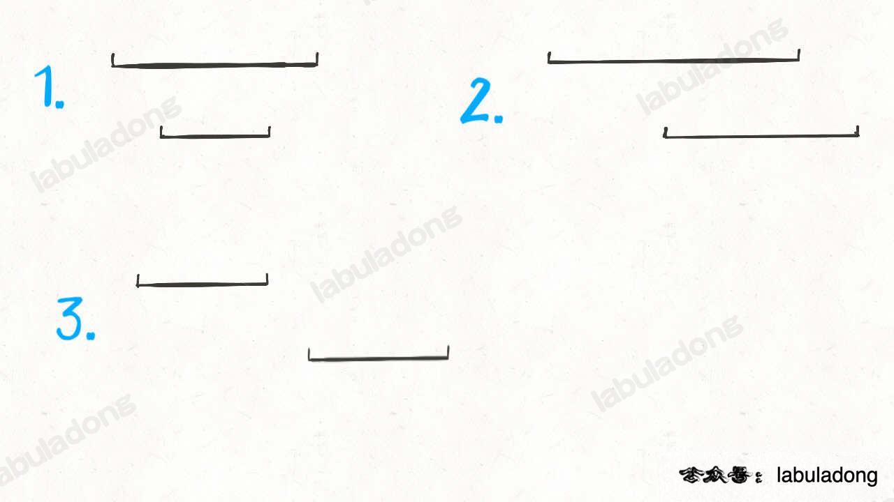

读完本文，你不仅学会了算法套路，还可以顺便解决如下题目：

|                           LeetCode                           |                             力扣                             | 难度 |
| :----------------------------------------------------------: | :----------------------------------------------------------: | :--: |
| [56. Merge Intervals](https://leetcode.com/problems/merge-intervals/) | [56. 合并区间](https://leetcode.cn/problems/merge-intervals/) |  🟠   |
| [986. Interval List Intersections](https://leetcode.com/problems/interval-list-intersections/) | [986. 区间列表的交集](https://leetcode.cn/problems/interval-list-intersections/) |  🟠   |
| [1288. Remove Covered Intervals](https://leetcode.com/problems/remove-covered-intervals/) | [1288. 删除被覆盖区间](https://leetcode.cn/problems/remove-covered-intervals/) |  🟠   |

**-----------**

经常有读者问区间相关的问题，今天写一篇文章，秒杀三道区间相关的问题。

所谓区间问题，就是线段问题，让你合并所有线段、找出线段的交集等等。主要有两个技巧：

**1、排序**。常见的排序方法就是按照区间起点排序，或者先按照起点升序排序，若起点相同，则按照终点降序排序。当然，如果你非要按照终点排序，无非对称操作，本质都是一样的。

**2、画图**。就是说不要偷懒，勤动手，两个区间的相对位置到底有几种可能，不同的相对位置我们的代码应该怎么去处理。

废话不多说，下面我们来做题。

### 区间覆盖问题

这是力扣第 1288 题「删除被覆盖区间」，看下题目：


题目问我们，去除被覆盖区间之后，还剩下多少区间，**那么我们可以先算一算，被覆盖区间有多少个，然后和总数相减就是剩余区间数**。

对于这种区间问题，如果没啥头绪，首先排个序看看，比如我们按照区间的起点进行升序排序：


排序之后，两个相邻区间可能有如下三种相对位置：



对于这三种情况，我们应该这样处理：

对于情况一，找到了覆盖区间。

对于情况二，两个区间可以合并，成一个大区间。

对于情况三，两个区间完全不相交。

依据几种情况，我们可以写出如下代码：

Copy

```java
int removeCoveredIntervals(int[][] intvs) {
    // 按照起点升序排列，起点相同时降序排列
    Arrays.sort(intvs, (a, b) -> {
        if (a[0] == b[0]) {
            return b[1] - a[1];
        }
        return a[0] - b[0]; 
    });

    // 记录合并区间的起点和终点
    int left = intvs[0][0];
    int right = intvs[0][1];

    int res = 0;
    for (int i = 1; i < intvs.length; i++) {
        int[] intv = intvs[i];
        // 情况一，找到覆盖区间
        if (left <= intv[0] && right >= intv[1]) {
            res++;
        }
        // 情况二，找到相交区间，合并
        if (right >= intv[0] && right <= intv[1]) {
            right = intv[1];
        }
        // 情况三，完全不相交，更新起点和终点
        if (right < intv[0]) {
            left = intv[0];
            right = intv[1];
        }
    }

    return intvs.length - res;
}
```

以上就是本题的解法代码，起点升序排列，终点降序排列的目的是防止如下情况：


对于这两个起点相同的区间，我们需要保证长的那个区间在上面（按照终点降序），这样才会被判定为覆盖，否则会被错误地判定为相交，少算一个覆盖区间。

### 区间合并问题

力扣第 56 题「区间合并」就是一道相关问题，题目很好理解：


我们解决区间问题的一般思路是先排序，然后观察规律。

一个区间可以表示为 `[start, end]`，前文 [区间调度问题](https://labuladong.github.io/article/fname.html?fname=贪心算法之区间调度问题) 需要按 `end` 排序，以便满足贪心选择性质。

而对于区间合并问题，其实按 `end` 和 `start` 排序都可以，不过为了清晰起见，我们选择按 `start` 排序：


**显然，对于几个相交区间合并后的结果区间 `x`，`x.start` 一定是这些相交区间中 `start` 最小的，`x.end` 一定是这些相交区间中 `end` 最大的**：


由于已经排了序，`x.start` 很好确定，求 `x.end` 也很容易，可以类比在数组中找最大值的过程：

Copy

```java
int max_elem = arr[0];
for (int i = 1; i < arr.length; i++) 
    max_elem = max(max_elem, arr[i]);
return max_elem;
```

然后就可以写出完整代码

Copy

```python
# intervals 形如 [[1,3],[2,6]...]
def merge(intervals):
    if not intervals: return []
    # 按区间的 start 升序排列
    intervals.sort(key=lambda intv: intv[0])
    res = []
    res.append(intervals[0])

    for i in range(1, len(intervals)):
        curr = intervals[i]
        # res 中最后一个元素的引用
        last = res[-1]
        if curr[0] <= last[1]:
            # 找到最大的 end
            last[1] = max(last[1], curr[1])
        else:
            # 处理下一个待合并区间
            res.append(curr)
    return res
```


### 区间交集问题

力扣第 986 题「区间列表的交集」就是这个问题：


题目很好理解，就是让你找交集，注意区间都是闭区间。

解决区间问题的思路一般是先排序，以便操作，不过题目说已经排好序了，那么可以用两个索引指针在 `A` 和 `B` 中游走，把交集找出来，代码大概是这样的：

Copy

```python
# A, B 形如 [[0,2],[5,10]...]
def intervalIntersection(A, B):
    i, j = 0, 0
    res = []
    while i < len(A) and j < len(B):
        # ...
        j += 1
        i += 1
    return res
```

不难，我们先老老实实分析一下各种情况。

首先，**对于两个区间**，我们用 `[a1, a2]` 和 `[b1, b2]` 表示在 `A` 和 `B` 中的两个区间，那么什么情况下这两个区间**没有交集**呢：


只有这两种情况，写成代码的条件判断就是这样：

Copy

```python
if b2 < a1 or a2 < b1:
    [a1,a2] 和 [b1,b2] 无交集
```

那么，什么情况下，两个区间存在交集呢？根据命题的否定，上面逻辑的否命题就是存在交集的条件：

Copy

```python
# 不等号取反，or 也要变成 and
if b2 >= a1 and a2 >= b1:
    [a1,a2] 和 [b1,b2] 存在交集
```

接下来，两个区间存在交集的情况有哪些呢？穷举出来：


这很简单吧，就这四种情况而已。那么接下来思考，这几种情况下，交集是否有什么共同点呢？


我们惊奇地发现，交集区间是有规律的！如果交集区间是 `[c1, c2]`，那么 `c1 = max(a1, b1)`，`c2 = min(a2 ,b2)`！这一点就是寻找交集的核心，我们把代码更进一步：

Copy

```python
while i < len(A) and j < len(B):
    a1, a2 = A[i][0], A[i][1]
    b1, b2 = B[j][0], B[j][1]
    if b2 >= a1 and a2 >= b1:
        res.append([max(a1, b1), min(a2, b2)])
    # ...
```

最后一步，我们的指针 `i` 和 `j` 肯定要前进（递增）的，什么时候应该前进呢？


结合动画示例就很好理解了，是否前进，只取决于 `a2` 和 `b2` 的大小关系：

Copy

```python
while i < len(A) and j < len(B):
    # ...
    if b2 < a2:
        j += 1
    else:
        i += 1
```

以此思路写出代码：

Copy

```python
# A, B 形如 [[0,2],[5,10]...]
def intervalIntersection(A, B):
    i, j = 0, 0 # 双指针
    res = []
    while i < len(A) and j < len(B):
        a1, a2 = A[i][0], A[i][1]
        b1, b2 = B[j][0], B[j][1]
        # 两个区间存在交集
        if b2 >= a1 and a2 >= b1:
            # 计算出交集，加入 res
            res.append([max(a1, b1), min(a2, b2)])
        # 指针前进
        if b2 < a2: j += 1
        else:       i += 1
    return res
```

总结一下，区间类问题看起来都比较复杂，情况很多难以处理，但实际上通过观察各种不同情况之间的共性可以发现规律，用简洁的代码就能处理。