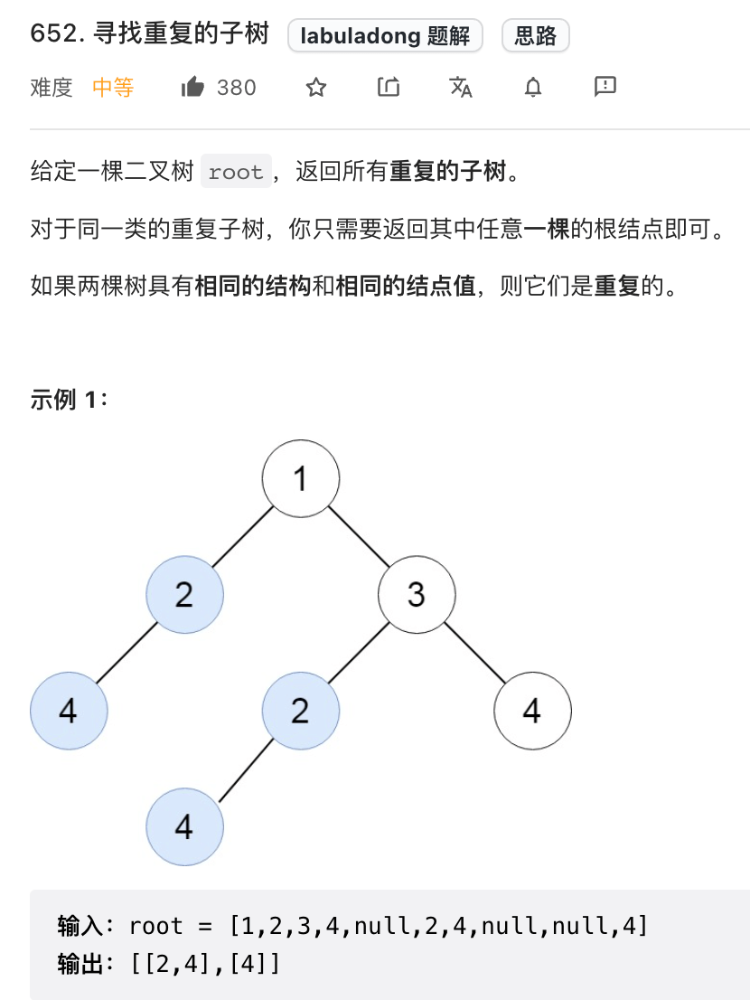
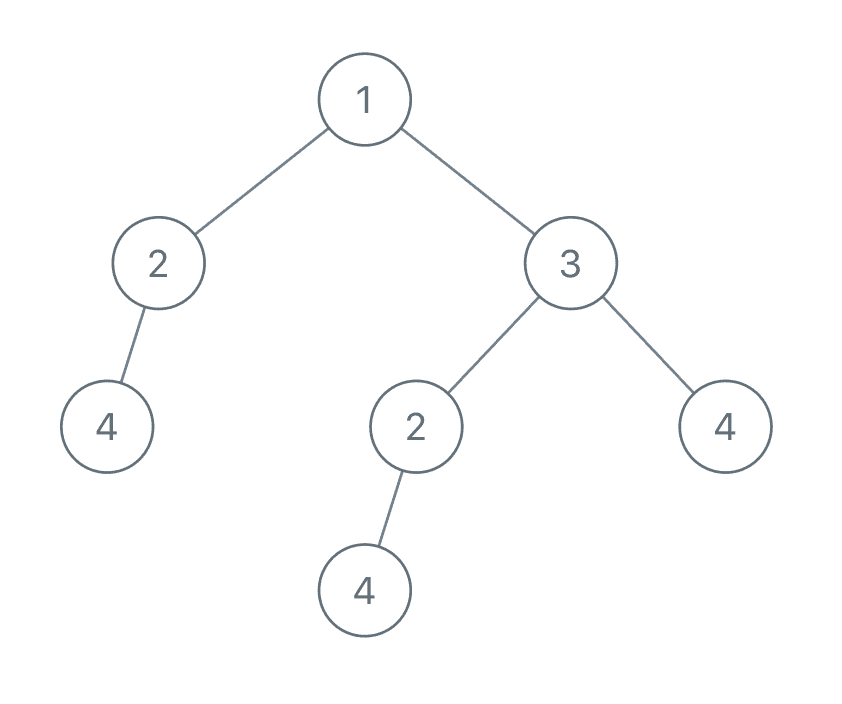
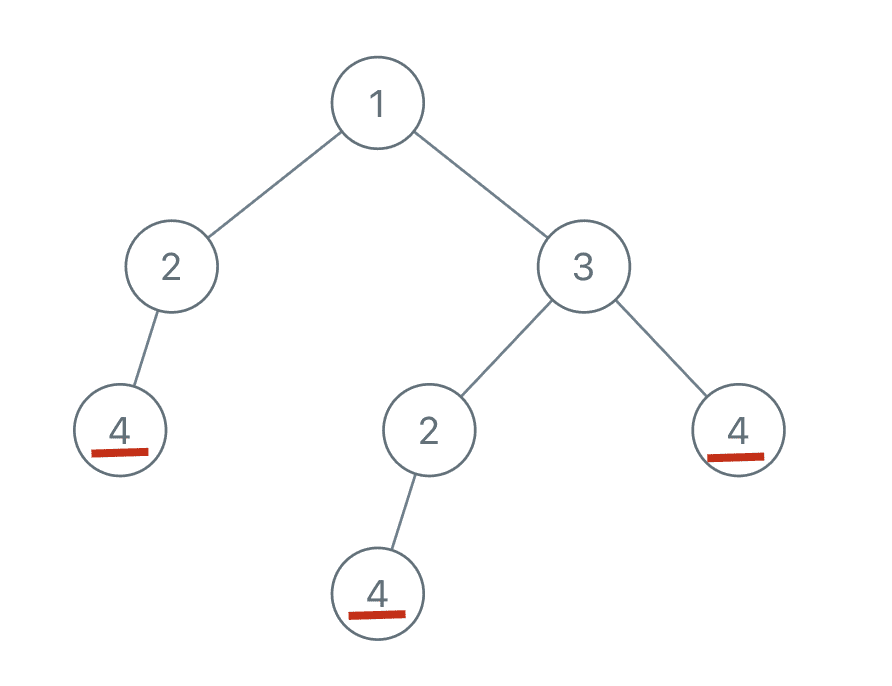
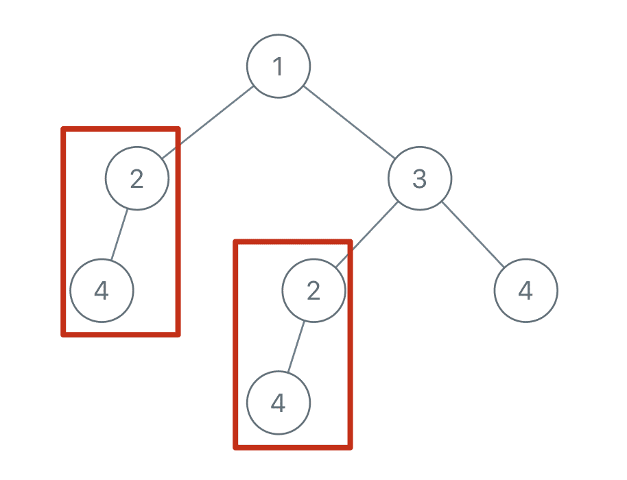
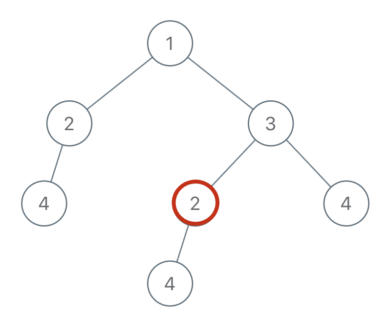

读完本文，你不仅学会了算法套路，还可以顺便解决如下题目：

|                           LeetCode                           |                             力扣                             | 难度 |
| :----------------------------------------------------------: | :----------------------------------------------------------: | :--: |
| [652. Find Duplicate Subtrees](https://leetcode.com/problems/find-duplicate-subtrees/) | [652. 寻找重复的子树](https://leetcode.cn/problems/find-duplicate-subtrees/) |  🟠   |

**-----------**

本文是承接 [东哥带你刷二叉树（纲领篇）](https://appktavsiei5995.pc.xiaoe-tech.com/detail/i_63a84ecde4b030cacaff6731/1) 的第四篇文章，主要讲二叉树后序位置的妙用，复述下前文关于后序遍历的描述：

> 前序位置的代码只能从函数参数中获取父节点传递来的数据，而后序位置的代码不仅可以获取参数数据，还可以获取到子树通过函数返回值传递回来的数据。
>
> **那么换句话说，一旦你发现题目和子树有关，那大概率要给函数设置合理的定义和返回值，在后序位置写代码了**。

多说无益，我们直接看题，这是力扣第 652 题「寻找重复的子树」：



函数签名如下：

Copy

```java
List<TreeNode> findDuplicateSubtrees(TreeNode root);
```

我来简单解释下题目，输入是一棵二叉树的根节点 `root`，返回的是一个列表，里面装着若干个二叉树节点，这些节点对应的子树在原二叉树中是存在重复的。

说起来比较绕，举例来说，比如输入如下的二叉树：



首先，节点 4 本身可以作为一棵子树，且二叉树中有多个节点 4：



类似的，还存在两棵以 2 为根的重复子树：



那么，我们返回的 `List` 中就应该有两个 `TreeNode`，值分别为 4 和 2（具体是哪个节点都无所谓）。

这题咋做呢？**还是老套路，先思考，对于某一个节点，它应该做什么**。

比如说，你站在图中这个节点 2 上：



如果你想知道以自己为根的子树是不是重复的，是否应该被加入结果列表中，你需要知道什么信息？

**你需要知道以下两点**：

**1、以我为根的这棵二叉树（子树）长啥样**？

**2、以其他节点为根的子树都长啥样**？

这就叫知己知彼嘛，我得知道自己长啥样，还得知道别人长啥样，然后才能知道有没有人跟我重复，对不对？好，那我们一个一个来看。

**首先来思考，我如何才能知道以自己为根的这棵二叉树长啥样**？

其实想到这里，就可以判断本题需要在二叉树的后序位置写代码了。

为什么？很简单呀，我要知道以自己为根的子树长啥样，是不是得先知道我的左右子树长啥样，再加上自己，就构成了整棵子树的样子？左右子树的样子，可不就得在后序位置通过递归函数的返回值传递回来吗？

如果你还绕不过来，我再来举个非常简单的例子：计算一棵二叉树有多少个节点。这个代码应该会写吧：

Copy

```java
int count(TreeNode root) {
    if (root == null) {
        return 0;
    }
    // 先算出左右子树有多少节点
    int left = count(root.left);
    int right = count(root.right);
    // 后序位置，子树加上自己，就是整棵二叉树的节点数
    int res = left + right + 1;
    return res;
}
```

这不就是标准的后序遍历框架嘛，和我们本题在本质上没啥区别对吧。

现在，明确了要用后序遍历，那应该怎么描述一棵二叉树的模样呢？我们前文 [序列化和反序列化二叉树](https://appktavsiei5995.pc.xiaoe-tech.com/detail/i_62987967e4b0812e17a1c2f7/1) 其实写过了，二叉树的前序/中序/后序/层序遍历结果可以描述二叉树的结构。

那么，我就以后序遍历结果作为序列化结果吧，可以通过拼接字符串的方式把二叉树序列化，看下代码：

Copy

```java
// 定义：输入以 root 为根的二叉树，返回这棵树的序列化字符串
String serialize(TreeNode root) {
    // 对于空节点，可以用一个特殊字符表示
    if (root == null) {
        return "#";
    }
    // 将左右子树序列化成字符串
    String left = serialize(root.left);
    String right = serialize(root.right);
    /* 后序遍历代码位置 */
    // 左右子树加上自己，就是以自己为根的二叉树序列化结果
    String myself = left + "," + right + "," + root.val;
    return myself;
}
```

我们用非数字的特殊符 `#` 表示空指针，并且用字符 `,` 分隔每个二叉树节点值，这属于序列化二叉树的套路了，不多说。

注意我们 `myself` 是按照左子树、右子树、根节点这样的顺序拼接字符串，也就是后序遍历顺序。因为我们这里的目的是通过序列化唯一描述一棵二叉树的结构，所以你也可以用前序顺序来拼接字符串，但是注意不能用中序顺序，具体原因参见前文 [序列化和反序列化二叉树](https://appktavsiei5995.pc.xiaoe-tech.com/detail/i_62987967e4b0812e17a1c2f7/1) 的总结。

这样，我们第一个问题就解决了，对于每个节点，递归函数中的 `myself` 变量就可以描述以该节点为根的二叉树。

**现在我们解决第二个问题，我知道了自己长啥样，怎么知道别人长啥样**？这样我才能知道有没有其他子树跟我重复对吧。

这很简单呀，我们借助一个外部数据结构，让每个节点把自己子树的序列化结果存进去，这样，对于每个节点，不就可以知道有没有其他节点的子树和自己重复了么？

初步思路可以使用 `HashSet` 记录所有子树的序列化结果，代码如下：

Copy

```java
// 记录所有子树
HashSet<String> subTrees = new HashSet<>();
// 记录重复的子树根节点
LinkedList<TreeNode> res = new LinkedList<>();

String serialize(TreeNode root) {
    if (root == null) {
        return "#";
    }

    // 左右子树的序列化结果
    String left = serialize(root.left);
    String right = serialize(root.right);

    // 后序位置，计算以自己为根的二叉树序列化结果
    String myself = left + "," + right+ "," + root.val;
    if (subTrees.contains(myself)) {
        // 有人和我重复，把自己加入结果列表
        res.add(root);
    } else {
        // 暂时没人跟我重复，把自己加入子树集合
        subTrees.add(myself);
    }
    return myself;
}
```

但是呢，这有个问题，如果出现多棵重复的子树，结果集 `res` 中必然出现重复，而题目要求不希望出现重复。

为了解决这个问题，可以把 `HashSet` 升级成 `HashMap`，额外记录每棵子树的出现次数：

Copy

```java
class Solution {
    // 记录所有子树以及出现的次数
    HashMap<String, Integer> subTrees = new HashMap<>();
    // 记录重复的子树根节点
    LinkedList<TreeNode> res = new LinkedList<>();

    /* 主函数 */
    List<TreeNode> findDuplicateSubtrees(TreeNode root) {
        serialize(root);
        return res;
    }

    /* 辅助函数 */
    String serialize(TreeNode root) {
        if (root == null) {
            return "#";
        }

        // 先算左右子树的序列化结果
        String left = serialize(root.left);
        String right = serialize(root.right);

        String myself = left + "," + right+ "," + root.val;

        int freq = subTrees.getOrDefault(myself, 0);
        // 多次重复也只会被加入结果集一次
        if (freq == 1) {
            res.add(root);
        }
        // 给子树对应的出现次数加一
        subTrees.put(myself, freq + 1);
        return myself;
    }
}
```

这样，这道题就完全解决了，题目本身算不上难，最后照应一下开头吧：

> 前序位置的代码只能从函数参数中获取父节点传递来的数据，而后序位置的代码不仅可以获取参数数据，还可以获取到子树通过函数返回值传递回来的数据。
>
> 那么换句话说，一旦你发现题目和子树有关，那大概率要给函数设置合理的定义和返回值，在后序位置写代码了。