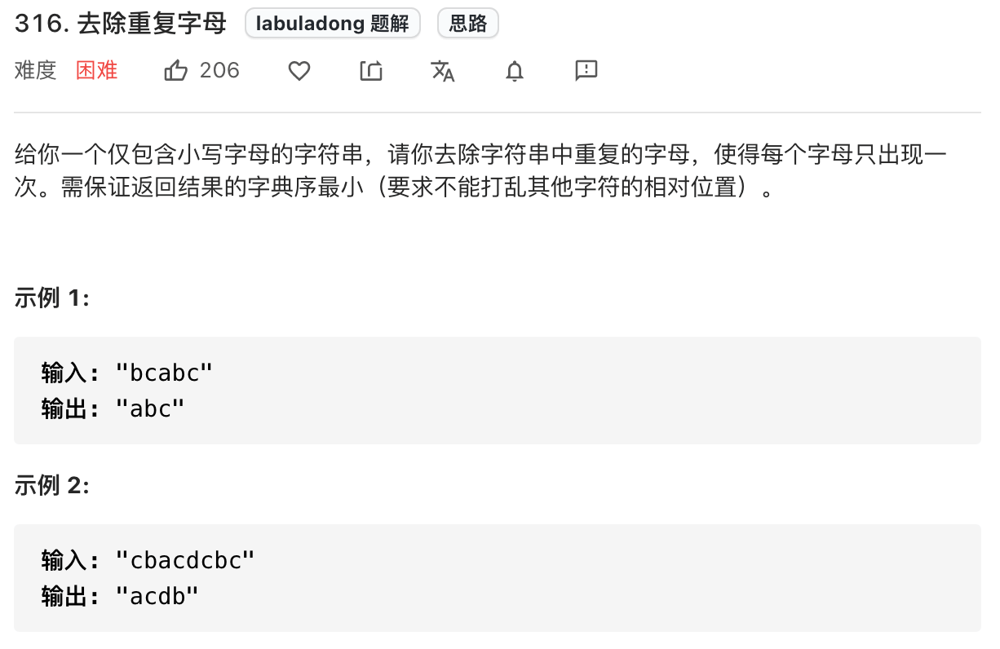

读完本文，你不仅学会了算法套路，还可以顺便解决如下题目：

|                           LeetCode                           |                             力扣                             | 难度 |
| :----------------------------------------------------------: | :----------------------------------------------------------: | :--: |
| [316. Remove Duplicate Letters](https://leetcode.com/problems/remove-duplicate-letters/) | [316. 去除重复字母](https://leetcode.cn/problems/remove-duplicate-letters/) |  🟠   |
| [1081. Smallest Subsequence of Distinct Characters](https://leetcode.com/problems/smallest-subsequence-of-distinct-characters/) | [1081. 不同字符的最小子序列](https://leetcode.cn/problems/smallest-subsequence-of-distinct-characters/) |  🟠   |

**-----------**

关于去重算法，应该没什么难度，往哈希集合里面塞不就行了么？

最多给你加点限制，问你怎么给有序数组原地去重，这个我们前文 [双指针技巧秒杀七道数组题目](https://appktavsiei5995.pc.xiaoe-tech.com/detail/i_629e11bae4b0812e17a33045/1) 讲过。

本文讲的问题应该是去重相关算法中难度最大的了，把这个问题搞懂，就再也不用怕数组去重问题了。

这是力扣第 316 题「去除重复字母」，题目如下：



这道题和第 1081 题「不同字符的最小子序列」的解法是完全相同的，你可以把这道题的解法代码直接粘过去把 1081 题也干掉。

题目的要求总结出来有三点：

要求一、**要去重**。

要求二、去重字符串中的字符顺序**不能打乱 `s` 中字符出现的相对顺序**。

要求三、在所有符合上一条要求的去重字符串中，**字典序最小**的作为最终结果。

上述三条要求中，要求三可能有点难理解，举个例子。

比如说输入字符串 `s = "babc"`，去重且符合相对位置的字符串有两个，分别是 `"bac"` 和 `"abc"`，但是我们的算法得返回 `"abc"`，因为它的字典序更小。

按理说，如果我们想要有序的结果，那就得对原字符串排序对吧，但是排序后就不能保证符合 `s` 中字符出现顺序了，这似乎是矛盾的。

其实这里会借鉴前文 [单调栈解题框架](https://appktavsiei5995.pc.xiaoe-tech.com/detail/i_627cd21ce4b01a4851fe126d/1) 中讲到的「单调栈」的思路，没看过也无妨，等会你就明白了。

**我们先暂时忽略要求三，用「栈」来实现一下要求一和要求二**，至于为什么用栈来实现，后面你就知道了：

Copy

```java
String removeDuplicateLetters(String s) {
    // 存放去重的结果
    Stack<Character> stk = new Stack<>();
    // 布尔数组初始值为 false，记录栈中是否存在某个字符
    // 输入字符均为 ASCII 字符，所以大小 256 够用了
    boolean[] inStack = new boolean[256];

    for (char c : s.toCharArray()) {
        // 如果字符 c 存在栈中，直接跳过
        if (inStack[c]) continue;
        // 若不存在，则插入栈顶并标记为存在
        stk.push(c);
        inStack[c] = true;
    }

    StringBuilder sb = new StringBuilder();
    while (!stk.empty()) {
        sb.append(stk.pop());
    }
    // 栈中元素插入顺序是反的，需要 reverse 一下
    return sb.reverse().toString();
}
```

这段代码的逻辑很简单吧，就是用布尔数组 `inStack` 记录栈中元素，达到去重的目的，**此时栈中的元素都是没有重复的**。

如果输入 `s = "bcabc"`，这个算法会返回 `"bca"`，已经符合要求一和要求二了，但是题目希望要的答案是 `"abc"` 对吧。

那我们想一想，如果想满足要求三，保证字典序，需要做些什么修改？

在向栈 `stk` 中插入字符 `'a'` 的这一刻，我们的算法需要知道，字符 `'a'` 的字典序和之前的两个字符 `'b'` 和 `'c'` 相比，谁大谁小？

**如果当前字符 `'a'` 比之前的字符字典序小，就有可能需要把前面的字符 pop 出栈，让 `'a'` 排在前面，对吧**？

那么，我们先改一版代码：

Copy

```java
String removeDuplicateLetters(String s) {
    Stack<Character> stk = new Stack<>();
    boolean[] inStack = new boolean[256];

    for (char c : s.toCharArray()) {
        if (inStack[c]) continue;

        // 插入之前，和之前的元素比较一下大小
        // 如果字典序比前面的小，pop 前面的元素
        while (!stk.isEmpty() && stk.peek() > c) {
            // 弹出栈顶元素，并把该元素标记为不在栈中
            inStack[stk.pop()] = false;
        }

        stk.push(c);
        inStack[c] = true;
    }

    StringBuilder sb = new StringBuilder();
    while (!stk.empty()) {
        sb.append(stk.pop());
    }
    return sb.reverse().toString();
}
```

这段代码也好理解，就是插入了一个 while 循环，连续 pop 出比当前字符小的栈顶字符，直到栈顶元素比当前元素的字典序还小为止。只是不是有点「单调栈」的意思了？

这样，对于输入 `s = "bcabc"`，我们可以得出正确结果 `"abc"` 了。

但是，如果我改一下输入，假设 `s = "bcac"`，按照刚才的算法逻辑，返回的结果是 `"ac"`，而正确答案应该是 `"bac"`，分析一下这是怎么回事？

很容易发现，因为 `s` 中只有唯一一个 `'b'`，即便字符 `'a'` 的字典序比字符 `'b'` 要小，字符 `'b'` 也不应该被 pop 出去。

那问题出在哪里？

**我们的算法在 `stk.peek() > c` 时才会 pop 元素，其实这时候应该分两种情况**：

情况一、如果 `stk.peek()` 这个字符之后还会出现，那么可以把它 pop 出去，反正后面还有嘛，后面再 push 到栈里，刚好符合字典序的要求。

情况二、如果 `stk.peek()` 这个字符之后不会出现了，前面也说了栈中不会存在重复的元素，那么就不能把它 pop 出去，否则你就永远失去了这个字符。

回到 `s = "bcac"` 的例子，插入字符 `'a'` 的时候，发现前面的字符 `'c'` 的字典序比 `'a'` 大，且在 `'a'` 之后还存在字符 `'c'`，那么栈顶的这个 `'c'` 就会被 pop 掉。

while 循环继续判断，发现前面的字符 `'b'` 的字典序还是比 `'a'` 大，但是在 `'a'` 之后再没有字符 `'b'` 了，所以不应该把 `'b'` pop 出去。

**那么关键就在于，如何让算法知道字符 `'a'` 之后有几个 `'b'` 有几个 `'c'` 呢**？

也不难，只要再改一版代码：

Copy

```java
String removeDuplicateLetters(String s) {
    Stack<Character> stk = new Stack<>();

    // 维护一个计数器记录字符串中字符的数量
    // 因为输入为 ASCII 字符，大小 256 够用了
    int[] count = new int[256];
    for (int i = 0; i < s.length(); i++) {
        count[s.charAt(i)]++;
    }

    boolean[] inStack = new boolean[256];
    for (char c : s.toCharArray()) {
        // 每遍历过一个字符，都将对应的计数减一
        count[c]--;

        if (inStack[c]) continue;

        while (!stk.isEmpty() && stk.peek() > c) {
            // 若之后不存在栈顶元素了，则停止 pop
            if (count[stk.peek()] == 0) {
                break;
            }
            // 若之后还有，则可以 pop
            inStack[stk.pop()] = false;
        }
        stk.push(c);
        inStack[c] = true;
    }

    StringBuilder sb = new StringBuilder();
    while (!stk.empty()) {
        sb.append(stk.pop());
    }
    return sb.reverse().toString();
}
```

我们用了一个计数器 `count`，当字典序较小的字符试图「挤掉」栈顶元素的时候，在 `count` 中检查栈顶元素是否是唯一的，只有当后面还存在栈顶元素的时候才能挤掉，否则不能挤掉。

至此，这个算法就结束了，时间空间复杂度都是 O(N)。

**你还记得我们开头提到的三个要求吗？我们是怎么达成这三个要求的**？

要求一、通过 `inStack` 这个布尔数组做到栈 `stk` 中不存在重复元素。

要求二、我们顺序遍历字符串 `s`，通过「栈」这种顺序结构的 push/pop 操作记录结果字符串，保证了字符出现的顺序和 `s` 中出现的顺序一致。

这里也可以想到为什么要用「栈」这种数据结构，因为先进后出的结构允许我们立即操作刚插入的字符，如果用「队列」的话肯定是做不到的。

要求三、我们用类似单调栈的思路，配合计数器 `count` 不断 pop 掉不符合最小字典序的字符，保证了最终得到的结果字典序最小。

当然，由于栈的结构特点，我们最后需要把栈中元素取出后再反转一次才是最终结果。

说实话，这应该是数组去重的最高境界了，没做过还真不容易想出来。你学会了吗？学会了点个「在看」？