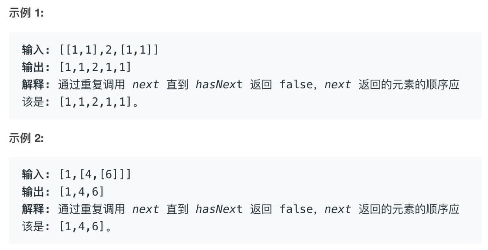

读完本文，你不仅学会了算法套路，还可以顺便解决如下题目：

|                           LeetCode                           |                             力扣                             | 难度 |
| :----------------------------------------------------------: | :----------------------------------------------------------: | :--: |
| [341. Flatten Nested List Iterator](https://leetcode.com/problems/flatten-nested-list-iterator/) | [341. 扁平化嵌套列表迭代器](https://leetcode.cn/problems/flatten-nested-list-iterator/) |  🟠   |

**-----------**

PS：[刷题插件](https://mp.weixin.qq.com/s/OE1zPVPj0V2o82N4HtLQbw) 集成了手把手刷二叉树功能，按照公式和套路讲解了 150 道二叉树题目，可手把手带你刷完二叉树分类的题目，迅速掌握递归思维。

今天来讲一道非常有启发性的设计题目，为什么说它有启发性，我们后面再说。

### 一、题目描述

这是力扣第 341 题「扁平化嵌套列表迭代器」，我来描述一下题目：

首先，现在有一种数据结构 `NestedInteger`，**这个结构中存的数据可能是一个 `Integer` 整数，也可能是一个 `NestedInteger` 列表**。注意，这个列表里面装着的是 `NestedInteger`，也就是说这个列表中的每一个元素可能是个整数，可能又是个列表，这样无限递归嵌套下去……

`NestedInteger` 有如下 API：

Copy

```java
public class NestedInteger {
    // 如果其中存的是一个整数，则返回 true，否则返回 false
    public boolean isInteger();

    // 如果其中存的是一个整数，则返回这个整数，否则返回 null
    public Integer getInteger();

    // 如果其中存的是一个列表，则返回这个列表，否则返回 null
    public List<NestedInteger> getList();
}
```

我们的算法会被输入一个 `NestedInteger` 列表，我们需要做的就是写一个迭代器类，将这个带有嵌套结构 `NestedInteger` 的列表「拍平」：

Copy

```java
public class NestedIterator implements Iterator<Integer> {
    // 构造器输入一个 NestedInteger 列表
    public NestedIterator(List<NestedInteger> nestedList) {}

    // 返回下一个整数
    public Integer next() {}

    // 是否还有下一个元素？
    public boolean hasNext() {}
}
```

我们写的这个类会被这样调用，**先调用 `hasNext` 方法，后调用 `next` 方法**：

Copy

```java
NestedIterator i = new NestedIterator(nestedList);
while (i.hasNext())
    print(i.next());
```



比如示例 1，输入的列表里有三个 `NestedInteger`，两个列表型的 `NestedInteger` 和一个整数型的 `NestedInteger`。

学过设计模式的朋友应该知道，迭代器也是设计模式的一种，目的就是为调用者屏蔽底层数据结构的细节，简单地通过 `hasNext` 和 `next` 方法有序地进行遍历。

为什么说这个题目很有启发性呢？因为我最近在用一款类似印象笔记的软件，叫做 Notion（挺有名的）。这个软件的一个亮点就是「万物皆 block」，比如说标题、页面、表格都是 block。有的 block 甚至可以无限嵌套，这就打破了传统笔记本「文件夹」->「笔记本」->「笔记」的三层结构。

回想这个算法问题，`NestedInteger` 结构实际上也是一种支持无限嵌套的结构，而且可以同时表示整数和列表两种不同类型，我想 Notion 的核心数据结构 block 估计也是这样的一种设计思路。

那么话说回来，对于这个算法问题，我们怎么解决呢？`NestedInteger` 结构可以无限嵌套，怎么把这个结构「打平」，为迭代器的调用者屏蔽底层细节，得到扁平化的输出呢？

### 二、解题思路

显然，`NestedInteger` 这个神奇的数据结构是问题的关键，不过题目专门提醒我们：

Copy

```
You should not implement it, or speculate about its implementation.
```

我不应该去尝试实现 `NestedInteger` 这个结构，也不应该去猜测它的实现？**为什么？凭什么？是不是题目在误导我？是不是我进行推测之后，这道题就不攻自破**了？

你不让推测，我就偏偏要去推测！我反手就把 `NestedInteger` 这个结构给实现出来：

Copy

```java
public class NestedInteger {
    private Integer val;
    private List<NestedInteger> list;

    public NestedInteger(Integer val) {
        this.val = val;
        this.list = null;
    }
    public NestedInteger(List<NestedInteger> list) {
        this.list = list;
        this.val = null;
    }

    // 如果其中存的是一个整数，则返回 true，否则返回 false
    public boolean isInteger() {
        return val != null;
    }

    // 如果其中存的是一个整数，则返回这个整数，否则返回 null
    public Integer getInteger() {
        return this.val;
    }

    // 如果其中存的是一个列表，则返回这个列表，否则返回 null
    public List<NestedInteger> getList() {
        return this.list;
    }
}
```

嗯，其实这个实现也不难嘛，写出来之后，我不禁翻出前文 [学习数据结构和算法的框架思维](https://labuladong.github.io/article/fname.html?fname=学习数据结构和算法的高效方法)，发现这玩意儿竟然……

Copy

```java
class NestedInteger {
    Integer val;
    List<NestedInteger> list;
}

/* 基本的 N 叉树节点 */
class TreeNode {
    int val;
    TreeNode[] children;
}
```

**这玩意儿不就是棵 N 叉树吗？叶子节点是 `Integer` 类型，其 `val` 字段非空；其他节点都是 `List<NestedInteger>` 类型，其 `val` 字段为空，但是 `list` 字段非空，装着孩子节点**。

比如说输入是 `[[1,1],2,[1,1]]`，其实就是如下树状结构：


好的，刚才题目说什么来着？把一个 `NestedInteger` 扁平化对吧？**这不就等价于遍历一棵 N 叉树的所有「叶子节点」吗**？我把所有叶子节点都拿出来，不就可以作为迭代器进行遍历了吗？

N 叉树的遍历怎么整？我又不禁翻出前文 [学习数据结构和算法的框架思维](https://labuladong.github.io/article/fname.html?fname=学习数据结构和算法的高效方法) 找出框架：

Copy

```java
void traverse(TreeNode root) {
    for (TreeNode child : root.children)
        traverse(child);
```

这个框架可以遍历所有节点，而我们只对整数型的 `NestedInteger` 感兴趣，也就是我们只想要「叶子节点」，所以 `traverse` 函数只要在到达叶子节点的时候把 `val` 加入结果列表即可：

Copy

```java
class NestedIterator implements Iterator<Integer> {

    private Iterator<Integer> it;

    public NestedIterator(List<NestedInteger> nestedList) {
        // 存放将 nestedList 打平的结果
        List<Integer> result = new LinkedList<>();
        for (NestedInteger node : nestedList) {
            // 以每个节点为根遍历
            traverse(node, result);
        }
        // 得到 result 列表的迭代器
        this.it = result.iterator();
    }

    public Integer next() {
        return it.next();
    }

    public boolean hasNext() {
        return it.hasNext();
    }    

    // 遍历以 root 为根的多叉树，将叶子节点的值加入 result 列表
    private void traverse(NestedInteger root, List<Integer> result) {
        if (root.isInteger()) {
            // 到达叶子节点
            result.add(root.getInteger());
            return;
        }
        // 遍历框架
        for (NestedInteger child : root.getList()) {
            traverse(child, result);
        }
    }
}
```

这样，我们就把原问题巧妙转化成了一个 N 叉树的遍历问题，并且得到了解法。

### 三、进阶思路

以上解法虽然可以通过，但是在面试中，也许是有瑕疵的。

我们的解法中，一次性算出了所有叶子节点的值，全部装到 `result` 列表，也就是内存中，`next` 和 `hasNext` 方法只是在对 `result` 列表做迭代。如果输入的规模非常大，构造函数中的计算就会很慢，而且很占用内存。

一般的迭代器求值应该是「惰性的」，也就是说，如果你要一个结果，我就算一个（或是一小部分）结果出来，而不是一次把所有结果都算出来。

如果想做到这一点，使用递归函数进行 DFS 遍历肯定是不行的，而且我们其实只关心「叶子节点」，所以传统的 BFS 算法也不行。实际的思路很简单：

**调用 `hasNext` 时，如果 `nestedList` 的第一个元素是列表类型，则不断展开这个元素，直到第一个元素是整数类型**。

由于调用 `next` 方法之前一定会调用 `hasNext` 方法，这就可以保证每次调用 `next` 方法的时候第一个元素是整数型，直接返回并删除第一个元素即可。

看一下代码：

Copy

```java
public class NestedIterator implements Iterator<Integer> {
    private LinkedList<NestedInteger> list;

    public NestedIterator(List<NestedInteger> nestedList) {
        // 不直接用 nestedList 的引用，是因为不能确定它的底层实现
        // 必须保证是 LinkedList，否则下面的 addFirst 会很低效
        list = new LinkedList<>(nestedList);
    }

    public Integer next() {
        // hasNext 方法保证了第一个元素一定是整数类型
        return list.remove(0).getInteger();
    }

    public boolean hasNext() {
        // 循环拆分列表元素，直到列表第一个元素是整数类型
        while (!list.isEmpty() && !list.get(0).isInteger()) {
            // 当列表开头第一个元素是列表类型时，进入循环
            List<NestedInteger> first = list.remove(0).getList();
            // 将第一个列表打平并按顺序添加到开头
            for (int i = first.size() - 1; i >= 0; i--) {
                list.addFirst(first.get(i));
            }
        }
        return !list.isEmpty();
    }
}
```

以这种方法，符合迭代器惰性求值的特性，是比较好的解法。