读完本文，你不仅学会了算法套路，还可以顺便解决如下题目：

|                           LeetCode                           |                             力扣                             | 难度 |
| :----------------------------------------------------------: | :----------------------------------------------------------: | :--: |
| [677. Map Sum Pairs](https://leetcode.com/problems/map-sum-pairs/) | [677. 键值映射](https://leetcode.cn/problems/map-sum-pairs/) |  🟠   |
| [648. Replace Words](https://leetcode.com/problems/replace-words/) | [648. 单词替换](https://leetcode.cn/problems/replace-words/) |  🟠   |
|                              -                               | [剑指 Offer II 062. 实现前缀树](https://leetcode.cn/problems/QC3q1f/) |  🟠   |
| [208. Implement Trie (Prefix Tree)](https://leetcode.com/problems/implement-trie-prefix-tree/) | [208. 实现 Trie (前缀树)](https://leetcode.cn/problems/implement-trie-prefix-tree/) |  🟠   |
| [1804. Implement Trie II (Prefix Tree)](https://leetcode.com/problems/implement-trie-ii-prefix-tree/)🔒 | [1804. 实现 Trie （前缀树） II](https://leetcode.cn/problems/implement-trie-ii-prefix-tree/)🔒 |  🟠   |
|                              -                               | [剑指 Offer II 066. 单词之和](https://leetcode.cn/problems/z1R5dt/) |  🟠   |
| [211. Design Add and Search Words Data Structure](https://leetcode.com/problems/design-add-and-search-words-data-structure/) | [211. 添加与搜索单词 - 数据结构设计](https://leetcode.cn/problems/design-add-and-search-words-data-structure/) |  🟠   |
|                              -                               | [剑指 Offer II 063. 替换单词](https://leetcode.cn/problems/UhWRSj/) |  🟠   |

**-----------**

> 本文有视频版：[动手实现字典树](https://appktavsiei5995.pc.xiaoe-tech.com/detail/p_6265562be4b01c509aa7b629/6)

Trie 树又叫字典树、前缀树、单词查找树，是一种二叉树衍生出来的高级数据结构，主要应用场景是处理字符串前缀相关的操作。

我是在《算法 4》第一次学到这种数据结构，不过书中的讲解不是特别通俗易懂，所以本文按照我的逻辑帮大家重新梳理一遍 Trie 树的原理，并基于《算法 4》的代码实现一套更通用易懂的代码模板，用于处理力扣上一系列字符串前缀问题。

阅读本文之前希望你读过我旧文讲过的 [回溯算法代码模板](https://labuladong.github.io/article/fname.html?fname=回溯算法详解修订版) 和 [手把手刷二叉树（总结篇）](https://appktavsiei5995.pc.xiaoe-tech.com/detail/i_63a84ecde4b030cacaff6731/1)。

本文主要分三部分：

**1、讲解 Trie 树的工作原理**。

**2、给出一套 `TrieMap` 和 `TrieSet` 的代码模板，实现几个常用 API**。

**3、实践环节，直接套代码模板秒杀 5 道算法题**。本来可以秒杀七八道题，篇幅考虑，剩下的我集成到 [刷题插件](https://mp.weixin.qq.com/s/uOubir_nLzQtp_fWHL73JA) 中。

关于 `Map` 和 `Set`，是两个抽象数据结构（接口），`Map` 存储一个键值对集合，其中键不重复，`Set` 存储一个不重复的元素集合。

常见的 `Map` 和 `Set` 的底层实现原理有哈希表和二叉搜索树两种，比如 Java 的 HashMap/HashSet 和 C++ 的 unorderd_map/unordered_set 底层就是用哈希表实现，而 Java 的 TreeMap/TreeSet 和 C++ 的 map/set 底层使用红黑树这种自平衡 BST 实现的。

而本文实现的 TrieSet/TrieMap 底层则用 Trie 树这种结构来实现。

了解数据结构的读者应该知道，本质上 `Set` 可以视为一种特殊的 `Map`，`Set` 其实就是 `Map` 中的键。

**所以本文先实现 `TrieMap`，然后在 `TrieMap` 的基础上封装出 `TrieSet`**。

> PS：为了模板通用性的考虑，后文会用到 Java 的泛型，也就是用尖括号 `<>` 指定的类型变量。这些类型变量的作用是指定我们实现的容器中存储的数据类型，类比 Java 标准库的那些容器的用法应该不难理解。

前文 [学习数据结构的框架思维](https://labuladong.github.io/article/fname.html?fname=学习数据结构和算法的高效方法) 说过，各种乱七八糟的结构都是为了在「特定场景」下尽可能高效地进行增删查改。

你比如 `HashMap<K, V>` 的优势是能够在 O(1) 时间通过键查找对应的值，但要求键的类型 `K` 必须是「可哈希」的；而 `TreeMap<K, V>` 的特点是方便根据键的大小进行操作，但要求键的类型 `K` 必须是「可比较」的。

本文要实现的 `TrieMap` 也是类似的，由于 Trie 树原理，我们要求 `TrieMap<V>` 的键必须是字符串类型，值的类型 `V` 可以随意。

接下来我们了解一下 Trie 树的原理，看看为什么这种数据结构能够高效操作字符串。

### Trie 树原理

**Trie 树本质上就是一棵从二叉树衍生出来的多叉树**。

二叉树节点的代码实现是这样：

Copy

```java
/* 基本的二叉树节点 */
class TreeNode {
    int val;
    TreeNode left, right;
}
```

其中 `left, right` 存储左右子节点的指针，所以二叉树的结构是这样：

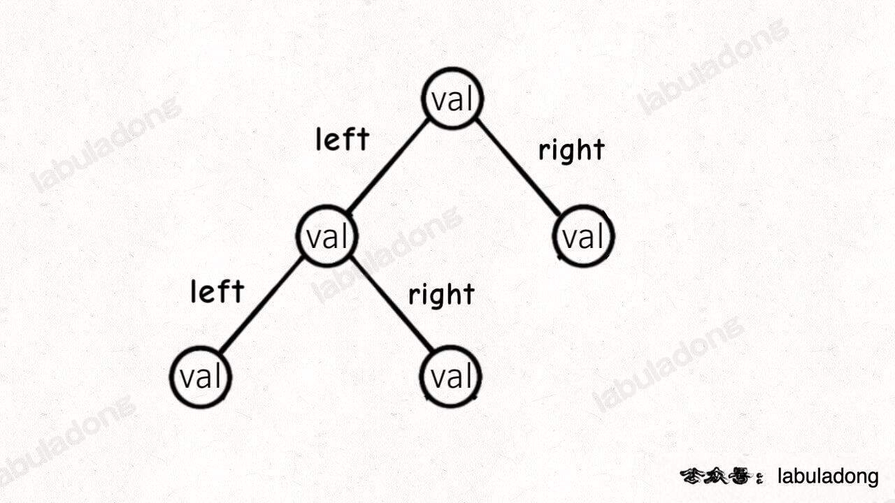

多叉树节点的代码实现是这样：

Copy

```java
/* 基本的多叉树节点 */
class TreeNode {
    int val;
    TreeNode[] children;
}
```

其中 `children` 数组中存储指向孩子节点的指针，所以多叉树的结构是这样：

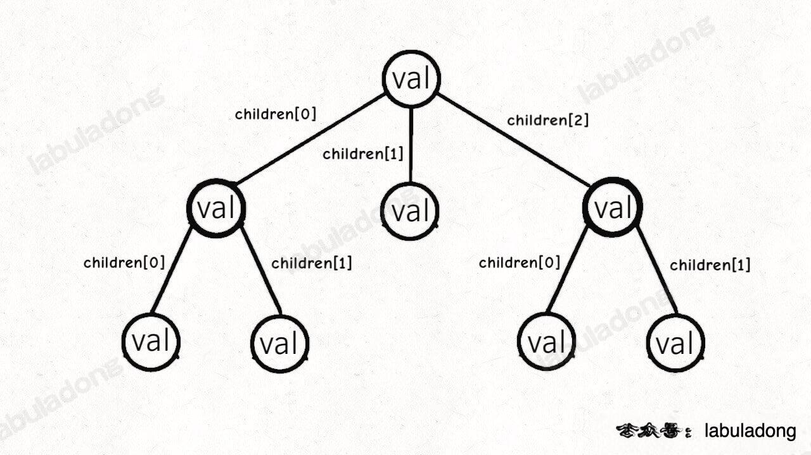

而 `TrieMap` 中的树节点 `TrieNode` 的代码实现是这样：

Copy

```java
/* Trie 树节点实现 */
class TrieNode<V> {
    V val = null;
    TrieNode<V>[] children = new TrieNode[256];
}
```

这个 `val` 字段存储键对应的值，`children` 数组存储指向子节点的指针。

**但是和之前的普通多叉树节点不同，`TrieNode` 中 `children` 数组的索引是有意义的，代表键中的一个字符**。

比如说 `children[97]` 如果非空，说明这里存储了一个字符 `'a'`，因为 `'a'` 的 ASCII 码为 97。

我们的模板只考虑处理 ASCII 字符，所以 `children` 数组的大小设置为 256。不过这个可以根据具体问题修改，比如改成更小的数组或者 `HashMap<Character, TrieNode>` 都是一样的效果。

有了以上铺垫，Trie 树的结构是这样的：

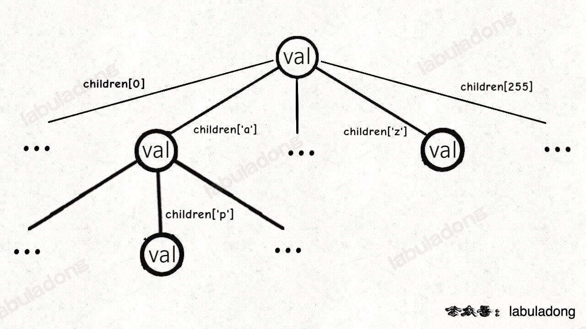

一个节点有 256 个子节点指针，但大多数时候都是空的，可以省略掉不画，**所以一般你看到的 Trie 树长这样**：


这是在 `TrieMap<Integer>` 中插入一些键值对后的样子，白色节点代表 `val` 字段为空，橙色节点代表 `val` 字段非空。

**这里要特别注意，`TrieNode` 节点本身只存储 `val` 字段，并没有一个字段来存储字符，字符是通过子节点在父节点的 `children` 数组中的索引确定的**。

**形象理解就是，Trie 树用「树枝」存储字符串（键），用「节点」存储字符串（键）对应的数据（值）。所以我在图中把字符标在树枝，键对应的值 `val` 标在节点上**：

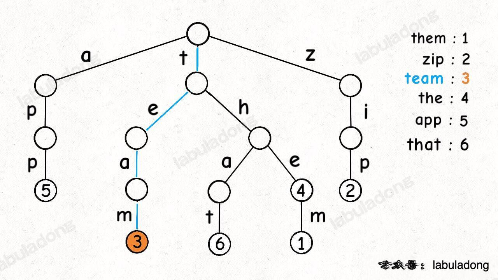

明白这一点很重要，有助于之后你理解代码实现。

> PS：《算法 4》以及网上讲 Trie 树的文章中都是把字符标在节点上，我认为这样很容易让初学者产生误解，所以建议大家按照我的这种理解来记忆 Trie 树结构。

现在你应该知道为啥 Trie 树也叫前缀树了，因为其中的字符串共享前缀，相同前缀的字符串集中在 Trie 树中的一个子树上，给字符串的处理带来很大的便利。

### TrieMap/TrieSet API 及实现

首先我们看一下本文实现的 `TrieMap` 的 API，为了举例 API 的功能，假设 TrieMap 中已经存储了如下键值对：


Copy

```java
// 底层用 Trie 树实现的键值映射
// 键为 String 类型，值为类型 V
class TrieMap<V> {

    /***** 增/改 *****/

    // 在 Map 中添加 key
    public void put(String key, V val);

    /***** 删 *****/

    // 删除键 key 以及对应的值
    public void remove(String key);

    /***** 查 *****/

    // 搜索 key 对应的值，不存在则返回 null
    // get("the") -> 4
    // get("tha") -> null
    public V get(String key);

    // 判断 key 是否存在在 Map 中
    // containsKey("tea") -> false
    // containsKey("team") -> true
    public boolean containsKey(String key);

    // 在 Map 的所有键中搜索 query 的最短前缀
    // shortestPrefixOf("themxyz") -> "the"
    public String shortestPrefixOf(String query);

    // 在 Map 的所有键中搜索 query 的最长前缀
    // longestPrefixOf("themxyz") -> "them"
    public String longestPrefixOf(String query);

    // 搜索所有前缀为 prefix 的键
    // keysWithPrefix("th") -> ["that", "the", "them"]
    public List<String> keysWithPrefix(String prefix);

    // 判断是和否存在前缀为 prefix 的键
    // hasKeyWithPrefix("tha") -> true
    // hasKeyWithPrefix("apple") -> false
    public boolean hasKeyWithPrefix(String prefix);

    // 通配符 . 匹配任意字符，搜索所有匹配的键
    // keysWithPattern("t.a.") -> ["team", "that"]
    public List<String> keysWithPattern(String pattern);

    // 通配符 . 匹配任意字符，判断是否存在匹配的键
    // hasKeyWithPattern(".ip") -> true
    // hasKeyWithPattern(".i") -> false
    public boolean hasKeyWithPattern(String pattern);

    // 返回 Map 中键值对的数量
    public int size();
}
```

至于 `TrieSet` 的 API 大同小异，所以这里不重复列举，后文直接给出实现。

**接下来是重头戏，我们一个一个实现 `TrieMap` 的上述 API 函数**。

首先，`TrieMap` 类中一定需要记录 Trie 的根节点 `root`，以及 Trie 树中的所有节点数量用于实现 `size()` 方法：

Copy

```java
class TrieMap<V> {
    // ASCII 码个数
    private static final int R = 256;
    // 当前存在 Map 中的键值对个数
    private int size = 0;

    private static class TrieNode<V> {
        V val = null;
        TrieNode<V>[] children = new TrieNode[R];
    }

    // Trie 树的根节点
    private TrieNode<V> root = null;

    /* 其他 API 的实现... */

    public int size() {
        return size;
    }
}
```

另外，我们再实现一个工具函数 `getNode`：

Copy

```java
// 从节点 node 开始搜索 key，如果存在返回对应节点，否则返回 null
private TrieNode<V> getNode(TrieNode<V> node, String key) {
    TrieNode<V> p = node;
    // 从节点 node 开始搜索 key
    for (int i = 0; i < key.length(); i++) {
        if (p == null) {
            // 无法向下搜索
            return null;
        }
        // 向下搜索
        char c = key.charAt(i);
        p = p.children[c];
    }
    return p;
}
```

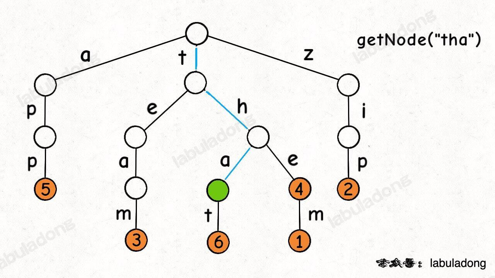

有了这个 `getNode` 函数，就能实现 `containsKey` 方法和 `get` 方法了：

Copy

```java
// 搜索 key 对应的值，不存在则返回 null
public V get(String key) {
    // 从 root 开始搜索 key
    TrieNode<V> x = getNode(root, key);
    if (x == null || x.val == null) {
        // x 为空或 x 的 val 字段为空都说明 key 没有对应的值
        return null;
    }
    return x.val;
}

// 判断 key 是否存在在 Map 中
public boolean containsKey(String key) {
    return get(key) != null;
}
```

**这里需要注意，就算 `getNode(key)` 的返回值 `x` 非空，也只能说字符串 `key` 是一个「前缀」；除非 `x.val` 同时非空，才能判断键 `key` 存在**。

不过，这个特性恰好能够帮我们实现 `hasKeyWithPrefix` 方法：

Copy

```java
// 判断是和否存在前缀为 prefix 的键
public boolean hasKeyWithPrefix(String prefix) {
    // 只要能找到一个节点，就是存在前缀
    return getNode(root, prefix) != null;
}
```

类似 `getNode` 方法的逻辑，我们可以实现 `shortestPrefixOf` 方法，只要在第一次遇到存有 `val` 的节点的时候返回就行了：

Copy

```java
// 在所有键中寻找 query 的最短前缀
public String shortestPrefixOf(String query) {
    TrieNode<V> p = root;
    // 从节点 node 开始搜索 key
    for (int i = 0; i < query.length(); i++) {
        if (p == null) {
            // 无法向下搜索
            return "";
        }
        if (p.val != null) {
            // 找到一个键是 query 的前缀
            return query.substring(0, i);
        }
        // 向下搜索
        char c = query.charAt(i);
        p = p.children[c];
    }

    if (p != null && p.val != null) {
        // 如果 query 本身就是一个键
        return query;
    }
    return "";
}
```

**这里需要注意的是 for 循环结束之后我们还需要额外检查一下**。

因为之前说了 Trie 树中「树枝」存储字符串，「节点」存储字符串对应的值，for 循环相当于只遍历了「树枝」，但漏掉了最后一个「节点」，即 `query` 本身就是 `TrieMap` 中的一个键的情况。

如果你理解了 `shortestPrefixOf` 的实现，那么 `longestPrefixOf` 也是非常类似的：

Copy

```java
// 在所有键中寻找 query 的最长前缀
public String longestPrefixOf(String query) {
    TrieNode<V> p = root;
    // 记录前缀的最大长度
    int max_len = 0;

    // 从节点 node 开始搜索 key
    for (int i = 0; i < query.length(); i++) {
        if (p == null) {
            // 无法向下搜索
            break;
        }
        if (p.val != null) {
            // 找到一个键是 query 的前缀，更新前缀的最大长度
            max_len = i;
        }
        // 向下搜索
        char c = query.charAt(i);
        p = p.children[c];
    }

    if (p != null && p.val != null) {
        // 如果 query 本身就是一个键
        return query;
    }
    return query.substring(0, max_len);
}
```

每次遇到 `p.val` 非空的时候说明找到一个键，但是我们不急着返回，而是更新 `max_len` 变量，记录最长前缀的长度。

同样的，在 for 循环结束时还是要特殊判断一下，处理 `query` 本身就是键的情况。

接下来，我们来实现 `keysWithPrefix` 方法，得到所有前缀为 `prefix` 的键。

看过前文 [手把手刷二叉树（总结篇）](https://appktavsiei5995.pc.xiaoe-tech.com/detail/i_63a84ecde4b030cacaff6731/1) 的读者应该可以想到，先利用 `getNode` 函数在 Trie 树中找到 `prefix` 对应的节点 `x`，然施展多叉树的遍历算法，遍历以 `x` 为根的这棵 Trie 树，找到所有键值对：

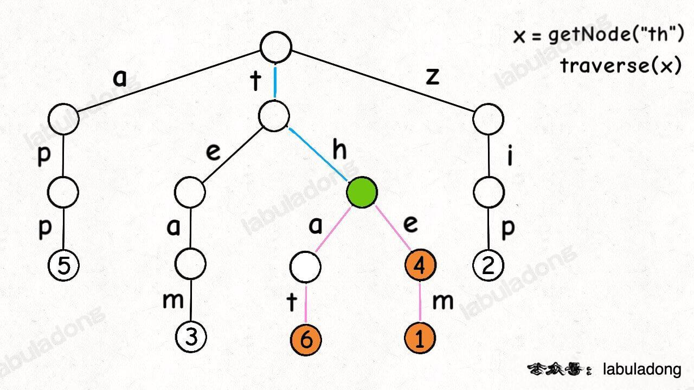

代码实现如下：

Copy

```java
// 搜索前缀为 prefix 的所有键
public List<String> keysWithPrefix(String prefix) {
    List<String> res = new LinkedList<>();
    // 找到匹配 prefix 在 Trie 树中的那个节点
    TrieNode<V> x = getNode(root, prefix);
    if (x == null) {
        return res;
    }
    // DFS 遍历以 x 为根的这棵 Trie 树
    traverse(x, new StringBuilder(prefix), res);
    return res;
}

// 遍历以 node 节点为根的 Trie 树，找到所有键
private void traverse(TrieNode<V> node, StringBuilder path, List<String> res) {
    if (node == null) {
        // 到达 Trie 树底部叶子结点
        return;
    }

    if (node.val != null) {
        // 找到一个 key，添加到结果列表中
        res.add(path.toString());
    }

    // 回溯算法遍历框架
    for (char c = 0; c < R; c++) {
        // 做选择
        path.append(c);
        traverse(node.children[c], path, res);
        // 撤销选择
        path.deleteCharAt(path.length() - 1);
    }
}
```

这段代码中 `traverse` 函数你可能看起来特别熟悉，就是 [回溯算法核心套路](https://labuladong.github.io/article/fname.html?fname=回溯算法详解修订版) 中讲的回溯算法代码框架。

关于回溯算法框架和标准多叉树框架的区别我在 [图论算法基础](https://labuladong.github.io/article/fname.html?fname=图) 中探讨过，关键在于遍历「节点」和遍历「树枝」的区别。由于 Trie 树将字符存储在「树枝」上，`traverse` 函数是在遍历树枝上的字符，所以采用的是回溯算法框架。

另外，再注意一下这段逻辑：

Copy

```java
// 回溯算法遍历框架
for (char c = 0; c < R; c++) {
    // 做选择
    path.append(c);
    traverse(node.children[c], path, res);
    // 撤销选择
    path.deleteCharAt(path.length() - 1);
}
```

回顾一下我们 Trie 树的图：


你是否会有疑问：代码中 for 循环会执行 256 次，但是图中的一个节点只有几个子节点，也就是说每个节点的 `children` 数组中大部分都是空指针，这不会有问题吗？

是不是应该把代码改成这样：

Copy

```java
// 回溯算法遍历框架
for (char c = 0; c < R; c++) {
    // 做选择
    path.append(c);
    if (node.children[c] != null) {
        traverse(node.children[c], path, res);
    }
    // 撤销选择
    path.deleteCharAt(path.length() - 1);
}
```

答案是，改不改都行，这两种写法从逻辑上讲完全相同，因为 `traverse` 函数开始的时候如果发现 `node == null` 也会直接返回。

我为了保持框架的一致性，就没有在 for 循环中判断子节点是否为空，而是依赖递归函数的 base case。当然你完全可以按照自己的喜好来实现。

下面来实现 `keysWithPattern` 方法，使用通配符来匹配多个键，其关键就在于通配符 `.` 可以匹配所有字符。

在代码实现上，用 `path` 变量记录匹配键的路径，遇到通配符时使用类似回溯算法的框架就行了：

Copy

```java
// 通配符 . 匹配任意字符
public List<String> keysWithPattern(String pattern) {
    List<String> res = new LinkedList<>();
    traverse(root, new StringBuilder(), pattern, 0, res);
    return res;
}

// 遍历函数，尝试在「以 node 为根的 Trie 树中」匹配 pattern[i..]
private void traverse(TrieNode<V> node, StringBuilder path, String pattern, int i, List<String> res) {
    if (node == null) {
        // 树枝不存在，即字符 pattern[i-1] 匹配失败
        return;
    }
    if (i == pattern.length()) {
        // pattern 匹配完成
        if (node.val != null) {
            // 如果这个节点存储着 val，则找到一个匹配的键
            res.add(path.toString());
        }
        return;
    }
    char c = pattern.charAt(i);
    if (c == '.') {
        // pattern[i] 是通配符，可以变化成任意字符
        // 多叉树（回溯算法）遍历框架
        for (char j = 0; j < R; j++) {
            path.append(j);
            traverse(node.children[j], path, pattern, i + 1, res);
            path.deleteCharAt(path.length() - 1);
        }
    } else {
        // pattern[i] 是普通字符 c
        path.append(c);
        traverse(node.children[c], path, pattern, i + 1, res);
        path.deleteCharAt(path.length() - 1);
    }
}
```

下面这个 GIF 画了匹配 `"t.a."` 的过程，应该就容易理解上述代码的逻辑了：

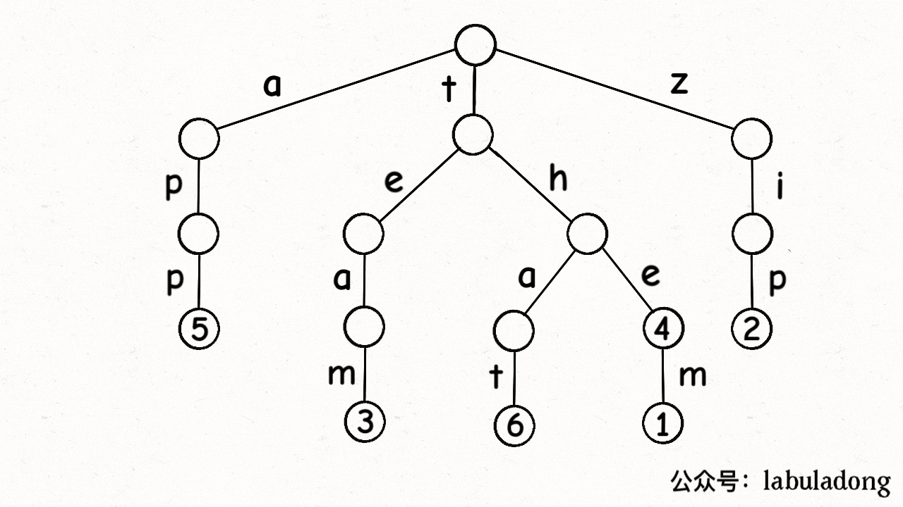

可以看到，`keysWithPattern` 和 `keysWithPrefix` 的实现是有些类似的，而且这两个函数还有一个潜在的特性：**它们返回的结果列表一定是符合「字典序」的**。

原因应该不难理解，每一个节点的 `children` 数组都是从左到右进行遍历，即按照 ASCII 码从小到大的顺序递归遍历，得到的结果自然是符合字典序的。

好，现在我们实现了 `keysWithPattern` 方法得到模式串匹配的所有键，那你是否可以实现 `hasKeyWithPattern` 方法，仅仅判断是否存在键匹配模式串？

Copy

```java
// 一个偷懒的实现
public boolean hasKeyWithPattern(String pattern) {
    return !keysWithPattern(pattern).isEmpty();
}
```

这是一个偷懒的实现，因为它的复杂度比较高。我们的目的仅仅是判断是否存在匹配模式串的键，你却把所有匹配的键都算出来了，这显然是没有必要的。

我们只需稍微改写一下 `keysWithPattern` 方法就可以高效实现 `hasKeyWithPattern` 方法：

Copy

```java
// 判断是和否存在前缀为 prefix 的键
public boolean hasKeyWithPattern(String pattern) {
    // 从 root 节点开始匹配 pattern[0..]
    return hasKeyWithPattern(root, pattern, 0);
}

// 函数定义：从 node 节点开始匹配 pattern[i..]，返回是否成功匹配
private boolean hasKeyWithPattern(TrieNode<V> node, String pattern, int i) {
    if (node == null) {
        // 树枝不存在，即匹配失败
        return false;
    }
    if (i == pattern.length()) {
        // 模式串走到头了，看看匹配到的是否是一个键
        return node.val != null;
    }
    char c = pattern.charAt(i);
    // 没有遇到通配符
    if (c != '.') {
        // 从 node.children[c] 节点开始匹配 pattern[i+1..]
        return hasKeyWithPattern(node.children[c], pattern, i + 1);
    }
    // 遇到通配符
    for (int j = 0; j < R; j++) {
        // pattern[i] 可以变化成任意字符，尝试所有可能，只要遇到一个匹配成功就返回
        if (hasKeyWithPattern(node.children[j], pattern, i + 1)) {
            return true;
        }
    }
    // 都没有匹配
    return false;
}
```

有之前的铺垫，这个实现应该是不难理解的，类似于 [回溯算法解数独游戏](https://labuladong.github.io/article/fname.html?fname=sudoku) 中找到一个可行解就提前结束递归的做法。

到这里，`TrieMap` 的所有和前缀相关的方法都实现完了，还剩下 `put` 和 `remove` 这两个基本方法了，其实它们的难度不大，就是递归修改数据结构的那一套，如果不熟悉的话可以参见 [二叉搜索树基本操作](https://appktavsiei5995.pc.xiaoe-tech.com/detail/i_63a84fb7e4b07b0558298a07/1)。

先说 `put` 方法的实现吧，直接看代码：

Copy

```java
// 在 map 中添加或修改键值对
public void put(String key, V val) {
    if (!containsKey(key)) {
        // 新增键值对
        size++;
    }
    // 需要一个额外的辅助函数，并接收其返回值
    root = put(root, key, val, 0);
}

// 定义：向以 node 为根的 Trie 树中插入 key[i..]，返回插入完成后的根节点
private TrieNode<V> put(TrieNode<V> node, String key, V val, int i) {
    if (node == null) {
        // 如果树枝不存在，新建
        node = new TrieNode<>();
    }
    if (i == key.length()) {
        // key 的路径已插入完成，将值 val 存入节点
        node.val = val;
        return node;
    }
    char c = key.charAt(i);
    // 递归插入子节点，并接收返回值
    node.children[c] = put(node.children[c], key, val, i + 1);
    return node;
}
```

因为是递归修改数据结构，所以我们必须额外创建一个返回类型为 `TrieNode` 的辅助函数，并且在递归调用的时候接收其返回值，拼接到父节点上。

**前文说了，Trie 树中的键就是「树枝」，值就是「节点」，所以插入的逻辑就是沿路新建「树枝」，把 `key` 的整条「树枝」构建出来之后，在树枝末端的「节点」中存储 `val`**：

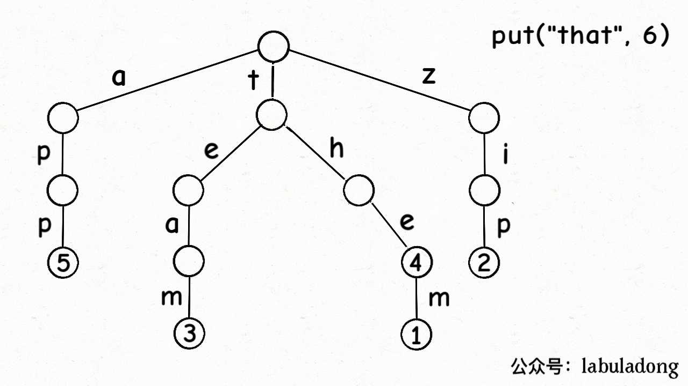

最后，我们说一下 `remove` 函数，似乎所有数据结构的删除操作相对其他操作都会更复杂一些。

比如说下图这个场景，如果你想删除键 `"team"`，那么需要删掉 `"eam"` 这条树枝才是符合逻辑的：

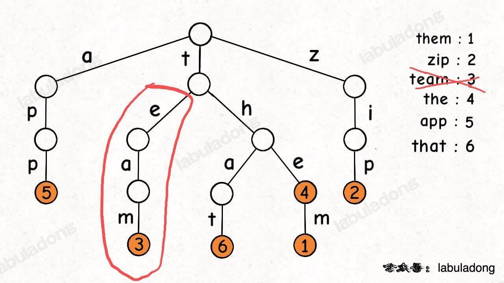

删多了肯定不行，但删少了也不行，否则前文实现的 `hasKeyWithPrefix` 就会出错。

那么如何控制算法来正确地进行删除呢？

首先，递归修改数据结构的时候，如果一个节点想删掉自己，直接返回空指针就行了。

**其次，一个节点如何知道自己是否需要被删除呢？主要看自己的 `val` 字段是否为空以及自己的 `children` 数组是否全都是空指针**。

这里就要利用前文 [手把手刷二叉树（总结篇）](https://appktavsiei5995.pc.xiaoe-tech.com/detail/i_63a84ecde4b030cacaff6731/1) 中说到的后序位置的特点了：

一个节点要先递归处理子树，然后在后序位置检查自己的 `val` 字段和 `children` 列表，判断自己是否需要被删除。

如果自己的 `val` 字段为空，说明自己没有存储值，如果同时自己的 `children` 数组全是空指针，说明自己下面也没有接树枝，即不是任何一个键的前缀。这种情况下这个节点就没有存在的意义了，应该删掉自己。

直接看代码：

Copy

```java
// 在 Map 中删除 key
public void remove(String key) {
    if (!containsKey(key)) {
        return;
    }
    // 递归修改数据结构要接收函数的返回值
    root = remove(root, key, 0);
    size--;
}

// 定义：在以 node 为根的 Trie 树中删除 key[i..]，返回删除后的根节点
private TrieNode<V> remove(TrieNode<V> node, String key, int i) {
    if (node == null) {
        return null;
    }
    if (i == key.length()) {
        // 找到了 key 对应的 TrieNode，删除 val
        node.val = null;
    } else {
        char c = key.charAt(i);
        // 递归去子树进行删除
        node.children[c] = remove(node.children[c], key, i + 1);
    }
    // 后序位置，递归路径上的节点可能需要被清理
    if (node.val != null) {
        // 如果该 TireNode 存储着 val，不需要被清理
        return node;
    }
    // 检查该 TrieNode 是否还有后缀
    for (int c = 0; c < R; c++) {
        if (node.children[c] != null) {
            // 只要存在一个子节点（后缀树枝），就不需要被清理
            return node;
        }
    }
    // 既没有存储 val，也没有后缀树枝，则该节点需要被清理
    return null;
}
```

到这里，`TrieMap` 的所有 API 就实现完了，完整代码如下：

Copy

```java
class TrieMap<V> {
    // ASCII 码个数
    private static final int R = 256;
    // 当前存在 Map 中的键值对个数
    private int size = 0;
    // Trie 树的根节点
    private TrieNode<V> root = null;

    private static class TrieNode<V> {
        V val = null;
        TrieNode<V>[] children = new TrieNode[R];
    }

    /***** 增/改 *****/

    // 在 map 中添加或修改键值对
    public void put(String key, V val) {
        if (!containsKey(key)) {
            // 新增键值对
            size++;
        }
        // 需要一个额外的辅助函数，并接收其返回值
        root = put(root, key, val, 0);
    }

    // 定义：向以 node 为根的 Trie 树中插入 key[i..]，返回插入完成后的根节点
    private TrieNode<V> put(TrieNode<V> node, String key, V val, int i) {
        if (node == null) {            


            // 如果树枝不存在，新建
            node = new TrieNode<>();
        }
        if (i == key.length()) {
            // key 的路径已插入完成，将值 val 存入节点
            node.val = val;
            return node;
        }
        char c = key.charAt(i);
        // 递归插入子节点，并接收返回值
        node.children[c] = put(node.children[c], key, val, i + 1);
        return node;
    }

    /***** 删 *****/

    // 在 Map 中删除 key
    public void remove(String key) {
        if (!containsKey(key)) {
            return;
        }
        // 递归修改数据结构要接收函数的返回值
        root = remove(root, key, 0);
        size--;
    }

    // 定义：在以 node 为根的 Trie 树中删除 key[i..]，返回删除后的根节点
    private TrieNode<V> remove(TrieNode<V> node, String key, int i) {
        if (node == null) {
            return null;
        }
        if (i == key.length()) {
            // 找到了 key 对应的 TrieNode，删除 val
            node.val = null;
        } else {
            char c = key.charAt(i);
            // 递归去子树进行删除
            node.children[c] = remove(node.children[c], key, i + 1);
        }        


        // 后序位置，递归路径上的节点可能需要被清理
        if (node.val != null) {
            // 如果该 TireNode 存储着 val，不需要被清理
            return node;
        }
        // 检查该 TrieNode 是否还有后缀
        for (int c = 0; c < R; c++) {
            if (node.children[c] != null) {
                // 只要存在一个子节点（后缀树枝），就不需要被清理
                return node;
            }
        }
        // 既没有存储 val，也没有后缀树枝，则该节点需要被清理
        return null;
    }

    /***** 查 *****/

    // 搜索 key 对应的值，不存在则返回 null
    public V get(String key) {
        // 从 root 开始搜索 key
        TrieNode<V> x = getNode(root, key);
        if (x == null || x.val == null) {
            // x 为空或 x 的 val 字段为空都说明 key 没有对应的值
            return null;
        }
        return x.val;
    }

    // 判断 key 是否存在在 Map 中
    public boolean containsKey(String key) {
        return get(key) != null;
    }

    // 判断是和否存在前缀为 prefix 的键
    public boolean hasKeyWithPrefix(String prefix) {
        // 只要能找到一个节点，就是存在前缀
        return getNode(root, prefix) != null;
    }

    // 在所有键中寻找 query 的最短前缀
    public String shortestPrefixOf(String query) {
        TrieNode<V> p = root;
        // 从节点 node 开始搜索 key
        for (int i = 0; i < query.length(); i++) {
            if (p == null) {
                // 无法向下搜索
                return "";
            }
            if (p.val != null) {
                // 找到一个键是 query 的前缀
                return query.substring(0, i);
            }
            // 向下搜索
            char c = query.charAt(i);
            p = p.children[c];
        }

        if (p != null && p.val != null) {
            // 如果 query 本身就是一个键
            return query;
        }
        return "";
    }

    // 在所有键中寻找 query 的最长前缀
    public String longestPrefixOf(String query) {
        TrieNode<V> p = root;
        // 记录前缀的最大长度
        int max_len = 0;

        // 从节点 node 开始搜索 key
        for (int i = 0; i < query.length(); i++) {
            if (p == null) {
                // 无法向下搜索
                break;
            }
            if (p.val != null) {
                // 找到一个键是 query 的前缀，更新前缀的最大长度
                max_len = i;
            }
            // 向下搜索
            char c = query.charAt(i);
            p = p.children[c];
        }

        if (p != null && p.val != null) {
            // 如果 query 本身就是一个键
            return query;
        }
        return query.substring(0, max_len);
    }

    // 搜索前缀为 prefix 的所有键
    public List<String> keysWithPrefix(String prefix) {
        List<String> res = new LinkedList<>();
        // 找到匹配 prefix 在 Trie 树中的那个节点
        TrieNode<V> x = getNode(root, prefix);        


        if (x == null) {
            return res;
        }
        // DFS 遍历以 x 为根的这棵 Trie 树
        traverse(x, new StringBuilder(prefix), res);
        return res;
    }

    // 遍历以 node 节点为根的 Trie 树，找到所有键
    private void traverse(TrieNode<V> node, StringBuilder path, List<String> res) {
        if (node == null) {
            // 到达 Trie 树底部叶子结点
            return;
        }

        if (node.val != null) {
            // 找到一个 key，添加到结果列表中
            res.add(path.toString());
        }

        // 回溯算法遍历框架
        for (char c = 0; c < R; c++) {
            // 做选择
            path.append(c);
            traverse(node.children[c], path, res);
            // 撤销选择
            path.deleteCharAt(path.length() - 1);
        }
    }

    // 通配符 . 匹配任意字符
    public List<String> keysWithPattern(String pattern) {
        List<String> res = new LinkedList<>();
        traverse(root, new StringBuilder(), pattern, 0, res);
        return res;
    }

    // 遍历函数，尝试在「以 node 为根的 Trie 树中」匹配 pattern[i..]
    private void traverse(TrieNode<V> node, StringBuilder path, String pattern, int i, List<String> res) {
        if (node == null) {
            // 树枝不存在，即匹配失败
            return;
        }
        if (i == pattern.length()) {
            // pattern 匹配完成
            if (node.val != null) {
                // 如果这个节点存储着 val，则找到一个匹配的键
                res.add(path.toString());
            }
            return;
        }
        char c = pattern.charAt(i);        


        if (c == '.') {
            // pattern[i] 是通配符，可以变化成任意字符
            // 多叉树（回溯算法）遍历框架
            for (char j = 0; j < R; j++) {
                path.append(j);
                traverse(node.children[j], path, pattern, i + 1, res);
                path.deleteCharAt(path.length() - 1);
            }
        } else {
            // pattern[i] 是普通字符 c
            path.append(c);
            traverse(node.children[c], path, pattern, i + 1, res);
            path.deleteCharAt(path.length() - 1);
        }
    }

    // 判断是和否存在前缀为 prefix 的键
    public boolean hasKeyWithPattern(String pattern) {
        // 从 root 节点开始匹配 pattern[0..]
        return hasKeyWithPattern(root, pattern, 0);
    }

    // 函数定义：从 node 节点开始匹配 pattern[i..]，返回是否成功匹配
    private boolean hasKeyWithPattern(TrieNode<V> node, String pattern, int i) {
        if (node == null) {
            // 树枝不存在，即匹配失败
            return false;
        }
        if (i == pattern.length()) {
            // 模式串走到头了，看看匹配到的是否是一个键
            return node.val != null;
        }
        char c = pattern.charAt(i);
        // 没有遇到通配符
        if (c != '.') {
            // 从 node.children[c] 节点开始匹配 pattern[i+1..]
            return hasKeyWithPattern(node.children[c], pattern, i + 1);
        }
        // 遇到通配符
        for (int j = 0; j < R; j++) {
            // pattern[i] 可以变化成任意字符，尝试所有可能，只要遇到一个匹配成功就返回
            if (hasKeyWithPattern(node.children[j], pattern, i + 1)) {
                return true;
            }
        }
        // 都没有匹配
        return false;
    }

    // 从节点 node 开始搜索 key，如果存在返回对应节点，否则返回 null
    private TrieNode<V> getNode(TrieNode<V> node, String key) {        


        TrieNode<V> p = node;
        // 从节点 node 开始搜索 key
        for (int i = 0; i < key.length(); i++) {
            if (p == null) {
                // 无法向下搜索
                return null;
            }
            // 向下搜索
            char c = key.charAt(i);
            p = p.children[c];
        }
        return p;
    }

    public int size() {
        return size;
    }
}
```

接下来我们只要对 `TrieMap` 做简单的封装，即可实现 `TrieSet`：

Copy

```java
class TrieSet {
    // 底层用一个 TrieMap，键就是 TrieSet，值仅仅起到占位的作用
    // 值的类型可以随便设置，我参考 Java 标准库设置成 Object
    private final TrieMap<Object> map = new TrieMap<>();

    /***** 增 *****/

    // 在集合中添加元素 key
    public void add(String key) {
        map.put(key, new Object());
    }

    /***** 删 *****/

    // 从集合中删除元素 key
    public void remove(String key) {
        map.remove(key);
    }

    /***** 查 *****/

    // 判断元素 key 是否存在集合中
    public boolean contains(String key) {
        return map.containsKey(key);
    }

    // 在集合中寻找 query 的最短前缀
    public String shortestPrefixOf(String query) {
        return map.shortestPrefixOf(query);
    }

    // 在集合中寻找 query 的最长前缀
    public String longestPrefixOf(String query) {
        return map.longestPrefixOf(query);
    }

    // 在集合中搜索前缀为 prefix 的所有元素
    public List<String> keysWithPrefix(String prefix) {
        return map.keysWithPrefix(prefix);
    }

    // 判断集合中是否存在前缀为 prefix 的元素
    public boolean hasKeyWithPrefix(String prefix) {
        return map.hasKeyWithPrefix(prefix);
    }

    // 通配符 . 匹配任意字符，返回集合中匹配 pattern 的所有元素
    public List<String> keysWithPattern(String pattern) {
        return map.keysWithPattern(pattern);
    }

    // 通配符 . 匹配任意字符，判断集合中是否存在匹配 pattern 的元素
    public boolean hasKeyWithPattern(String pattern) {
        return map.hasKeyWithPattern(pattern);
    }

    // 返回集合中元素的个数
    public int size() {
        return map.size();
    }
}
```

**有了 `TrieMap` 和 `TrieSet`，力扣上所有前缀树相关的题目都可以直接套用了**，下面我举几个题目实践一下。

### 秒杀题目

**首先需要说明，上文实现的算法模板的执行效率在具体的题目里面肯定是有优化空间的**。

比如力扣前缀树相关题目的输入都被限制在小写英文字母 `a-z`，所以 `TrieNode` 其实不用维护一个大小为 256 的 `children` 数组，大小设置为 26 就够了，可以减小时间和空间上的复杂度。

不过本文只考虑模板的通用性，重在思路，所以就直接套用上文给出的算法模板解题，具体实现上的细节优化我集成在 [刷题插件](https://mp.weixin.qq.com/s/uOubir_nLzQtp_fWHL73JA) 的「思路」按钮中。

先看下力扣第 208 题「实现前缀树」：

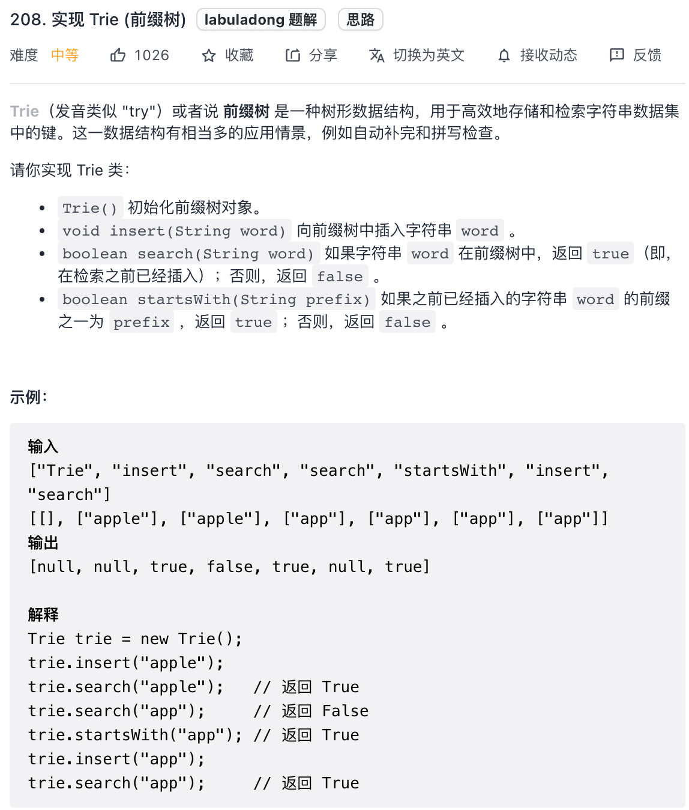

题目让我们实现的几个函数其实就是 `TrieSet` 的部分 API，所以直接封装一个 `TrieSet` 就能解决这道题了：

Copy

```java
class Trie {
    // 直接封装 TrieSet
    TrieSet set = new TrieSet();

    // 插入一个元素
    public void insert(String word) {
        set.add(word);
    }

    // 判断元素是否在集合中
    public boolean search(String word) {
        return set.contains(word);
    }

    // 判断集合中是否有前缀为 prefix 的元素
    public boolean startsWith(String prefix) {
        return set.hasKeyWithPrefix(prefix);
    }
}

class TrieSet { /* 见上文 */ }

class TrieMap { /* 见上文 */ }
```

接下来看下力扣第 648 题「单词替换」：

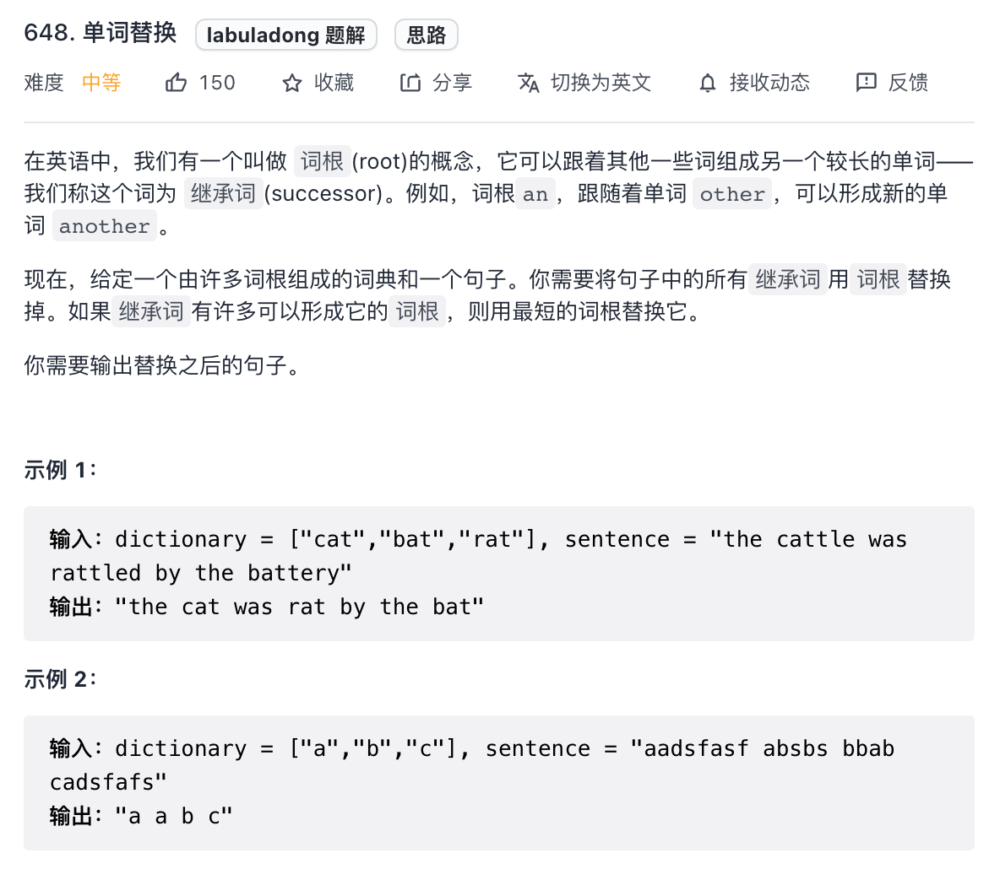

现在你学过 Trie 树结构，应该可以看出来这题就在考察最短前缀问题。

所以可以把输入的词根列表 `dict` 存入 `TrieSet`，然后直接复用我们实现的 `shortestPrefixOf` 函数就行了：

Copy

```java
String replaceWords(List<String> dict, String sentence) {
    // 先将词根都存入 TrieSet
    TrieSet set = new TrieSet();
    for (String key : dict) {
        set.add(key);
    }
    StringBuilder sb = new StringBuilder();
    String[] words = sentence.split(" ");
    // 处理句子中的单词
    for (int i = 0; i < words.length; i++) {
        // 在 Trie 树中搜索最短词根（最短前缀）
        String prefix = set.shortestPrefixOf(words[i]);
        if (!prefix.isEmpty()) {
            // 如果搜索到了，改写为词根
            sb.append(prefix);
        } else {
            // 否则，原样放回
            sb.append(words[i]);
        }

        if (i != words.length - 1) {
            // 添加单词之间的空格
            sb.append(' ');
        }
    }

    return sb.toString();
}

class TrieSet { /* 见上文 */ }

class TrieMap { /* 见上文 */ }
```

继续看力扣第 211 题「添加与搜索单词 - 数据结构设计」：

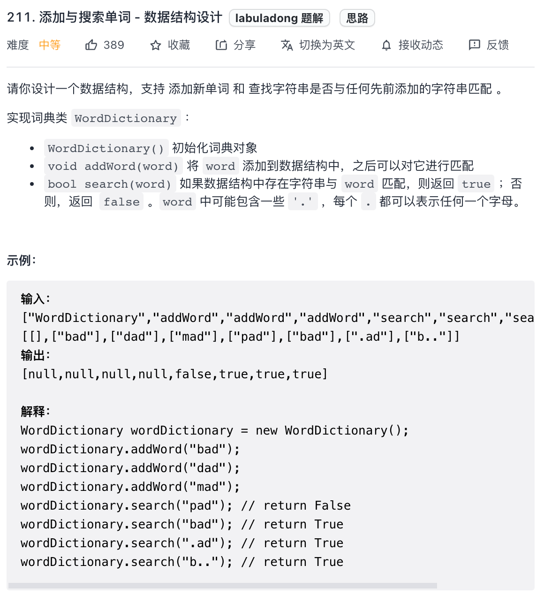

这道题的考点就在于这个 `search` 函数进行通配符匹配，其实就是我们给 `TrieSet` 实现的 `hasKeyWithPattern` 方法，直接套就行了：

Copy

```java
class WordDictionary {
    TrieSet set = new TrieSet();

    // 在 TrieSet 中添加元素
    public void addWord(String word) {
        set.add(word);
    }

    // 通配符匹配元素
    public boolean search(String word) {
        return set.hasKeyWithPattern(word);
    }
}

class TrieSet { /* 见上文 */ }

class TrieMap { /* 见上文 */ }
```

上面列举的这几道题用的都是 `TrieSet`，下面来看看 `TrieMap` 的题目。

先看力扣第 1804 题「实现前缀树 II」：

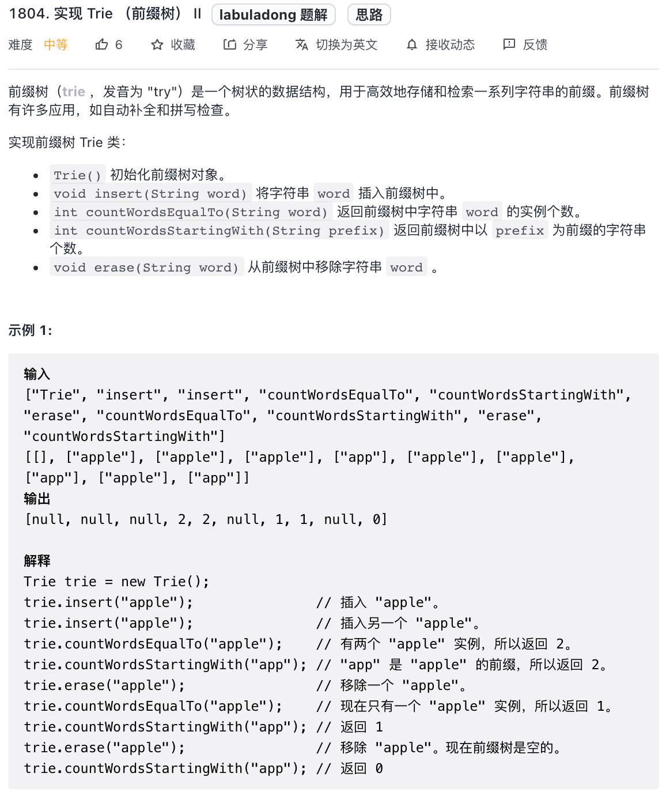

这题就可以用到 `TrieMap`，每个插入的 `word` 就是键，插入的次数就是对应的值，然后复用 `TrieMap` 的 API 就能实现题目要求的这些函数：

Copy

```java
class Trie {
    // 封装我们实现的 TrieMap
    TrieMap<Integer> map = new TrieMap<>();

    // 插入 word 并记录插入次数
    public void insert(String word) {
        if (!map.containsKey(word)) {
            map.put(word, 1);
        } else {
            map.put(word, map.get(word) + 1);
        }
    }

    // 查询 word 插入的次数
    public int countWordsEqualTo(String word) {
        if (!map.containsKey(word)) {
            return 0;
        }
        return map.get(word);
    }

    // 累加前缀为 prefix 的键的插入次数总和
    public int countWordsStartingWith(String prefix) {
        int res = 0;
        for (String key : map.keysWithPrefix(prefix)) {
            res += map.get(key);
        }
        return res;
    }

    // word 的插入次数减一
    public void erase(String word) {
        int freq = map.get(word);
        if (freq - 1 == 0) {
            map.remove(word);
        } else {
            map.put(word, freq - 1);
        }
    }
}

class TrieMap { /* 见上文 */ }
```

反正都是直接套模板，也没什么意思，再看最后一道题目吧，这是力扣第 677 题「键值映射」：

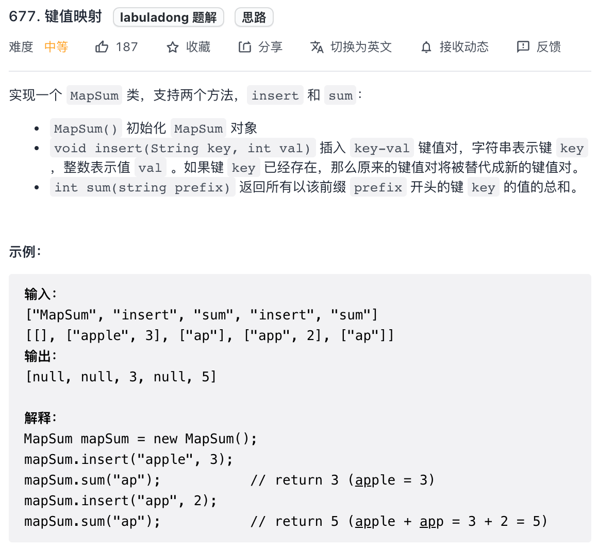

这道题还是标准的 `TrieMap` 的应用，直接看代码吧：

Copy

```java
class MapSum {
    // 封装我们实现的 TrieMap
    TrieMap<Integer> map = new TrieMap<>();

    // 插入键值对
    public void insert(String key, int val) {
        map.put(key, val);
    }

    // 累加所有前缀为 prefix 的键的值
    public int sum(String prefix) {
        List<String> keys = map.keysWithPrefix(prefix);
        int res = 0;
        for (String key : keys) {
            res += map.get(key);
        }
        return res;
    }
}

class TrieMap { /* 见上文 */ }
```

Trie 树这种数据结构的实现原理和题目实践就讲完了，如果你能够看到这里，真得给你鼓掌。

可以看到，我最近写的图论算法以及本文讲的 Trie 树算法，都和「树」这种基本数据结构相关，所以我才会在刷题插件中集成 [手把手刷 100 道二叉树题目](https://mp.weixin.qq.com/s/OE1zPVPj0V2o82N4HtLQbw) 的功能。

最后，纸上得来终觉浅，绝知此事要躬行，我建议最好亲手实现一遍上面的代码，去把题目刷一遍，才能对 Trie 树有更深入的理解。

之后我准备继续讲解一些基本数据结构在高级数据结构或实际算法题中的应用，大家期待就好。