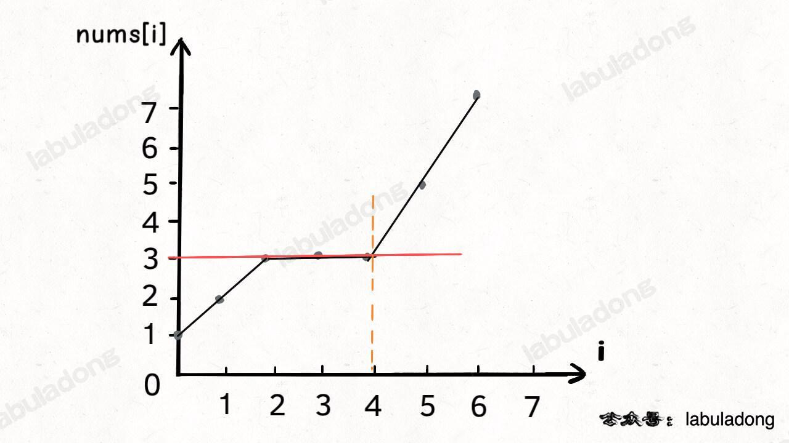
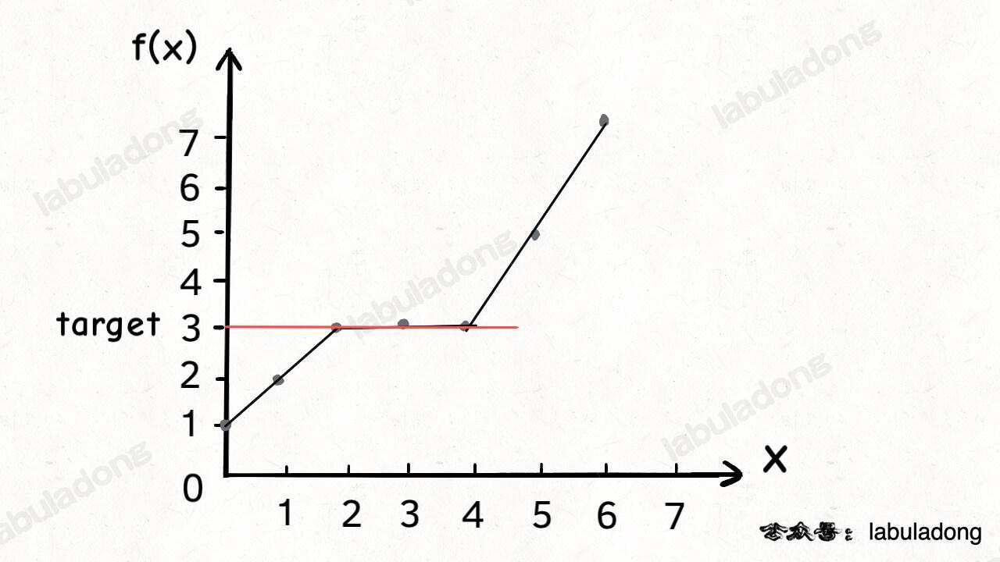
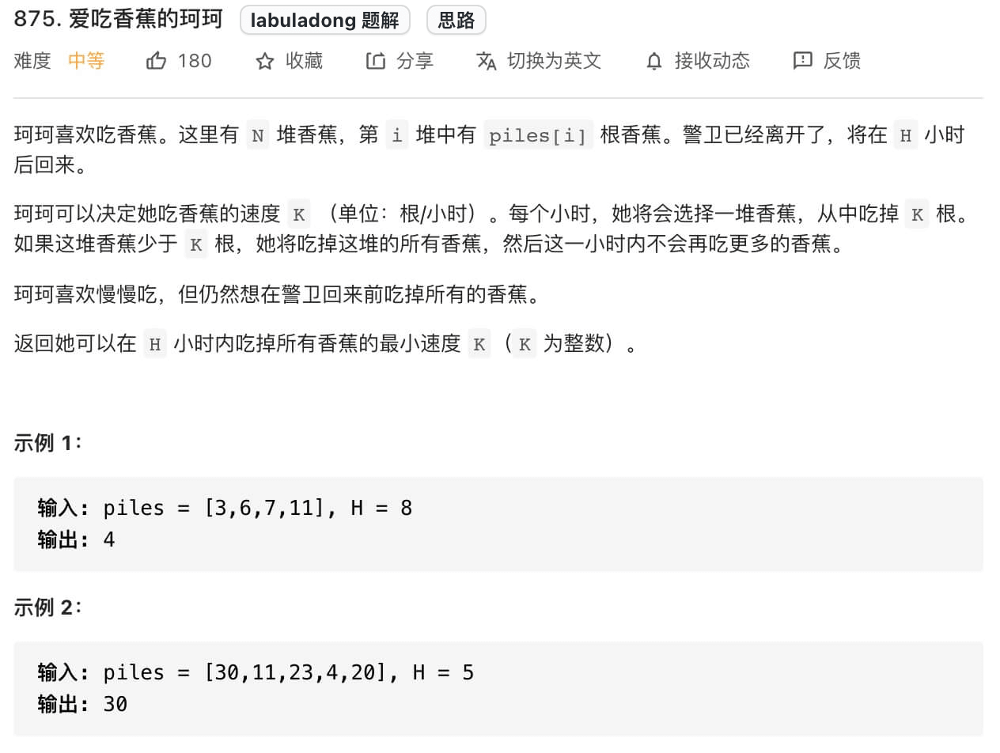
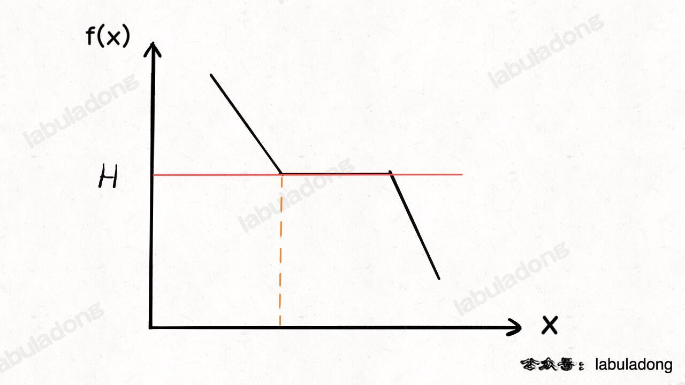
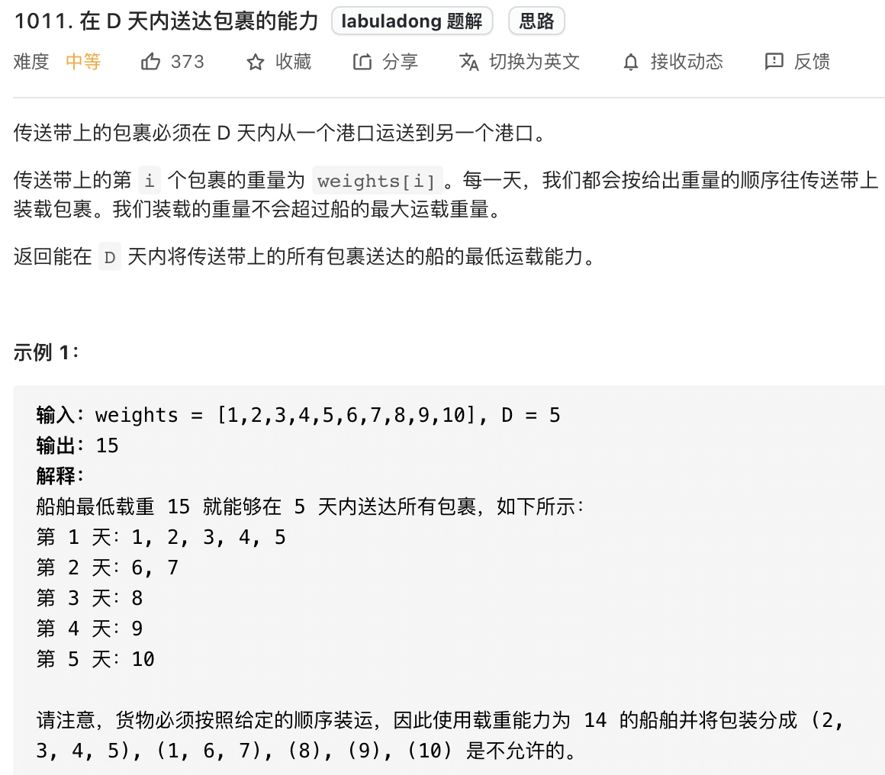
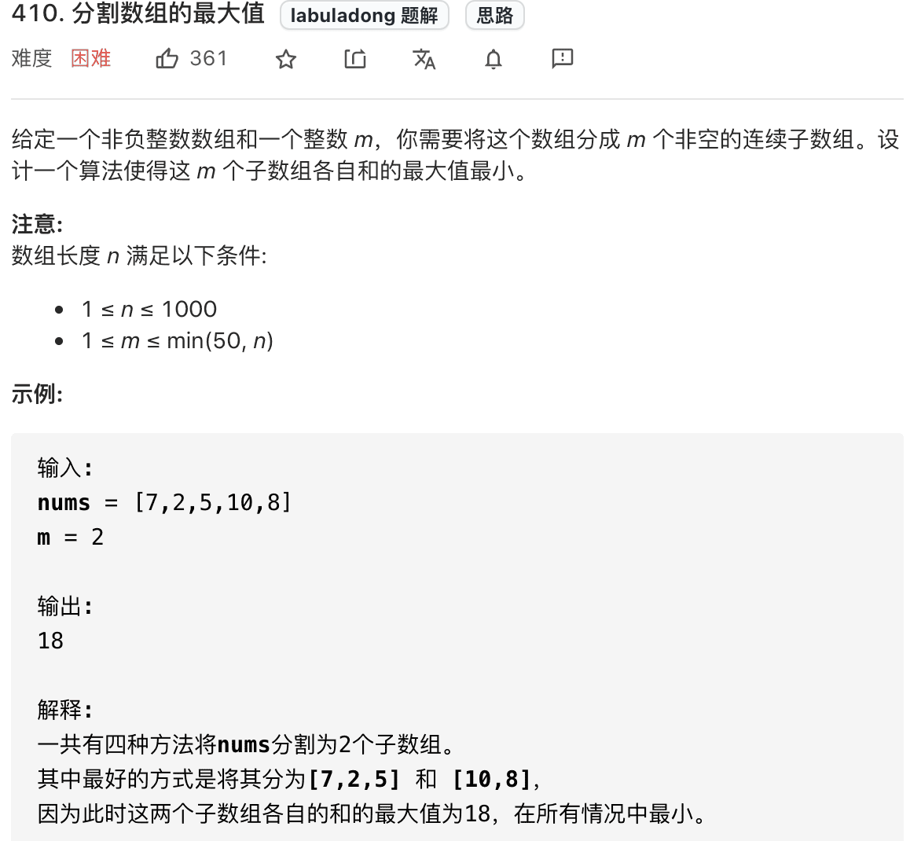

读完本文，你不仅学会了算法套路，还可以顺便解决如下题目：

|                           LeetCode                           |                             力扣                             | 难度 |
| :----------------------------------------------------------: | :----------------------------------------------------------: | :--: |
| [875. Koko Eating Bananas](https://leetcode.com/problems/koko-eating-bananas/) | [875. 爱吃香蕉的珂珂](https://leetcode.cn/problems/koko-eating-bananas/) |  🟠   |
| [1011. Capacity To Ship Packages Within D Days](https://leetcode.com/problems/capacity-to-ship-packages-within-d-days/) | [1011. 在 D 天内送达包裹的能力](https://leetcode.cn/problems/capacity-to-ship-packages-within-d-days/) |  🟠   |
| [410. Split Array Largest Sum](https://leetcode.com/problems/split-array-largest-sum/) | [410. 分割数组的最大值](https://leetcode.cn/problems/split-array-largest-sum/) |  🔴   |

**-----------**

我们前文 [我写了首诗，把二分搜索变成了默写题](https://appktavsiei5995.pc.xiaoe-tech.com/detail/i_627cce93e4b0812e17989cfa/1) 详细介绍了二分搜索的细节问题，探讨了「搜索一个元素」，「搜索左侧边界」，「搜索右侧边界」这三个情况，教你如何写出正确无 bug 的二分搜索算法。

**但是前文总结的二分搜索代码框架仅仅局限于「在有序数组中搜索指定元素」这个基本场景，具体的算法问题没有这么直接，可能你都很难看出这个问题能够用到二分搜索**。

所以本文就来总结一套二分搜索算法运用的框架套路，帮你在遇到二分搜索算法相关的实际问题时，能够有条理地思考分析，步步为营，写出答案。

### 原始的二分搜索代码

二分搜索的原型就是在「**有序数组**」中搜索一个元素 `target`，返回该元素对应的索引。

如果该元素不存在，那可以返回一个什么特殊值，这种细节问题只要微调算法实现就可实现。

还有一个重要的问题，如果「**有序数组**」中存在多个 `target` 元素，那么这些元素肯定挨在一起，这里就涉及到算法应该返回最左侧的那个 `target` 元素的索引还是最右侧的那个 `target` 元素的索引，也就是所谓的「搜索左侧边界」和「搜索右侧边界」，这个也可以通过微调算法的代码来实现。

**我们前文 [我写了首诗，把二分搜索变成了默写题](https://appktavsiei5995.pc.xiaoe-tech.com/detail/i_627cce93e4b0812e17989cfa/1) 详细探讨了上述问题，对这块还不清楚的读者建议复习前文**，已经搞清楚基本二分搜索算法的读者可以继续看下去。

**在具体的算法问题中，常用到的是「搜索左侧边界」和「搜索右侧边界」这两种场景**，很少有让你单独「搜索一个元素」。

因为算法题一般都让你求最值，比如让你求吃香蕉的「最小速度」，让你求轮船的「最低运载能力」，求最值的过程，必然是搜索一个边界的过程，所以后面我们就详细分析一下这两种搜索边界的二分算法代码。

「搜索左侧边界」的二分搜索算法的具体代码实现如下：

Copy

```java
// 搜索左侧边界
int left_bound(int[] nums, int target) {
    if (nums.length == 0) return -1;
    int left = 0, right = nums.length;

    while (left < right) {
        int mid = left + (right - left) / 2;
        if (nums[mid] == target) {
            // 当找到 target 时，收缩右侧边界
            right = mid;
        } else if (nums[mid] < target) {
            left = mid + 1;
        } else if (nums[mid] > target) {
            right = mid;
        }
    }
    return left;
}
```

假设输入的数组 `nums = [1,2,3,3,3,5,7]`，想搜索的元素 `target = 3`，那么算法就会返回索引 2。

如果画一个图，就是这样：


「搜索右侧边界」的二分搜索算法的具体代码实现如下：

Copy

```java
// 搜索右侧边界
int right_bound(int[] nums, int target) {
    if (nums.length == 0) return -1;
    int left = 0, right = nums.length;

    while (left < right) {
        int mid = left + (right - left) / 2;
        if (nums[mid] == target) {
            // 当找到 target 时，收缩左侧边界
            left = mid + 1;
        } else if (nums[mid] < target) {
            left = mid + 1;
        } else if (nums[mid] > target) {
            right = mid;
        }
    }
    return left - 1;
}
```

输入同上，那么算法就会返回索引 4，如果画一个图，就是这样：



好，上述内容都属于复习，我想读到这里的读者应该都能理解。记住上述的图像，所有能够抽象出上述图像的问题，都可以使用二分搜索解决。

### 二分搜索问题的泛化

什么问题可以运用二分搜索算法技巧？

**首先，你要从题目中抽象出一个自变量 `x`，一个关于 `x` 的函数 `f(x)`，以及一个目标值 `target`**。

同时，`x, f(x), target` 还要满足以下条件：

**1、`f(x)` 必须是在 `x` 上的单调函数（单调增单调减都可以）**。

**2、题目是让你计算满足约束条件 `f(x) == target` 时的 `x` 的值**。

上述规则听起来有点抽象，来举个具体的例子：

给你一个升序排列的有序数组 `nums` 以及一个目标元素 `target`，请你计算 `target` 在数组中的索引位置，如果有多个目标元素，返回最小的索引。

这就是「搜索左侧边界」这个基本题型，解法代码之前都写了，但这里面 `x, f(x), target` 分别是什么呢？

我们可以把数组中元素的索引认为是自变量 `x`，函数关系 `f(x)` 就可以这样设定：

Copy

```java
// 函数 f(x) 是关于自变量 x 的单调递增函数
// 入参 nums 是不会改变的，所以可以忽略，不算自变量
int f(int x, int[] nums) {
    return nums[x];
}
```

其实这个函数 `f` 就是在访问数组 `nums`，因为题目给我们的数组 `nums` 是升序排列的，所以函数 `f(x)` 就是在 `x` 上单调递增的函数。

最后，题目让我们求什么来着？是不是让我们计算元素 `target` 的最左侧索引？

是不是就相当于在问我们「满足 `f(x) == target` 的 `x` 的最小值是多少」？

画个图，如下：



**如果遇到一个算法问题，能够把它抽象成这幅图，就可以对它运用二分搜索算法**。

算法代码如下：

Copy

```java
// 函数 f 是关于自变量 x 的单调递增函数
int f(int x, int[] nums) {
    return nums[x];
}

int left_bound(int[] nums, int target) {
    if (nums.length == 0) return -1;
    int left = 0, right = nums.length;

    while (left < right) {
        int mid = left + (right - left) / 2;
        if (f(mid, nums) == target) {
            // 当找到 target 时，收缩右侧边界
            right = mid;
        } else if (f(mid, nums) < target) {
            left = mid + 1;
        } else if (f(mid, nums) > target) {
            right = mid;
        }
    }
    return left;
}
```

这段代码把之前的代码微调了一下，把直接访问 `nums[mid]` 套了一层函数 `f`，其实就是多此一举，但是，这样能抽象出二分搜索思想在具体算法问题中的框架。

### 运用二分搜索的套路框架

想要运用二分搜索解决具体的算法问题，可以从以下代码框架着手思考：

Copy

```java
// 函数 f 是关于自变量 x 的单调函数
int f(int x) {
    // ...
}

// 主函数，在 f(x) == target 的约束下求 x 的最值
int solution(int[] nums, int target) {
    if (nums.length == 0) return -1;
    // 问自己：自变量 x 的最小值是多少？
    int left = ...;
    // 问自己：自变量 x 的最大值是多少？
    int right = ... + 1;

    while (left < right) {
        int mid = left + (right - left) / 2;
        if (f(mid) == target) {
            // 问自己：题目是求左边界还是右边界？
            // ...
        } else if (f(mid) < target) {
            // 问自己：怎么让 f(x) 大一点？
            // ...
        } else if (f(mid) > target) {
            // 问自己：怎么让 f(x) 小一点？
            // ...
        }
    }
    return left;
}
```

具体来说，想要用二分搜索算法解决问题，分为以下几步：

**1、确定 `x, f(x), target` 分别是什么，并写出函数 `f` 的代码**。

**2、找到 `x` 的取值范围作为二分搜索的搜索区间，初始化 `left` 和 `right` 变量**。

**3、根据题目的要求，确定应该使用搜索左侧还是搜索右侧的二分搜索算法，写出解法代码**。

下面用几道例题来讲解这个流程。

### 例题一、珂珂吃香蕉

这是力扣第 875 题「爱吃香蕉的珂珂」：



珂珂每小时最多只能吃一堆香蕉，如果吃不完的话留到下一小时再吃；如果吃完了这一堆还有胃口，也只会等到下一小时才会吃下一堆。

他想在警卫回来之前吃完所有香蕉，让我们确定吃香蕉的**最小速度 `K`**。函数签名如下：

Copy

```java
int minEatingSpeed(int[] piles, int H);
```

那么，对于这道题，如何运用刚才总结的套路，写出二分搜索解法代码？

按步骤思考即可：

**1、确定 `x, f(x), target` 分别是什么，并写出函数 `f` 的代码**。

自变量 `x` 是什么呢？回忆之前的函数图像，二分搜索的本质就是在搜索自变量。

所以，题目让求什么，就把什么设为自变量，珂珂吃香蕉的速度就是自变量 `x`。

那么，在 `x` 上单调的函数关系 `f(x)` 是什么？

显然，吃香蕉的速度越快，吃完所有香蕉堆所需的时间就越少，速度和时间就是一个单调函数关系。

所以，`f(x)` 函数就可以这样定义：

若吃香蕉的速度为 `x` 根/小时，则需要 `f(x)` 小时吃完所有香蕉。

代码实现如下：

Copy

```java
// 定义：速度为 x 时，需要 f(x) 小时吃完所有香蕉
// f(x) 随着 x 的增加单调递减
long f(int[] piles, int x) {
    long hours = 0;
    for (int i = 0; i < piles.length; i++) {
        hours += piles[i] / x;
        if (piles[i] % x > 0) {
            hours++;
        }
    }
    return hours;
}
```

> info：为什么 `f(x)` 的返回值是 `long` 类型？因为你注意题目给的数据范围和 `f` 函数的逻辑。`piles` 数组中元素的最大值是 10^9，最多有 10^4 个元素；那么当 `x` 取值为 1 时，`hours` 变量就会被加到 10^13 这个数量级，超过了 `int` 类型的最大值（大概 2x10^9 这个量级），所以这里用 `long` 类型避免可能出现的整型溢出。

`target` 就很明显了，吃香蕉的时间限制 `H` 自然就是 `target`，是对 `f(x)` 返回值的最大约束。

**2、找到 `x` 的取值范围作为二分搜索的搜索区间，初始化 `left` 和 `right` 变量**。

珂珂吃香蕉的速度最小是多少？多大是多少？

显然，最小速度应该是 1，最大速度是 `piles` 数组中元素的最大值，因为每小时最多吃一堆香蕉，胃口再大也白搭嘛。

这里可以有两种选择，要么你用一个 for 循环去遍历 `piles` 数组，计算最大值，要么你看题目给的约束，`piles` 中的元素取值范围是多少，然后给 `right` 初始化一个取值范围之外的值。

我选择第二种，题目说了 `1 <= piles[i] <= 10^9`，那么我就可以确定二分搜索的区间边界：

Copy

```java
public int minEatingSpeed(int[] piles, int H) {
    int left = 1;
    // 注意，我选择左闭右开的二分搜索写法，right 是开区间，所以再加一
    int right = 1000000000 + 1;

    // ...
}
```

因为我们二分搜索是对数级别的复杂度，所以 `right` 就算是个很大的值，算法的效率依然很高。

**3、根据题目的要求，确定应该使用搜索左侧还是搜索右侧的二分搜索算法，写出解法代码**。

现在我们确定了自变量 `x` 是吃香蕉的速度，`f(x)` 是单调递减的函数，`target` 就是吃香蕉的时间限制 `H`，题目要我们计算最小速度，也就是 `x` 要尽可能小：



这就是搜索左侧边界的二分搜索嘛，不过注意 `f(x)` 是单调递减的，不要闭眼睛套框架，需要结合上图进行思考，写出代码：

Copy

```java
public int minEatingSpeed(int[] piles, int H) {
    int left = 1;
    int right = 1000000000 + 1;

    while (left < right) {
        int mid = left + (right - left) / 2;
        if (f(piles, mid) == H) {
            // 搜索左侧边界，则需要收缩右侧边界
            right = mid;
        } else if (f(piles, mid) < H) {
            // 需要让 f(x) 的返回值大一些
            right = mid;
        } else if (f(piles, mid) > H) {
            // 需要让 f(x) 的返回值小一些
            left = mid + 1;
        }
    }
    return left;
}
```

> tip：我这里采用的是左闭右开的二分搜索写法，关于这个算法中的细节问题，前文 [二分搜索算法详解](https://appktavsiei5995.pc.xiaoe-tech.com/detail/i_627cce93e4b0812e17989cfa/1) 进行了详细分析，这里不展开了。

至此，这道题就解决了。我们代码框架中多余的 if 分支主要是帮助理解的，写出正确解法后建议合并多余的分支，可以提高算法运行的效率：

Copy

```java
public int minEatingSpeed(int[] piles, int H) {
    int left = 1;
    int right = 1000000000 + 1;

    while (left < right) {
        int mid = left + (right - left) / 2;
        if (f(piles, mid) <= H) {
            right = mid;
        } else {
            left = mid + 1;
        }
    }
    return left;
}

// f(x) 随着 x 的增加单调递减
long f(int[] piles, int x) {
    // 见上文
}
```

肯定有读者会尝试使用前文 [二分搜索算法详解](https://appktavsiei5995.pc.xiaoe-tech.com/detail/i_627cce93e4b0812e17989cfa/1) 介绍的两端都闭的二分搜索框架来写解法，其实简单，只要修改 `right` 的初始值和 `right` 更新的逻辑即可：

Copy

```java
// 两端都闭的二分搜索写法
int minEatingSpeed(int[] piles, int H) {
    int left = 1;
    // right 是闭区间，所以这里改成最大取值
    int right = 1000000000;

    // right 是闭区间，所以这里改成 <=
    while (left <= right) {
        int mid = left + (right - left) / 2;
        if (f(piles, mid) <= H) {
            // right 是闭区间，所以这里用 mid - 1
            right = mid - 1;
        } else {
            left = mid + 1;
        }
    }
    return left;
}

// f(x) 随着 x 的增加单调递减
long f(int[] piles, int x) {
    // 见上文
}
```

### 例题二、运送货物

再看看力扣第 1011 题「在 D 天内送达包裹的能力」：



要在 `D` 天内按顺序运输完所有货物，货物不可分割，如何确定运输的最小载重呢？

函数签名如下：

Copy

```java
int shipWithinDays(int[] weights, int days);
```

和上一道题一样的，我们按照流程来就行：

**1、确定 `x, f(x), target` 分别是什么，并写出函数 `f` 的代码**。

题目问什么，什么就是自变量，也就是说船的运载能力就是自变量 `x`。

运输天数和运载能力成反比，所以可以让 `f(x)` 计算 `x` 的运载能力下需要的运输天数，那么 `f(x)` 是单调递减的。

函数 `f(x)` 的实现如下：

Copy

```java
// 定义：当运载能力为 x 时，需要 f(x) 天运完所有货物
// f(x) 随着 x 的增加单调递减
int f(int[] weights, int x) {
    int days = 0;
    for (int i = 0; i < weights.length; ) {
        // 尽可能多装货物
        int cap = x;
        while (i < weights.length) {
            if (cap < weights[i]) break;
            else cap -= weights[i];
            i++;
        }
        days++;
    }
    return days;
}
```

对于这道题，`target` 显然就是运输天数 `D`，我们要在 `f(x) == D` 的约束下，算出船的最小载重。

**2、找到 `x` 的取值范围作为二分搜索的搜索区间，初始化 `left` 和 `right` 变量**。

船的最小载重是多少？最大载重是多少？

显然，船的最小载重应该是 `weights` 数组中元素的最大值，因为每次至少得装一件货物走，不能说装不下嘛。

最大载重显然就是`weights` 数组所有元素之和，也就是一次把所有货物都装走。

这样就确定了搜索区间 `[left, right)`：

Copy

```java
public int shipWithinDays(int[] weights, int days) {
    int left = 0;
    // 注意，right 是开区间，所以额外加一
    int right = 1;
    for (int w : weights) {
        left = Math.max(left, w);
        right += w;
    }

    // ...
}
```

**3、需要根据题目的要求，确定应该使用搜索左侧还是搜索右侧的二分搜索算法，写出解法代码**。

现在我们确定了自变量 `x` 是船的载重能力，`f(x)` 是单调递减的函数，`target` 就是运输总天数限制 `D`，题目要我们计算船的最小载重，也就是 `x` 要尽可能小：


这就是搜索左侧边界的二分搜索嘛，结合上图就可写出二分搜索代码：

Copy

```java
public int shipWithinDays(int[] weights, int days) {
    int left = 0;
    // 注意，right 是开区间，所以额外加一
    int right = 1;
    for (int w : weights) {
        left = Math.max(left, w);
        right += w;
    }

    while (left < right) {
        int mid = left + (right - left) / 2;
        if (f(weights, mid) == days) {
            // 搜索左侧边界，则需要收缩右侧边界
            right = mid;
        } else if (f(weights, mid) < days) {
            // 需要让 f(x) 的返回值大一些
            right = mid;
        } else if (f(weights, mid) > days) {
            // 需要让 f(x) 的返回值小一些
            left = mid + 1;
        }
    }

    return left;
}
```

到这里，这道题的解法也写出来了，我们合并一下多余的 if 分支，提高代码运行速度，最终代码如下：

Copy

```java
public int shipWithinDays(int[] weights, int days) {
    int left = 0;
    int right = 1;
    for (int w : weights) {
        left = Math.max(left, w);
        right += w;
    }

    while (left < right) {
        int mid = left + (right - left) / 2;
        if (f(weights, mid) <= days) {
            right = mid;
        } else {
            left = mid + 1;
        }
    }

    return left;
}

int f(int[] weights, int x) {
    // 见上文
}
```

### 例题三、分割数组

我们实操一下力扣第 410 题「分割数组的最大值」，难度为困难：



函数签名如下：

Copy

```java
int splitArray(int[] nums, int m);
```

这个题目有点类似前文一道经典动态规划题目 [高楼扔鸡蛋](https://appktavsiei5995.pc.xiaoe-tech.com/detail/i_6298795de4b01a4852072fa7/1)，题目比较绕，又是最大值又是最小值的。

简单说，给你输入一个数组 `nums` 和数字 `m`，你要把 `nums` 分割成 `m` 个子数组。

肯定有不止一种分割方法，每种分割方法都会把 `nums` 分成 `m` 个子数组，这 `m` 个子数组中肯定有一个和最大的子数组对吧。

我们想要找一个分割方法，该方法分割出的最大子数组和是所有方法中最大子数组和最小的。

请你的算法返回这个分割方法对应的最大子数组和。

我滴妈呀，这个题目看了就觉得难的不行，完全没思路，这题怎么运用我们之前说套路，转化成二分搜索呢？

**其实，这道题和上面讲的运输问题是一模一样的，不相信的话我给你改写一下题目**：

你只有一艘货船，现在有若干货物，每个货物的重量是 `nums[i]`，现在你需要在 `m` 天内将这些货物运走，请问你的货船的最小载重是多少？

这不就是刚才我们解决的力扣第 1011 题「在 D 天内送达包裹的能力」吗？

货船每天运走的货物就是 `nums` 的一个子数组；在 `m` 天内运完就是将 `nums` 划分成 `m` 个子数组；让货船的载重尽可能小，就是让所有子数组中最大的那个子数组元素之和尽可能小。

所以这道题的解法直接复制粘贴运输问题的解法代码即可：

Copy

```java
int splitArray(int[] nums, int m) {
    return shipWithinDays(nums, m);
}

int shipWithinDays(int[] weights, int days) {
    // 见上文
}

int f(int[] weights, int x) {
    // 见上文
}
```

本文就到这里，总结来说，如果发现题目中存在单调关系，就可以尝试使用二分搜索的思路来解决。搞清楚单调性和二分搜索的种类，通过分析和画图，就能够写出最终的代码。