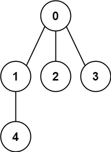
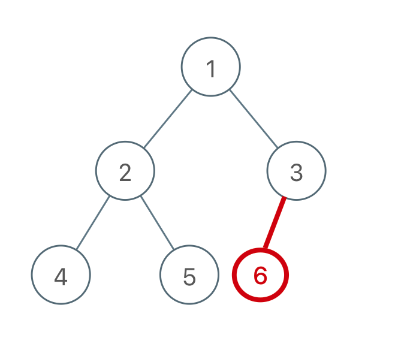
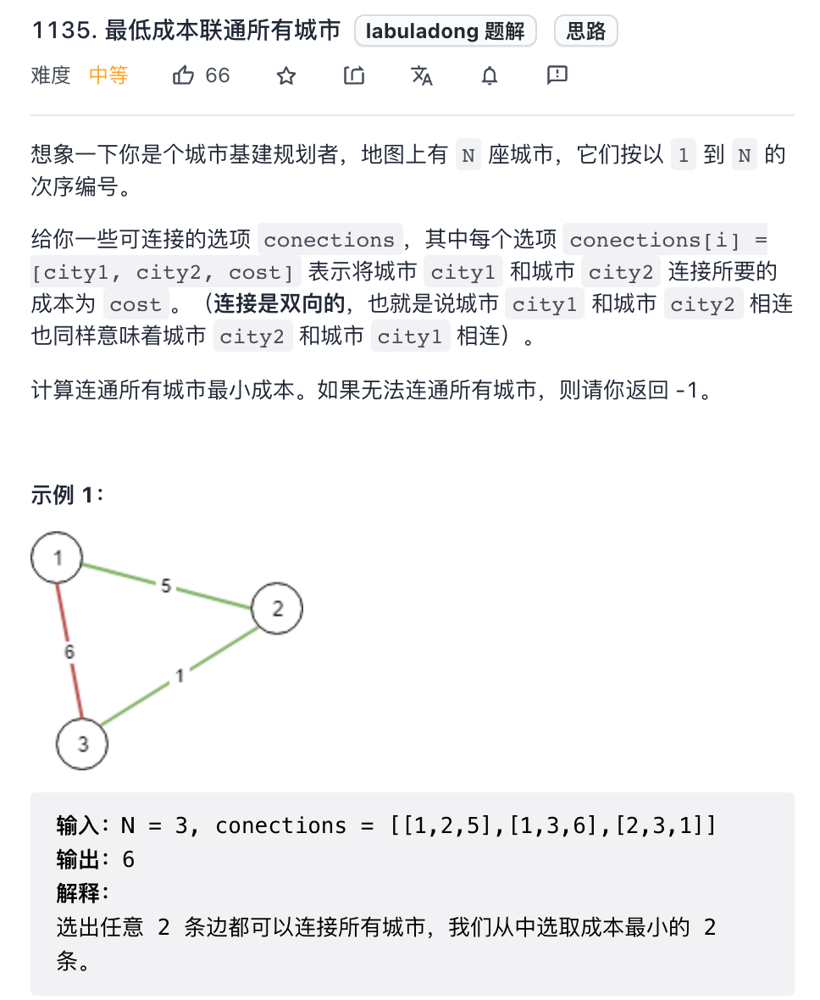
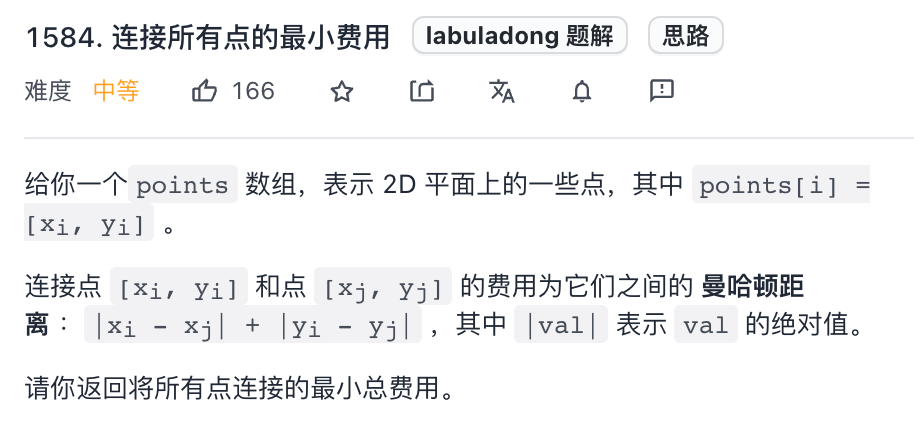

读完本文，你不仅学会了算法套路，还可以顺便解决如下题目：

|                           LeetCode                           |                             力扣                             | 难度 |
| :----------------------------------------------------------: | :----------------------------------------------------------: | :--: |
| [1135. Connecting Cities With Minimum Cost](https://leetcode.com/problems/connecting-cities-with-minimum-cost/)🔒 | [1135. 最低成本联通所有城市](https://leetcode.cn/problems/connecting-cities-with-minimum-cost/)🔒 |  🟠   |
| [1584. Min Cost to Connect All Points](https://leetcode.com/problems/min-cost-to-connect-all-points/) | [1584. 连接所有点的最小费用](https://leetcode.cn/problems/min-cost-to-connect-all-points/) |  🟠   |
| [261. Graph Valid Tree](https://leetcode.com/problems/graph-valid-tree/)🔒 | [261. 以图判树](https://leetcode.cn/problems/graph-valid-tree/)🔒 |  🟠   |

**-----------**

图论中知名度比较高的算法应该就是 [Dijkstra 最短路径算法](https://labuladong.github.io/article/fname.html?fname=dijkstra算法)，[环检测和拓扑排序](https://labuladong.github.io/article/fname.html?fname=拓扑排序)，[二分图判定算法](https://labuladong.github.io/article/fname.html?fname=二分图) 以及今天要讲的最小生成树（Minimum Spanning Tree）算法了。

最小生成树算法主要有 Prim 算法（普里姆算法）和 Kruskal 算法（克鲁斯卡尔算法）两种，这两种算法虽然都运用了贪心思想，但从实现上来说差异还是蛮大的。

本文先来讲比较简单易懂的 Kruskal 算法，然后在下一篇文章 [Prim 算法模板](https://labuladong.github.io/article/fname.html?fname=prim算法) 中聊 Prim 算法。

Kruskal 算法其实很容易理解和记忆，其关键是要熟悉并查集算法，如果不熟悉，建议先看下前文 [Union-Find 并查集算法](https://labuladong.github.io/article/fname.html?fname=UnionFind算法详解)。

接下来，我们从最小生成树的定义说起。

### 什么是最小生成树

**先说「树」和「图」的根本区别：树不会包含环，图可以包含环**。

如果一幅图没有环，完全可以拉伸成一棵树的模样。说的专业一点，树就是「无环连通图」。

那么什么是图的「生成树」呢，其实按字面意思也好理解，就是在图中找一棵包含图中的所有节点的树。专业点说，生成树是含有图中所有顶点的「无环连通子图」。

容易想到，一幅图可以有很多不同的生成树，比如下面这幅图，红色的边就组成了两棵不同的生成树：


对于加权图，每条边都有权重，所以每棵生成树都有一个权重和。比如上图，右侧生成树的权重和显然比左侧生成树的权重和要小。

**那么最小生成树很好理解了，所有可能的生成树中，权重和最小的那棵生成树就叫「最小生成树」**。

> PS：一般来说，我们都是在**无向加权图**中计算最小生成树的，所以使用最小生成树算法的现实场景中，图的边权重一般代表成本、距离这样的标量。

在讲 Kruskal 算法之前，需要回顾一下 Union-Find 并查集算法。

### Union-Find 并查集算法

刚才说了，图的生成树是含有其所有顶点的「无环连通子图」，最小生成树是权重和最小的生成树。

那么说到连通性，相信老读者应该可以想到 Union-Find 并查集算法，用来高效处理图中联通分量的问题。

前文 [Union-Find 并查集算法详解](https://labuladong.github.io/article/fname.html?fname=UnionFind算法详解) 详细介绍了 Union-Find 算法的实现原理和一些应用场景，主要运用路径压缩技巧提高连通分量的判断效率。

如果不了解 Union-Find 算法的读者可以去看前文，为了节约篇幅，本文直接给出 Union-Find 算法的实现：

Copy

```java
class UF {
    // 连通分量个数
    private int count;
    // 存储每个节点的父节点
    private int[] parent;

    // n 为图中节点的个数
    public UF(int n) {
        this.count = n;
        parent = new int[n];
        for (int i = 0; i < n; i++) {
            parent[i] = i;
        }
    }

    // 将节点 p 和节点 q 连通
    public void union(int p, int q) {
        int rootP = find(p);
        int rootQ = find(q);

        if (rootP == rootQ)
            return;

        parent[rootQ] = rootP;
        // 两个连通分量合并成一个连通分量
        count--;
    }

    // 判断节点 p 和节点 q 是否连通
    public boolean connected(int p, int q) {
        int rootP = find(p);
        int rootQ = find(q);
        return rootP == rootQ;
    }

    public int find(int x) {
        if (parent[x] != x) {
            parent[x] = find(parent[x]);
        }
        return parent[x];
    }

    // 返回图中的连通分量个数
    public int count() {
        return count;
    }
}
```

Kruskal 算法的一个难点是保证生成树的合法性，因为在构造生成树的过程中，你首先得保证生成的那玩意是棵树（不包含环）对吧，那么 Union-Find 算法就是帮你干这个事儿的。怎么做到的呢？先来看看力扣第 261 题「以图判树」，我描述下题目：

给你输入编号从 `0` 到 `n - 1` 的 `n` 个结点，和一个无向边列表 `edges`（每条边用节点二元组表示），请你判断输入的这些边组成的结构是否是一棵树。

函数签名如下：

```java
boolean validTree(int n, int[][] edges);
```

比如输入如下：

```shell
n = 5
edges = [[0,1], [0,2], [0,3], [1,4]]
```

这些边构成的是一棵树，算法应该返回 true：



但如果输入：

Copy

```shell
n = 5
edges = [[0,1],[1,2],[2,3],[1,3],[1,4]]
```

形成的就不是树结构了，因为包含环：


**对于这道题，我们可以思考一下，什么情况下加入一条边会使得树变成图（出现环）**？

显然，像下面这样添加边会出现环：


而这样添加边则不会出现环：



总结一下规律就是：

**对于添加的这条边，如果该边的两个节点本来就在同一连通分量里，那么添加这条边会产生环；反之，如果该边的两个节点不在同一连通分量里，则添加这条边不会产生环**。

而判断两个节点是否连通（是否在同一个连通分量中）就是 Union-Find 算法的拿手绝活，所以这道题的解法代码如下：

Copy

```java
// 判断输入的若干条边是否能构造出一棵树结构
boolean validTree(int n, int[][] edges) {
    // 初始化 0...n-1 共 n 个节点
    UF uf = new UF(n);
    // 遍历所有边，将组成边的两个节点进行连接
    for (int[] edge : edges) {
        int u = edge[0];
        int v = edge[1];
        // 若两个节点已经在同一连通分量中，会产生环
        if (uf.connected(u, v)) {            


            return false;
        }
        // 这条边不会产生环，可以是树的一部分
        uf.union(u, v);        


    }
    // 要保证最后只形成了一棵树，即只有一个连通分量
    return uf.count() == 1;
}

class UF {
    // 见上文代码实现
}
```

如果你能够看懂这道题的解法思路，那么掌握 Kruskal 算法就很简单了。

### Kruskal 算法

所谓最小生成树，就是图中若干边的集合（我们后文称这个集合为 `mst`，最小生成树的英文缩写），你要保证这些边：

1、包含图中的所有节点。

2、形成的结构是树结构（即不存在环）。

3、权重和最小。

有之前题目的铺垫，前两条其实可以很容易地利用 Union-Find 算法做到，关键在于第 3 点，如何保证得到的这棵生成树是权重和最小的。

这里就用到了贪心思路：

**将所有边按照权重从小到大排序，从权重最小的边开始遍历，如果这条边和 `mst` 中的其它边不会形成环，则这条边是最小生成树的一部分，将它加入 `mst` 集合；否则，这条边不是最小生成树的一部分，不要把它加入 `mst` 集合**。

这样，最后 `mst` 集合中的边就形成了最小生成树，下面我们看两道例题来运用一下 Kruskal 算法。

第一题是力扣第 1135 题「最低成本联通所有城市」，这是一道标准的最小生成树问题：



函数签名如下：

```java
int minimumCost(int n, int[][] connections);
```

每座城市相当于图中的节点，连通城市的成本相当于边的权重，连通所有城市的最小成本即是最小生成树的权重之和。

```java
int minimumCost(int n, int[][] connections) {
    // 城市编号为 1...n，所以初始化大小为 n + 1
    UF uf = new UF(n + 1);
    // 对所有边按照权重从小到大排序
    Arrays.sort(connections, (a, b) -> (a[2] - b[2]));
    // 记录最小生成树的权重之和
    int mst = 0;
    for (int[] edge : connections) {
        int u = edge[0];
        int v = edge[1];
        int weight = edge[2];
        // 若这条边会产生环，则不能加入 mst
        if (uf.connected(u, v)) {
            continue;
        }
        // 若这条边不会产生环，则属于最小生成树
        mst += weight;
        uf.union(u, v);
    }
    // 保证所有节点都被连通
    // 按理说 uf.count() == 1 说明所有节点被连通
    // 但因为节点 0 没有被使用，所以 0 会额外占用一个连通分量
    return uf.count() == 2 ? mst : -1;
}

class UF {
    // 见上文代码实现
}
```

这道题就解决了，整体思路和上一道题非常类似，你可以认为树的判定算法加上按权重排序的逻辑就变成了 Kruskal 算法。

再来看看力扣第 1584 题「连接所有点的最小费用」：



比如题目给的例子：

Copy

```
points = [[0,0],[2,2],[3,10],[5,2],[7,0]]
```

算法应该返回 20，按如下方式连通各点：


函数签名如下：

```java
int minCostConnectPoints(int[][] points);
```

很显然这也是一个标准的最小生成树问题：每个点就是无向加权图中的节点，边的权重就是曼哈顿距离，连接所有点的最小费用就是最小生成树的权重和。

所以解法思路就是先生成所有的边以及权重，然后对这些边执行 Kruskal 算法即可：

```java
int minCostConnectPoints(int[][] points) {
    int n = points.length;
    // 生成所有边及权重
    List<int[]> edges = new ArrayList<>();
    for (int i = 0; i < n; i++) {
        for (int j = i + 1; j < n; j++) {
            int xi = points[i][0], yi = points[i][1];
            int xj = points[j][0], yj = points[j][1];
            // 用坐标点在 points 中的索引表示坐标点
            edges.add(new int[] {
                i, j, Math.abs(xi - xj) + Math.abs(yi - yj)
            });
        }
    }
    // 将边按照权重从小到大排序
    Collections.sort(edges, (a, b) -> {
        return a[2] - b[2];
    });
    // 执行 Kruskal 算法
    int mst = 0;
    UF uf = new UF(n);
    for (int[] edge : edges) {
        int u = edge[0];
        int v = edge[1];
        int weight = edge[2];
        // 若这条边会产生环，则不能加入 mst
        if (uf.connected(u, v)) {
            continue;
        }
        // 若这条边不会产生环，则属于最小生成树
        mst += weight;
        uf.union(u, v);
    }
    return mst;
}

class UF {
    // 见上文代码实现
}
```

这道题做了一个小的变通：每个坐标点是一个二元组，那么按理说应该用五元组表示一条带权重的边，但这样的话不便执行 Union-Find 算法；所以我们用 `points` 数组中的索引代表每个坐标点，这样就可以直接复用之前的 Kruskal 算法逻辑了。

通过以上三道算法题，相信你已经掌握了 Kruskal 算法，主要的难点是利用 Union-Find 并查集算法向最小生成树中添加边，配合排序的贪心思路，从而得到一棵权重之和最小的生成树。

最后说下 Kruskal 算法的复杂度分析：

假设一幅图的节点个数为 `V`，边的条数为 `E`，首先需要 `O(E)` 的空间装所有边，而且 Union-Find 算法也需要 `O(V)` 的空间，所以 Kruskal 算法总的空间复杂度就是 `O(V + E)`。

时间复杂度主要耗费在排序，需要 `O(ElogE)` 的时间，Union-Find 算法所有操作的复杂度都是 `O(1)`，套一个 for 循环也不过是 `O(E)`，所以总的时间复杂度为 `O(ElogE)`。

本文就到这里，关于 Prim 最小生成树算法，我们在 [Prim 算法模板](https://labuladong.github.io/article/fname.html?fname=prim算法) 中聊。