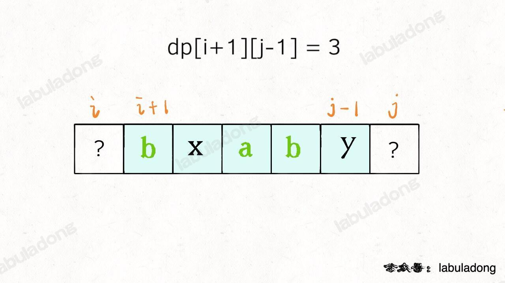
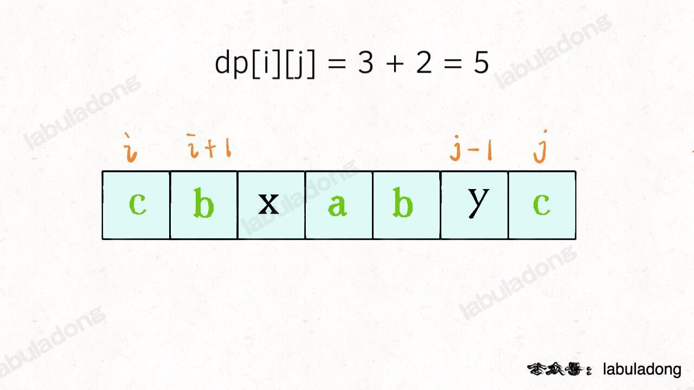
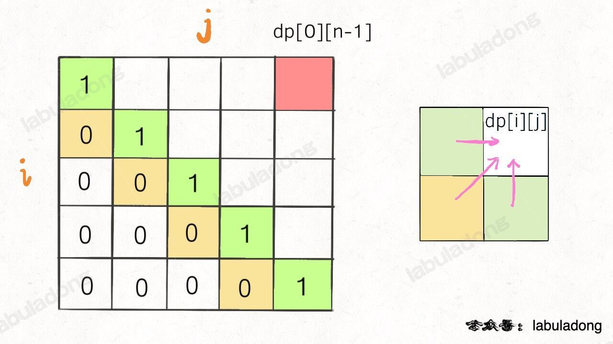
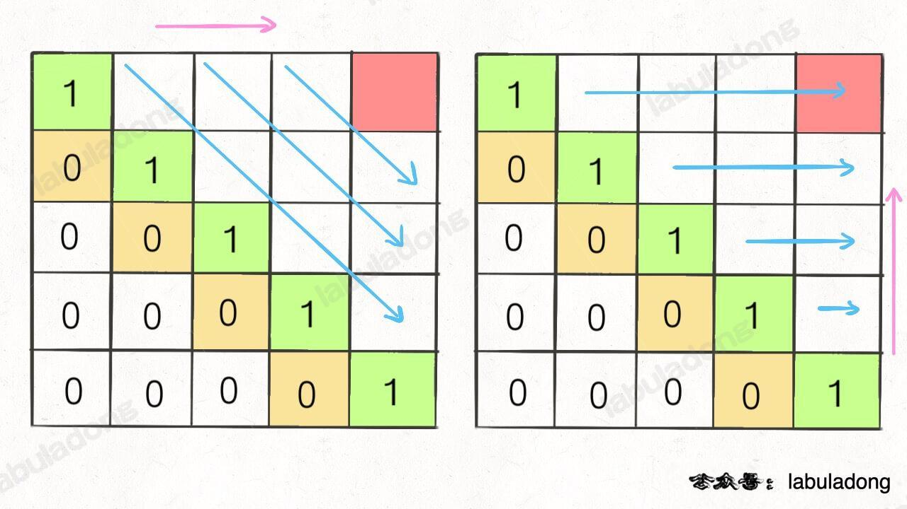
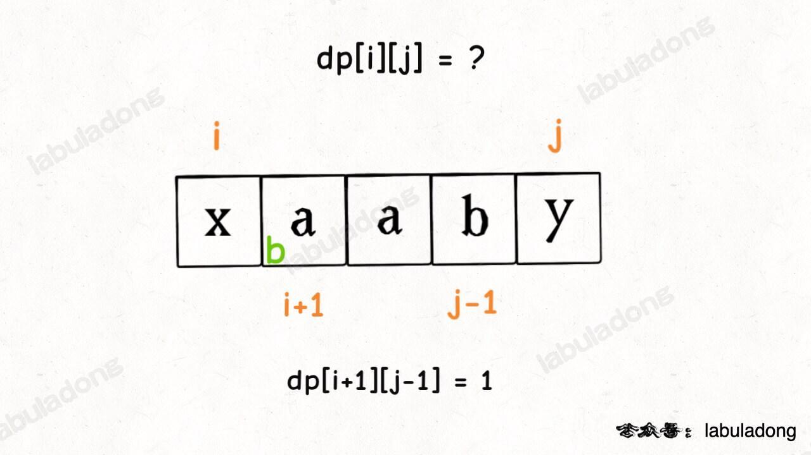

读完本文，你不仅学会了算法套路，还可以顺便解决如下题目：

|                           LeetCode                           |                             力扣                             | 难度 |
| :----------------------------------------------------------: | :----------------------------------------------------------: | :--: |
| [1312. Minimum Insertion Steps to Make a String Palindrome](https://leetcode.com/problems/minimum-insertion-steps-to-make-a-string-palindrome/) | [1312. 让字符串成为回文串的最少插入次数](https://leetcode.cn/problems/minimum-insertion-steps-to-make-a-string-palindrome/) |  🔴   |
| [516. Longest Palindromic Subsequence](https://leetcode.com/problems/longest-palindromic-subsequence/) | [516. 最长回文子序列](https://leetcode.cn/problems/longest-palindromic-subsequence/) |  🟠   |

**-----------**

子序列问题是常见的算法问题，而且并不好解决。

首先，子序列问题本身就相对子串、子数组更困难一些，因为前者是不连续的序列，而后两者是连续的，就算穷举你都不一定会，更别说求解相关的算法问题了。

而且，子序列问题很可能涉及到两个字符串，比如前文 [最长公共子序列](https://appktavsiei5995.pc.xiaoe-tech.com/detail/i_6298793ae4b09dda12708be8/1)，如果没有一定的处理经验，真的不容易想出来。所以本文就来扒一扒子序列问题的套路，其实就有两种模板，相关问题只要往这两种思路上想，十拿九稳。

一般来说，这类问题都是让你求一个**最长子序列**，因为最短子序列就是一个字符嘛，没啥可问的。一旦涉及到子序列和最值，那几乎可以肯定，**考察的是动态规划技巧，时间复杂度一般都是 O(n^2)**。

原因很简单，你想想一个字符串，它的子序列有多少种可能？起码是指数级的吧，这种情况下，不用动态规划技巧，还想怎么着？

既然要用动态规划，那就要定义 `dp` 数组，找状态转移关系。我们说的两种思路模板，就是 `dp` 数组的定义思路。不同的问题可能需要不同的 `dp` 数组定义来解决。

### 一、两种思路

**1、第一种思路模板是一个一维的 `dp` 数组**：

Copy

```java
int n = array.length;
int[] dp = new int[n];

for (int i = 1; i < n; i++) {
    for (int j = 0; j < i; j++) {
        dp[i] = 最值(dp[i], dp[j] + ...)
    }
}
```

比如我们写过的 [最长递增子序列](https://labuladong.github.io/article/fname.html?fname=动态规划设计：最长递增子序列) 和 [最大子数组和](https://labuladong.github.io/article/fname.html?fname=最大子数组) 都是这个思路。

在这个思路中 `dp` 数组的定义是：

**在子数组 `arr[0..i]` 中，我们要求的子序列（最长递增子序列）的长度是 `dp[i]`**。

为啥最长递增子序列需要这种思路呢？前文说得很清楚了，因为这样符合归纳法，可以找到状态转移的关系，这里就不具体展开了。

**2、第二种思路模板是一个二维的 `dp` 数组**：

Copy

```java
int n = arr.length;
int[][] dp = new dp[n][n];

for (int i = 0; i < n; i++) {
    for (int j = 0; j < n; j++) {
        if (arr[i] == arr[j]) 
            dp[i][j] = dp[i][j] + ...
        else
            dp[i][j] = 最值(...)
    }
}
```

这种思路运用相对更多一些，尤其是涉及两个字符串/数组的子序列时，比如前文讲的 [最长公共子序列](https://appktavsiei5995.pc.xiaoe-tech.com/detail/i_6298793ae4b09dda12708be8/1) 和 [编辑距离](https://labuladong.github.io/article/fname.html?fname=编辑距离)；这种思路也可以用于只涉及一个字符串/数组的情景，比如本文讲的回文子序列问题。

**2.1 涉及两个字符串/数组的场景**，`dp` 数组的定义如下：

**在子数组 `arr1[0..i]` 和子数组 `arr2[0..j]` 中，我们要求的子序列长度为 `dp[i][j]`**。

**2.2 只涉及一个字符串/数组的场景**，`dp` 数组的定义如下：

**在子数组 `array[i..j]` 中，我们要求的子序列的长度为 `dp[i][j]`**。

下面就看看最长回文子序列问题，详解一下第二种情况下如何使用动态规划。

### 二、最长回文子序列

之前解决了 [最长回文子串](https://appktavsiei5995.pc.xiaoe-tech.com/detail/i_629e11bae4b0812e17a33045/1) 的问题，这次提升难度，看看力扣第 516 题「最长回文子序列」，求最长回文子序列的长度：

输入一个字符串 `s`，请你找出 `s` 中的最长回文子序列长度，函数签名如下：

Copy

```java
int longestPalindromeSubseq(String s);
```

比如说输入 `s = "aecda"`，算法返回 3，因为最长回文子序列是 `"aca"`，长度为 3。

我们对 `dp` 数组的定义是：**在子串 `s[i..j]` 中，最长回文子序列的长度为 `dp[i][j]`**。一定要记住这个定义才能理解算法。

为啥这个问题要这样定义二维的 `dp` 数组呢？我在 [最长递增子序列](https://labuladong.github.io/article/fname.html?fname=动态规划设计：最长递增子序列) 提到，找状态转移需要归纳思维，说白了就是如何从已知的结果推出未知的部分。而这样定义能够进行归纳，容易发现状态转移关系。

具体来说，如果我们想求 `dp[i][j]`，假设你知道了子问题 `dp[i+1][j-1]` 的结果（`s[i+1..j-1]` 中最长回文子序列的长度），你是否能想办法算出 `dp[i][j]` 的值（`s[i..j]` 中，最长回文子序列的长度）呢？



可以！这取决于 `s[i]` 和 `s[j]` 的字符：

**如果它俩相等**，那么它俩加上 `s[i+1..j-1]` 中的最长回文子序列就是 `s[i..j]` 的最长回文子序列：



**如果它俩不相等**，说明它俩**不可能同时**出现在 `s[i..j]` 的最长回文子序列中，那么把它俩**分别**加入 `s[i+1..j-1]` 中，看看哪个子串产生的回文子序列更长即可：


以上两种情况写成代码就是这样：

Copy

```java
if (s[i] == s[j])
    // 它俩一定在最长回文子序列中
    dp[i][j] = dp[i + 1][j - 1] + 2;
else
    // s[i+1..j] 和 s[i..j-1] 谁的回文子序列更长？
    dp[i][j] = max(dp[i + 1][j], dp[i][j - 1]);
```

至此，状态转移方程就写出来了，根据 dp 数组的定义，我们要求的就是 `dp[0][n - 1]`，也就是整个 `s` 的最长回文子序列的长度。

### 三、代码实现

首先明确一下 base case，如果只有一个字符，显然最长回文子序列长度是 1，也就是 `dp[i][j] = 1 (i == j)`。

因为 `i` 肯定小于等于 `j`，所以对于那些 `i > j` 的位置，根本不存在什么子序列，应该初始化为 0。

另外，看看刚才写的状态转移方程，想求 `dp[i][j]` 需要知道 `dp[i+1][j-1]`，`dp[i+1][j]`，`dp[i][j-1]` 这三个位置；再看看我们确定的 base case，填入 `dp` 数组之后是这样：



**为了保证每次计算 `dp[i][j]`，左下右方向的位置已经被计算出来，只能斜着遍历或者反着遍历**：



我选择反着遍历，代码如下：

Copy

```java
int longestPalindromeSubseq(String s) {
    int n = s.length();
    // dp 数组全部初始化为 0
    int[][] dp = new int[n][n];
    // base case
    for (int i = 0; i < n; i++) {
        dp[i][i] = 1;
    }
    // 反着遍历保证正确的状态转移
    for (int i = n - 1; i >= 0; i--) {
        for (int j = i + 1; j < n; j++) {
            // 状态转移方程
            if (s.charAt(i) == s.charAt(j)) {
                dp[i][j] = dp[i + 1][j - 1] + 2;
            } else {
                dp[i][j] = Math.max(dp[i + 1][j], dp[i][j - 1]);
            }
        }
    }
    // 整个 s 的最长回文子串长度
    return dp[0][n - 1];
}
```

至此，最长回文子序列的问题就解决了。

### 四、拓展延伸

虽然回文相关的问题没有什么特别广泛的使用场景，但是你会算最长回文子序列之后，一些类似的题目也可以顺手做掉。

比如力扣第 1312 题「计算让字符串成为回文串的最少插入次数」：

输入一个字符串 `s`，你可以在字符串的任意位置插入任意字符。如果要把 `s` 变成回文串，请你计算最少要进行多少次插入？

函数签名如下：

Copy

```java
int minInsertions(String s);
```

比如说输入 `s = "abcea"`，算法返回 2，因为可以给 `s` 插入 2 个字符变成回文串 `"abeceba"` 或者 `"aebcbea"`。如果输入 `s = "aba"`，则算法返回 0，因为 `s` 已经是回文串，不用插入任何字符。

这也是一道单字符串的子序列问题，所以我们也可以使用一个二维 `dp` 数组，其中 `dp[i][j]` 的定义如下：

**对字符串 `s[i..j]`，最少需要进行 `dp[i][j]` 次插入才能变成回文串**。

根据 `dp` 数组的定义，base case 就是 `dp[i][i] = 0`，因为单个字符本身就是回文串，不需要插入。

然后使用数学归纳法，假设已经计算出了子问题 `dp[i+1][j-1]` 的值了，思考如何推出 `dp[i][j]` 的值：



实际上和最长回文子序列问题的状态转移方程非常类似，这里也分两种情况：

Copy

```java
if (s[i] == s[j]) {
    // 不需要插入任何字符
    dp[i][j] = dp[i + 1][j - 1];
} else {
    // 把 s[i+1..j] 和 s[i..j-1] 变成回文串，选插入次数较少的
    // 然后还要再插入一个 s[i] 或 s[j]，使 s[i..j] 配成回文串
    dp[i][j] = min(dp[i + 1][j], dp[i][j - 1]) + 1;
}
```

最后，我们依然采取倒着遍历 `dp` 数组的方式，写出代码：

Copy

```java
int minInsertions(String s) {
    int n = s.length();
    // dp[i][j] 表示把字符串 s[i..j] 变成回文串的最少插入次数
    // dp 数组全部初始化为 0
    int[][] dp = new int[n][n];
    // 反着遍历保证正确的状态转移
    for (int i = n - 1; i >= 0; i--) {
        for (int j = i + 1; j < n; j++) {
            // 状态转移方程
            if (s.charAt(i) == s.charAt(j)) {
                dp[i][j] = dp[i + 1][j - 1];
            } else {
                dp[i][j] = Math.min(dp[i + 1][j], dp[i][j - 1]) + 1;
            }
        }
    }
    // 整个 s 的最少插入次数
    return dp[0][n - 1];
}
```

至此，这道题也使用子序列解题模板解决了，整体逻辑和最长回文子序列非常相似，那么这个问题是否可以直接复用回文子序列的解法呢？

其实是可以的，我们甚至都不用写状态转移方程，你仔细想想：

**我先算出字符串 `s` 中的最长回文子序列，那些不在最长回文子序列中的字符，不就是需要插入的字符吗**？

所以这道题可以直接复用之前实现的 `longestPalindromeSubseq` 函数：

Copy

```java
// 计算把 s 变成回文串的最少插入次数
public int minInsertions(String s) {
    return s.length() - longestPalindromeSubseq(s);
}

// 计算 s 中的最长回文子序列长度
int longestPalindromeSubseq(String s) {
    // 见上文
}
```

好了，子序列相关的算法就讲到这里，希望对你有启发。