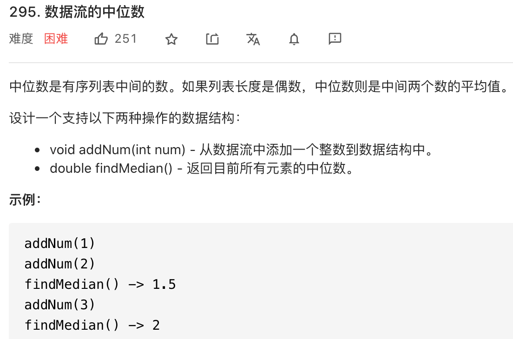
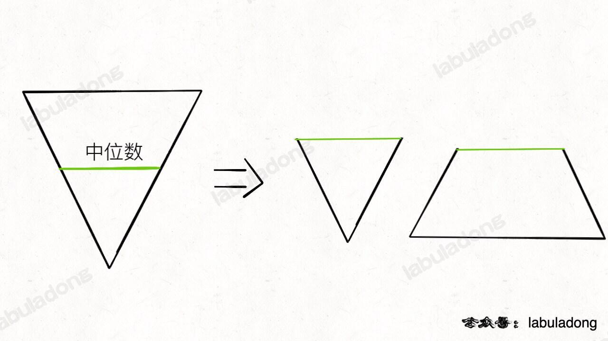
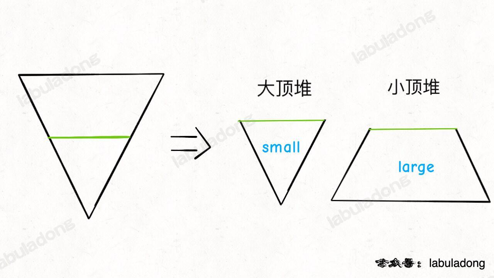
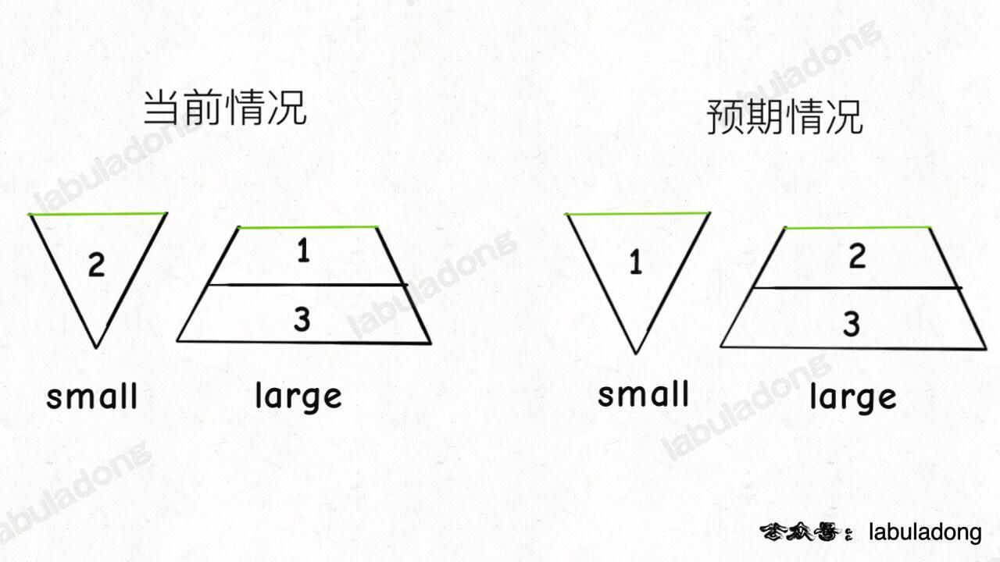

读完本文，你不仅学会了算法套路，还可以顺便解决如下题目：

|                           LeetCode                           |                             力扣                             | 难度 |
| :----------------------------------------------------------: | :----------------------------------------------------------: | :--: |
| [295. Find Median from Data Stream](https://leetcode.com/problems/find-median-from-data-stream/) | [295. 数据流的中位数](https://leetcode.cn/problems/find-median-from-data-stream/) |  🔴   |

**-----------**

如果输入一个数组，让你求中位数，这个好办，排个序，如果数组长度是奇数，最中间的一个元素就是中位数，如果数组长度是偶数，最中间两个元素的平均数作为中位数。

如果数据规模非常巨大，排序不太现实，那么也可以使用概率算法，随机抽取一部分数据，排序，求中位数，作为所有数据的中位数。

本文说的中位数算法比较困难，也比较精妙，是力扣第 295 题「数据流的中位数」：



就是让你设计这样一个类：

Copy

```java
class MedianFinder {

    // 添加一个数字
    public void addNum(int num) {}

    // 计算当前添加的所有数字的中位数
    public double findMedian() {}
}
```

**其实，所有关于「流」的算法都比较难**，比如我在前文 [谈谈游戏中的随机算法](https://labuladong.github.io/article/fname.html?fname=随机算法) 写过如何从数据流中等概率随机抽取一个元素，如果说你没有接触过这个问题的话，还是很难想到解法的。

这道题要求在数据流中计算平均数，我们先想一想常规思路。

### 尝试分析

一个直接的解法可以用一个数组记录所有 `addNum` 添加进来的数字，通过插入排序的逻辑保证数组中的元素有序，当调用 `findMedian` 方法时，可以通过数组索引直接计算中位数。

但是用数组作为底层容器的问题也很明显，`addNum` 搜索插入位置的时候可以用二分搜索算法，但是插入操作需要搬移数据，所以最坏时间复杂度为 O(N)。

那换链表？链表插入元素很快，但是查找插入位置的时候只能线性遍历，最坏时间复杂度还是 O(N)，而且 `findMedian` 方法也需要遍历寻找中间索引，最坏时间复杂度也是 O(N)。

那么就用平衡二叉树呗，增删查改复杂度都是 O(logN)，这样总行了吧？

比如用 Java 提供的 `TreeSet` 容器，底层是红黑树，`addNum` 直接插入，`findMedian` 可以通过当前元素的个数推出计算中位数的元素的排名。

很遗憾，依然不行，这里有两个问题：

第一，`TreeSet` 是一种 `Set`，其中不存在重复元素的元素，但是我们的数据流可能输入重复数据的，而且计算中位数也是需要算上重复元素的。

第二，`TreeSet` 并没有实现一个通过排名快速计算元素的 API。假设我想找到 `TreeSet` 中第 5 大的元素，并没有一个现成可用的方法实现这个需求。

> PS：如果让你实现一个在二叉搜索树中通过排名计算对应元素的方法 `select(int index)`，你会怎么设计？你可以思考一下，我会把答案写在留言区置顶。

除了平衡二叉树，还有没有什么常用的数据结构是动态有序的？优先级队列（二叉堆）行不行？

好像也不太行，因为优先级队列是一种受限的数据结构，只能从堆顶添加/删除元素，我们的 `addNum` 方法可以从堆顶插入元素，但是 `findMedian` 函数需要从数据中间取，这个功能优先级队列是没办法提供的。

可以看到，求个中位数还是挺难的，我们使尽浑身解数都没有一个高效地思路，下面直接来看解法吧，比较巧妙。

### 解法思路

**我们必然需要有序数据结构，本题的核心思路是使用两个优先级队列**。

中位数是有序数组最中间的元素算出来的对吧，我们可以把「有序数组」抽象成一个倒三角形，宽度可以视为元素的大小，那么这个倒三角的中部就是计算中位数的元素对吧：



然后我把这个大的倒三角形从正中间切成两半，变成一个小倒三角和一个梯形，这个小倒三角形相当于一个从小到大的有序数组，这个梯形相当于一个从大到小的有序数组。

中位数就可以通过小倒三角和梯形顶部的元素算出来对吧？嗯，你联想到什么了没有？它们能不能用优先级队列表示？

**小倒三角不就是个大顶堆嘛，梯形不就是个小顶堆嘛，中位数可以通过它们的堆顶元素算出来**：



梯形虽然是小顶堆，但其中的元素是较大的，我们称其为 `large`，倒三角虽然是大顶堆，但是其中元素较小，我们称其为 `small`。

当然，这两个堆需要算法逻辑正确维护，才能保证堆顶元素是可以算出正确的中位数，**我们很容易看出来，两个堆中的元素之差不能超过 1**。

因为我们要求中位数嘛，假设元素总数是 `n`，如果 `n` 是偶数，我们希望两个堆的元素个数是一样的，这样把两个堆的堆顶元素拿出来求个平均数就是中位数；如果 `n` 是奇数，那么我们希望两个堆的元素个数分别是 `n/2 + 1` 和 `n/2`，这样元素多的那个堆的堆顶元素就是中位数。

根据这个逻辑，我们可以直接写出 `findMedian` 函数的代码：

Copy

```java
class MedianFinder {

    private PriorityQueue<Integer> large;
    private PriorityQueue<Integer> small;

    public MedianFinder() {
        // 小顶堆
        large = new PriorityQueue<>();
        // 大顶堆
        small = new PriorityQueue<>((a, b) -> {
            return b - a;
        });
    }

    public double findMedian() {        


        // 如果元素不一样多，多的那个堆的堆顶元素就是中位数
        if (large.size() < small.size()) {
            return small.peek();
        } else if (large.size() > small.size()) {
            return large.peek();
        }
        // 如果元素一样多，两个堆堆顶元素的平均数是中位数
        return (large.peek() + small.peek()) / 2.0;        


    }

    public void addNum(int num) {
        // 后文实现
    }
}
```

现在的问题是，如何实现 `addNum` 方法，维护「两个堆中的元素之差不能超过 1」这个条件呢？

这样行不行？每次调用 `addNum` 函数的时候，我们比较一下 `large` 和 `small` 的元素个数，谁的元素少我们就加到谁那里，如果它们的元素一样多，我们默认加到 `large` 里面：

Copy

```java
// 有缺陷的代码实现
public void addNum(int num) {
    if (small.size() >= large.size()) {
        large.offer(num);
    } else {
        small.offer(num);
    }
}
```

看起来好像没问题，但是跑一下就发现问题了，比如说我们这样调用：

`addNum(1)`，现在两个堆元素数量相同，都是 0，所以默认把 1 添加进 `large` 堆。

`addNum(2)`，现在 `large` 的元素比 `small` 的元素多，所以把 2 添加进 `small` 堆中。

`addNum(3)`，现在两个堆都有一个元素，所以默认把 3 添加进 `large` 中。

调用 `findMedian`，预期的结果应该是 2，但是实际得到的结果是 1。

问题很容易发现，看下当前两个堆中的数据：



抽象点说，我们的梯形和小倒三角都是由原始的大倒三角从中间切开得到的，那么梯形中的最小宽度要大于等于小倒三角的最大宽度，这样它俩才能拼成一个大的倒三角对吧？

**也就是说，不仅要维护 `large` 和 `small` 的元素个数之差不超过 1，还要维护 `large` 堆的堆顶元素要大于等于 `small` 堆的堆顶元素**。

维护 `large` 堆的元素大小整体大于 `small` 堆的元素是本题的难点，不是一两个 if 语句能够正确维护的，而是需要如下技巧：

Copy

```java
// 正确的代码实现
public void addNum(int num) {
    if (small.size() >= large.size()) {
        small.offer(num);
        large.offer(small.poll());
    } else {
        large.offer(num);
        small.offer(large.poll());
    }
}
```

**简单说，想要往 `large` 里添加元素，不能直接添加，而是要先往 `small` 里添加，然后再把 `small` 的堆顶元素加到 `large` 中；向 `small` 中添加元素同理**。

为什么呢，稍加思考可以想明白，假设我们准备向 `large` 中插入元素：

如果插入的 `num` 小于 `small` 的堆顶元素，那么 `num` 就会留在 `small` 堆里，为了保证两个堆的元素数量之差不大于 1，作为交换，把 `small` 堆顶部的元素再插到 `large` 堆里。

如果插入的 `num` 大于 `small` 的堆顶元素，那么 `num` 就会成为 `samll` 的堆顶元素，最后还是会被插入 `large` 堆中。

反之，向 `small` 中插入元素是一个道理，这样就巧妙地保证了 `large` 堆整体大于 `small` 堆，且两个堆的元素之差不超过 1，那么中位数就可以通过两个堆的堆顶元素快速计算了。

至此，整个算法就结束了，`addNum` 方法时间复杂度 O(logN)，`findMedian` 方法时间复杂度 O(1)。