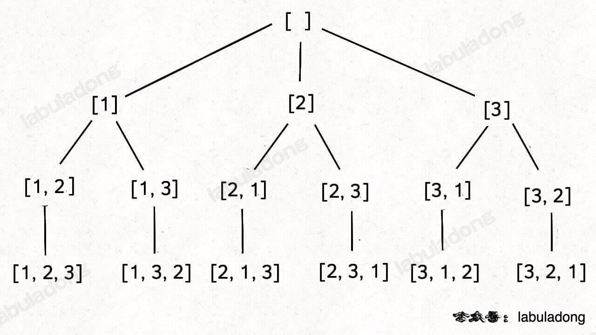
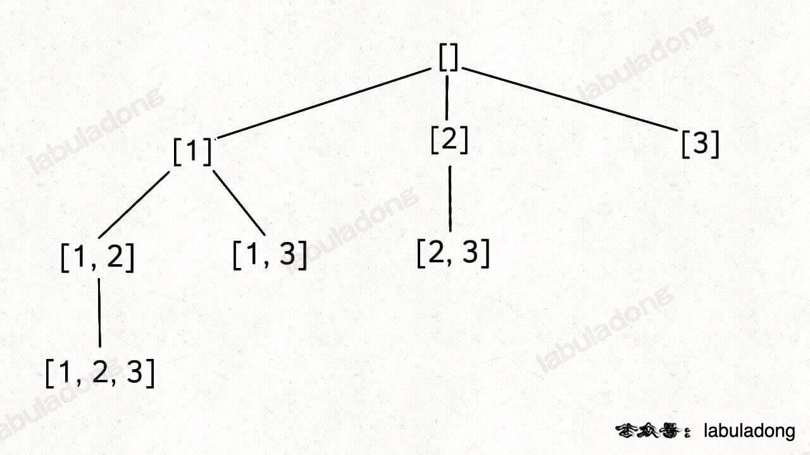

我以前的文章主要都是讲解算法的原理和解题的思维，对时间复杂度和空间复杂度的分析经常一笔带过，主要是基于以下两个原因：

1、对于偏小白的读者，我希望你集中精力理解算法原理。如果加入太多偏数学的内容，很容易把人劝退。

2、正确理解常用算法底层原理，是进行复杂度的分析的前提。尤其是递归相关的算法，只有你从树的角度进行思考和分析，才能正确分析其复杂度。

鉴于现在历史文章已经涵盖了所有常见算法的核心原理，所以我专门写一篇时空复杂度的分析指南，授人以鱼不如授人以渔，教给你一套通用的方法分析任何算法的时空复杂度。

本文会篇幅较长，会涵盖如下几点：

1、Big O 表示法的几个基本特点。

2、非递归算法中的时间复杂度分析。

3、数据结构 API 的效率衡量方法（摊还分析）。

4、递归算法的时间/空间复杂度的分析方法，这部分是重点，我会用动态规划和回溯算法举例。

废话不多说了，接下来一个个看。

### Big O 表示法

首先看一下 Big O 记号的数学定义：

> `O(g(n))` = { `f(n)`: 存在正常量 `c` 和 `n_0`，使得对所有 `n ≥ n_0`，有 `0 ≤ f(n) ≤ c*g(n)` }

我们常用的这个符号 `O` 其实代表一个函数的集合，比如 `O(n^2)` 代表着一个由 `g(n) = n^2` 派生出来的一个函数集合；我们说一个算法的时间复杂度为 `O(n^2)`，意思就是描述该算法的复杂度的函数属于这个函数集合之中。

**理论上，你看明白这个抽象的数学定义，就可以解答你关于 Big O 表示法的一切疑问了**。

但考虑到大部分人看到数学定义就头晕，我给你列举两个复杂度分析中会用到的特性，记住这两个就够用了。

**1、只保留增长速率最快的项，其他的项可以省略**。

首先，乘法和加法中的常数因子都可以忽略不计，比如下面的例子：

Copy

```java
O(2N + 100) = O(N)
O(2^(N+1)) = O(2 * 2^N) = O(2^N)
O(M + 3N + 99) = O(M + N)
```

当然，不要见到常数就消，有的常数消不得：

Copy

```java
O(2^(2N)) = O(4^N)
```

除了常数因子，增长速率慢的项在增长速率快的项面前也可以忽略不计：

Copy

```java
O(N^3 + 999 * N^2 + 999 * N) = O(N^3)
O((N + 1) * 2^N) = O(N * 2^N + 2^N) = O(N * 2^N)
```

以上列举的都是最简单常见的例子，这些例子都可以被 Big O 记号的定义正确解释。如果你遇到更复杂的复杂度场景，也可以根据定义来判断自己的复杂度表达式是否正确。

**2、Big O 记号表示复杂度的「上界」**。

换句话说，只要你给出的是一个上界，用 Big O 记号表示就都是正确的。

比如如下代码：

Copy

```java
for (int i = 0; i < N; i++) {
    print("hello world");
}
```

如果说这是一个算法，那么显然它的时间复杂度是 `O(N)`。但如果你非要说它的时间复杂度是 `O(N^2)`，严格意义上讲是可以的，因为 `O` 记号表示一个上界嘛，这个算法的时间复杂度确实不会超过 `N^2` 这个上界呀，虽然这个上界不够「紧」，但符合定义，所以没毛病。

上述例子太简单，非要扩大它的时间复杂度上界显得没什么意义。但有些算法的复杂度会和算法的输入数据有关，没办法提前给出一个特别精确的时间复杂度，那么在这种情况下，用 Big O 记号扩大时间复杂度的上界就变得有意义了。

比如前文 [动态规划核心框架](https://labuladong.github.io/article/fname.html?fname=动态规划详解进阶) 中讲到的凑零钱问题的暴力递归解法，核心代码框架如下：

Copy

```java
// 定义：要凑出金额 n，至少要 dp(coins, n) 个硬币
int dp(int[] coins, int amount) {
    // base case
    if (amount <= 0) return;
    // 状态转移
    for (int coin : coins) {
        dp(coins, amount - coin);
    }
}
```

当 `amount = 11, coins = [1,2,5]` 时，算法的递归树就长这样：


后文会具体讲递归算法的时间复杂度计算方法，现在我们先求一下这棵递归树上的节点个数吧。

假设金额 `amount` 的值为 `N`，`coins` 列表中元素个数为 `K`，那么这棵递归树就是一棵 `K` 叉树。但这棵树的生长和 `coins` 列表中的硬币面额有直接的关系，所以这棵树的形状会很不规则，导致我们很难精确地求出树上节点的总数。

对于这种情况，比较简单的处理方式就是按最坏情况做近似处理：

这棵树的高度有多高？不知道，那就按最坏情况来处理，假设全都是面额为 1 的硬币，这种情况下树高为 `N`。

这棵树的结构是什么样的？不知道，那就按最坏情况来处理，假设它是一棵满 `K` 叉树好了。

那么，这棵树上共有多少节点？都按最坏情况来处理，高度为 `N` 的一棵满 `K` 叉树，其节点总数为等比数列求和公式 `(K^N - 1)/(K - 1)`，用 Big O 表示就是 `O(K^N)`。

当然，我们知道这棵树上的节点数其实没有这么多，但用 `O(K^N)` 表示一个上界是没问题的。

**所以，有时候你自己估算出来的时间复杂度和别人估算的复杂度不同，并不一定代表谁算错了，可能你俩都是对的，只是是估算的精度不同**，一般来说只要数量级（线性/指数级/对数级/平方级等）能对上就没问题。

在算法领域，除了用 Big O 表示渐进上界，还有渐进下界、渐进紧确界等边界的表示方法，有兴趣的读者可以自行搜索。不过从实用的角度看，以上对 Big O 记号表示法的讲解就够用了。

### 非递归算法分析

非递归算法的空间复杂度一般很容易计算，你看它有没有申请数组之类的存储空间就行了，所以我主要说下时间复杂度的分析。

非递归算法中嵌套循环很常见，大部分场景下，只需把每一层的复杂度相乘就是总的时间复杂度：

Copy

```java
// 复杂度 O(N*W)
for (int i = 1; i <= N; i++) {
    for (int w = 1; w <= W; w++) {
        dp[i][w] = ...;
    }
}

// 1 + 2 + ... + n = n/2 + (n^2)/2
// 用 Big O 表示化简为 O(n^2)
for (int i = 0; i < n; i++) {
    for (int j = i; j >= 0; j--) {
        dp[i][j] = ...;
    }
}
```

但有时候只看嵌套循环的层数并不准确，还得看算法**具体在做什么**，比如前文 [一文秒杀所有 nSum 问题](https://appktavsiei5995.pc.xiaoe-tech.com/detail/i_62987931e4b0cedf38ba0684/1) 中就有这样一段代码：

Copy

```java
// 左右双指针
int lo = 0, hi = nums.length;
while (lo < hi) {
    int sum = nums[lo] + nums[hi];
    int left = nums[lo], right = nums[hi];
    if (sum < target) {
        while (lo < hi && nums[lo] == left) lo++;
    } else if (sum > target) {
        while (lo < hi && nums[hi] == right) hi--;
    } else {
        while (lo < hi && nums[lo] == left) lo++;
        while (lo < hi && nums[hi] == right) hi--;
    }
}
```

这段代码看起来很复杂，大 while 循环里面套了好多小 while 循环，感觉这段代码的时间复杂度应该是 `O(N^2)`（`N` 代表 `nums` 的长度）？

**其实，你只需要搞清楚代码到底在干什么，就能轻松计算出正确的复杂度了**。

这段代码就是个 [左右双指针](https://appktavsiei5995.pc.xiaoe-tech.com/detail/i_629e11bae4b0812e17a33045/1) 嘛，`lo` 是左边的指针，`hi` 是右边的指针，这两个指针相向而行，相遇时外层 while 结束。

甭管多复杂的逻辑，你看 `lo` 指针一直在往右走（`lo++`），`hi` 指针一直在往左走（`hi--`），它俩有没有回退过？没有。

所以这段算法的逻辑就是 `lo` 和 `hi` 不断相向而行，相遇时算法结束，那么它的时间复杂度就是线性的 `O(N)`。

类似的，你看前文 [滑动窗口算法核心框架](https://appktavsiei5995.pc.xiaoe-tech.com/detail/i_627ccf3be4b01a4851fe1012/1) 给出的滑动窗口算法模板：

Copy

```cpp
/* 滑动窗口算法框架 */
void slidingWindow(string s, string t) {
    unordered_map<char, int> need, window;
    for (char c : t) need[c]++;
    // 双指针，维护 [left, right) 为窗口
    int left = 0, right = 0;
    while (right < s.size()) {
        // 增大窗口
        right++;
        // 判断左侧窗口是否要收缩
        while (window needs shrink) {
            // 缩小窗口
            left++;
        }
    }
}
```

乍一看也是个嵌套循环，但仔细观察，发现这也是个双指针技巧，`left` 和 `right` 指针从 0 开始，一直向右移，直到移动到 `s` 的末尾结束外层 while 循环，没有回退过。

那么该算法做的事情就是把 `left` 和 `right` 两个指针从 0 移动到 `N`（`N` 代表字符串 `s` 的长度），所以滑动窗口算法的时间复杂度为线性的 `O(N)`。

### 数据结构分析

因为数据结构会用来存储数据，其 API 的执行效率可能受到其中存储的数据的影响，所以衡量数据结构 API 效率的方法和衡量普通算法函数效率的方法是有一些区别的。

就拿我们常见的数据结构举例，比如很多语言都提供动态数组，可以自动进行扩容和缩容。在它的尾部添加元素的时间复杂度是 `O(1)`。但当底层数组扩容时会分配新内存并把原来的数据搬移到新数组中，这个时间复杂度就是 `O(N)` 了，那我们能说在数组尾部添加元素的时间复杂度就是 `O(N)` 吗？

再比如哈希表也会在负载因子达到某个阈值时进行扩容和 rehash，时间复杂度也会达到 `O(N)`，那么我们为什么还说哈希表对单个键值对的存取效率是 `O(1)` 呢？

答案就是，**如果想衡量数据结构类中的某个方法的时间复杂度，不能简单地看最坏时间复杂度，而应该看摊还（平均）时间复杂度**。

比如说前文 [特殊数据结构：单调队列](https://appktavsiei5995.pc.xiaoe-tech.com/detail/i_627cd285e4b01a4851fe12be/1) 实现的单调队列类：

Copy

```java
/* 单调队列的实现 */
class MonotonicQueue {
    LinkedList<Integer> q = new LinkedList<>();

    public void push(int e) {
        // 将小于 e 的元素全部删除
        while (!q.isEmpty() && q.getLast() < e) {
            q.pollLast();
        }
        q.addLast(e);
    }

    public void pop(int e) {
        // e 可能已经在 push 的时候被删掉了
        // 所以需要额外判断一下
        if (e == q.getFirst()) {
            q.pollFirst();
        }
    }
}
```

标准的队列实现中，`push` 和 `pop` 方法的时间复杂度应该都是 `O(1)`，但这个 `MonotonicQueue` 类的 `push` 方法包含一个循环，其复杂度取决于参数 `e`，最好情况下是 `O(1)`，而最坏情况下复杂度应该是 `O(N)`，`N` 为队列中的元素个数。

对于这种情况，我们用平均时间复杂度来衡量 `push` 方法的效率比较合理。虽然它包含循环，但它的平均时间复杂度依然为 `O(1)`。

**计算平均时间复杂度最常用的方法叫做「聚合分析」，思路如下**：

给你一个空的 `MonotonicQueue`，然后请你执行 `N` 个 `push, pop` 组成的操作序列，请问这 `N` 个操作所需的总时间复杂度是多少？

因为这 `N` 个操作最多就是让 `O(N)` 个元素入队再出队，每个元素只会入队和出队一次，所以这 `N` 个操作的总时间复杂度是 `O(N)`。

那么平均下来，一次操作的时间复杂度就是 `O(N)/N = O(1)`，也就是说 `push` 和 `pop` 方法的平均时间复杂度都是 `O(1)`。

类似的，想想之前说的数据结构扩容的场景，也许 `N` 次操作中的某一次操作恰好触发了扩容，导致时间复杂度提高，但不可能每次操作都触发扩容吧？所以总的时间复杂度依然保持在 `O(N)`，均摊到每一次操作上，其平均时间复杂度依然是 `O(1)`。

### 递归算法分析

对很多人来说，递归算法的时间复杂度是比较难分析的。但如果你有 [框架思维](https://labuladong.github.io/article/fname.html?fname=学习数据结构和算法的高效方法)，明白所有递归算法的本质是树的遍历，那么分析起来应该没什么难度。

计算算法的时间复杂度，无非就是看这个算法做了些啥事儿，花了多少时间。而递归算法做的事情就是遍历一棵递归树，在树上的每个节点所做一些事情罢了。

所以：

**递归算法的时间复杂度 = 递归的次数 x 函数本身的时间复杂度**

**递归算法的空间复杂度 = 递归堆栈的深度 + 算法申请的存储空间**

或者再说得直观一点：

**递归算法的时间复杂度 = 递归树的节点个数 x 每个节点的时间复杂度**

**递归算法的空间复杂度 = 递归树的高度 + 算法申请的存储空间**

函数递归的原理是操作系统维护的函数堆栈，所以递归栈的空间消耗也需要算在空间复杂度之内，这一点不要忘了。

**首先说一下动态规划算法**，还是拿前文 [动态规划核心框架](https://labuladong.github.io/article/fname.html?fname=动态规划详解进阶) 中讲到的凑零钱问题举例，它的暴力递归解法主体如下：

Copy

```java
int dp(int[] coins, int amount) {
    // base case
    if (amount == 0) return 0;
    if (amount < 0) return -1;

    int res = Integer.MAX_VALUE;
    // 时间 O(K)
    for (int coin : coins) {
        int subProblem = dp(coins, amount - coin);
        if (subProblem == -1) continue;
        res = Math.min(res, subProblem + 1);
    }

    return res == Integer.MAX_VALUE ? -1 : res;
}
```

当 `amount = 11, coins = [1,2,5]` 时，该算法的递归树就长这样：


刚才说了这棵树上的节点个数为 `O(K^N)`，那么每个节点消耗的时间复杂度是多少呢？其实就是这个 `dp` 函数本身的复杂度。

你看 `dp` 函数里面有个 for 循环遍历长度为 `K` 的 `coins` 列表，所以函数本身的复杂度为 `O(K)`，故该算法总的时间复杂度为：

Copy

```java
O(K^N) * O(K) = O(K^(N+1))
```

当然，之前也说了，这个复杂度只是一个粗略的上界，并不准确，真实的效率肯定会高一些。

这个算法的空间复杂度很容易分析：

`dp` 函数本身没有申请数组之类的，所以算法申请的存储空间为 `O(1)`；而 `dp` 函数的堆栈深度为递归树的高度 `O(N)`，所以这个算法的空间复杂度为 `O(N)`。

暴力递归解法的分析结束，但这个解法存在重叠子问题，通过备忘录消除重叠子问题的冗余计算之后，相当于在原来的递归树上进行剪枝：

Copy

```java
// 备忘录，空间 O(N)
memo = new int[N];
Arrays.fill(memo, -666);

int dp(int[] coins, int amount) {
    if (amount == 0) return 0;
    if (amount < 0) return -1;
    // 查备忘录，防止重复计算
    if (memo[amount] != -666)
        return memo[amount];

    int res = Integer.MAX_VALUE;
    // 时间 O(K)
    for (int coin : coins) {
        int subProblem = dp(coins, amount - coin);
        if (subProblem == -1) continue;
        res = Math.min(res, subProblem + 1);
    }
    // 把计算结果存入备忘录
    memo[amount] = (res == Integer.MAX_VALUE) ? -1 : res;
    return memo[amount];
}
```

通过备忘录剪掉了大量节点之后，虽然函数本身的时间复杂度依然是 `O(K)`，但大部分递归在函数开头就立即返回了，根本不会执行到 for 循环那里，所以可以认为递归函数执行的次数（递归树上的节点）减少了，从而时间复杂度下降。

剪枝之后还剩多少节点呢？根据备忘录剪枝的原理，相同「状态」不会被重复计算，所以剪枝之后剩下的节点数就是「状态」的数量，即 `memo` 的大小 `N`。

所以，对于带备忘录的动态规划算法的时间复杂度，以下几种理解方式都是等价的：

Copy

```java
  递归的次数 x 函数本身的时间复杂度
= 递归树节点个数 x 每个节点的时间复杂度
= 状态个数 x 计算每个状态的时间复杂度
= 子问题个数 x 解决每个子问题的时间复杂度
= O(N) * O(K)
= O(NK)
```

像「状态」「子问题」属于动态规划类型问题特有的词汇，但时间复杂度本质上还是递归次数 x 函数本身复杂度，换汤不换药罢了。反正你爱怎么说怎么说吧，别把自己绕进去就行。

备忘录优化解法的空间复杂度也不难分析：

`dp` 函数的堆栈深度为「状态」的个数，依然是 `O(N)`，而算法申请了一个大小为 `O(N)` 的备忘录 `memo` 数组，所以总的空间复杂度为 `O(N) + O(N) = O(N)`。

虽然用 Big O 表示法来看，优化前后的空间复杂度相同，不过显然优化解法消耗的空间要更多，所以用备忘录进行剪枝也被称为「用空间换时间」。

如果你把自顶向下带备忘录的解法进一步改写成自底向上的迭代解法：

Copy

```java
int coinChange(int[] coins, int amount) {
    // 空间 O(N)
    int[] dp = new int[amount + 1];
    Arrays.fill(dp, amount + 1);

    dp[0] = 0;
    // 时间 O(KN)
    for (int i = 0; i < dp.length; i++) {
        for (int coin : coins) {
            if (i - coin < 0) continue;
            dp[i] = Math.min(dp[i], 1 + dp[i - coin]);
        }
    }
    return (dp[amount] == amount + 1) ? -1 : dp[amount];
}
```

该解法的时间复杂度不变，但已经不存在递归，所以空间复杂度中不需要考虑堆栈的深度，只需考虑 `dp` 数组的存储空间，虽然用 Big O 表示法来看，该算法的空间复杂度依然是 `O(N)`，但该算法的实际空间消耗是更小的，所以自底向上迭代的动态规划是各方面性能最好的。

**接下来说一下回溯算法**，需要你看过前文 [回溯算法秒杀排列组合问题的 9 种变体](https://labuladong.github.io/article/fname.html?fname=子集排列组合)，下面我会以标准的全排列问题和子集问题的解法为例，分析一下其时间复杂度。

**先看标准全排列问题**（元素无重不可复选）的核心函数 `backtrack`：

Copy

```java
// 回溯算法计算全排列
void backtrack(int[] nums) {
    // 到达叶子节点，收集路径值，时间 O(N)
    if (track.size() == nums.length) {
        res.add(new LinkedList(track));
        return;
    }

    // 非叶子节点，遍历所有子节点，时间 O(N)
    for (int i = 0; i < nums.length; i++) {
        if (used[i]) {
            // 剪枝逻辑
            continue;
        }
        // 做选择
        used[i] = true;
        track.addLast(nums[i]);
        backtrack(nums);
        // 取消选择
        track.removeLast();
        used[i] = false;
    }
}
```

当 `nums = [1,2,3]` 时，`backtrack` 其实在遍历这棵递归树：



假设输入的 `nums` 数组长度为 `N`，那么这个 `backtrack` 函数递归了多少次？`backtrack` 函数本身的复杂度是多少？

先看看 `backtrack` 函数本身的时间复杂度，即树中每个节点的复杂度。

对于非叶子节点，会执行 for 循环，复杂度为 `O(N)`；对于叶子节点，不会执行循环，但将 `track` 中的值拷贝到 `res` 列表中也需要 `O(N)` 的时间，**所以 `backtrack` 函数本身的时间复杂度为 `O(N)`**。

> PS：函数本身（每个节点）的时间复杂度并不是树枝的条数。看代码，每个节点都会执行整个 for 循环，所以每个节点的复杂度都是 `O(N)`。

再来看看 `backtrack` 函数递归了多少次，即这个排列树上有多少个节点。

第 0 层（根节点）有 `P(N, 0) = 1` 个节点。

第 1 层有 `P(N, 1) = N` 个节点。

第 2 层有 `P(N, 2) = N x (N - 1)` 个节点。

第 3 层有 `P(N, 3) = N x (N - 1) x (N - 2)` 个节点。

以此类推，其中 `P` 就是我们高中学过的排列数函数。

全排列的回溯树高度为 `N`，所以节点总数为：

Copy

```java
P(N, 0) + P(N, 1) + P(N, 2) + ... + P(N, N)
```

这一堆排列数累加不好算，粗略估计一下上界吧，把它们全都扩大成 `P(N, N) = N!`，**那么节点总数的上界就是 `O(N\*N!)`**。

现在就可以得出算法的总时间复杂度：

Copy

```java
  递归的次数 x 函数本身的时间复杂度
= 递归树节点个数 x 每个节点的时间复杂度
= O(N*N!) * O(N)
= O(N^2 * N!)
```

当然，由于计算节点总数的时候我们为了方便计算把累加项扩大了很多，所以这个结果肯定也是偏大的，不过用来描述复杂度的上界还是可以接受的。

分析下该算法的空间复杂度：

`backtrack` 函数的递归深度为递归树的高度 `O(N)`，而算法需要存储所有全排列的结果，即需要申请的空间为 `O(N*N!)`。**所以总的空间复杂度为 `O(N\*N!)`**。

**最后看下标准子集问题**（元素无重不可复选）的核心函数 `backtrack`：

Copy

```java
// 回溯算法计算所有子集（幂集）
void backtrack(int[] nums, int start) {

    // 每个节点的值都是一个子集，O(N)
    res.add(new LinkedList<>(track));

    // 遍历子节点，O(N)
    for (int i = start; i < nums.length; i++) {
        // 做选择
        track.addLast(nums[i]);
        backtrack(nums, i + 1);
        // 撤销选择
        track.removeLast();
    }
}
```

当 `nums = [1,2,3]` 时，`backtrack` 其实在遍历这棵递归树：



假设输入的 `nums` 数组长度为 `N`，那么这个 `backtrack` 函数递归了多少次？`backtrack` 函数本身的复杂度是多少？

先看看 `backtrack` 函数本身的时间复杂度，即树中每个节点的复杂度。

`backtrack` 函数在前序位置都会将 `track` 列表拷贝到 `res` 中，消耗 `O(N)` 的时间，且会执行一个 for 循环，也消耗 `O(N)` 的时间，**所以 `backtrack` 函数本身的时间复杂度为 `O(N)`**。

再来看看 `backtrack` 函数递归了多少次，即这个排列树上有多少个节点。

那就直接看图一层一层数呗：

第 0 层（根节点）有 `C(N, 0) = 1` 个节点。

第 1 层有 `C(N, 1) = N` 个节点。

第 2 层有 `C(N, 2)` 个节点。

第 3 层有 `C(N, 3)` 个节点。

以此类推，其中 `C` 就是我们高中学过的组合数函数。

由于这棵组合树的高度为 `N`，组合数求和公式是高中学过的，**所以总的节点数为 `2^N`**：

Copy

```java
C(N, 0) + C(N, 1) + C(N, 2) + ... + C(N, N) = 2^N
```

就算你忘记了组合数求和公式，其实也可以推导出来节点总数：因为 `N` 个元素的所有子集（幂集）数量为 `2^N`，而这棵树的每个节点代表一个子集，所以树的节点总数也为 `2^N`。

那么，现在就可以得出算法的总复杂度：

Copy

```java
  递归的次数 x 函数本身的时间复杂度
= 递归树节点个数 x 每个节点的时间复杂度
= O(2^N) * O(N)
= O(N*2^N)
```

分析下该算法的空间复杂度：

`backtrack` 函数的递归深度为递归树的高度 `O(N)`，而算法需要存储所有子集的结果，粗略估算下需要申请的空间为 `O(N*2^N)`，**所以总的空间复杂度为 `O(N\*2^N)`**。

到这里，标准排列/子集问题的时间复杂度就分析完了，前文 [回溯算法秒杀排列组合问题的 9 种变体](https://labuladong.github.io/article/fname.html?fname=子集排列组合) 中的其他问题变形都可以按照类似的逻辑分析，这些就留给你自己分析吧。

### 最后总结

本文篇幅较大，我简单总结下重点：

1、Big O 标记代表一个函数的集合，用它表示时空复杂度时代表一个上界，所以如果你和别人算的复杂度不一样，可能你们都是对的，只是精确度不同罢了。

2、时间复杂度的分析不难，关键是你要透彻理解算法到底干了什么事。非递归算法中嵌套循环的复杂度依然可能是线性的；数据结构 API 需要用平均时间复杂度衡量性能；递归算法本质是遍历递归树，时间复杂度取决于递归树中节点的个数（递归次数）和每个节点的复杂度（递归函数本身的复杂度）。

好了，能看到这里，真得给你鼓掌。需要说明的是，本文给出的一些复杂度都是比较粗略的估算，上界都不是很「紧」，如果你不满足于粗略的估算，想计算更「紧」更精确的上界，就需要比较好的数学功底了。不过从面试笔试的角度来说，掌握这些基本分析技术已经足够应对了。